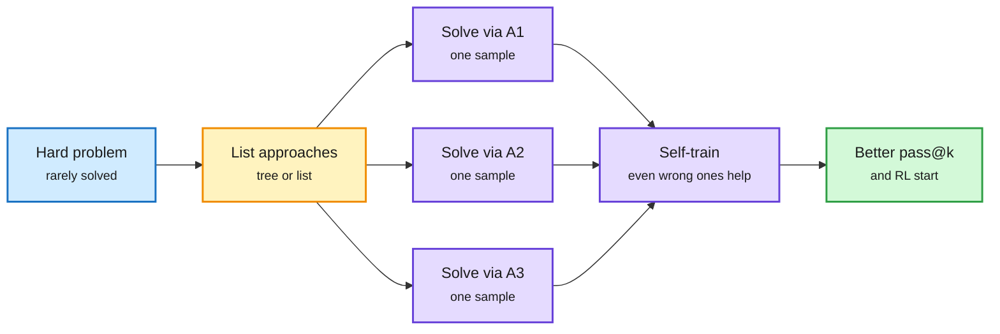

# Two distillation results: sample diversity, and why defenses fail

**TL;DR.** Two papers this week attack the assumption that distillation value lives in the teacher.

1. **Strategically Diverse Sampling for Self-Training** (Gurung, Whitammer, Lapata; Edinburgh). Standard rejection-sampling fine-tuning (RFT: sample many answers, keep the correct ones, train on them) produces mode-collapsed data on hard problems, because independent samples repeat one strategy. Instead, the model first lists several distinct **approaches** (as a tree, GROOT, or a list, Verbalized Sampling) and then solves the problem once per approach. **GROOT with 4 samples beats independent sampling with 64**: held-out pass@64 of 15.5 vs 7.9 on hard coding problems. **Training only on the incorrect diverse samples still beats RFT on independent data.** And a **4B model's own diverse samples beat independent-sample distillation from a 235B teacher (22.8 vs 13.4)**.
2. **Distillation Defenses Easily Break After Reinforcement Learning** (arXiv 2609.35699; Kurate cs.LG top 20). Defenses against distillation attacks (copying a closed model's reasoning by training on its outputs) are usually tested right after distillation. The paper argues attackers will also run RL afterward, and shows that defenses that look effective after distillation break after RL. Simple attacks using data easy to get from today's APIs yield reasoning gains equal to attacks that extract full hidden traces. Conclusion: any defense that leaks enough to reconstruct approximate traces is likely ineffective; batch-level defenses may work better.

Ask for approaches first, then solve once per approach

The diversity is forced at the plan level, so the training data covers more than one strategy.

Blue is the problem, amber is the forced approach split, purple are the samples and training step, green is the outcome.

## Key findings

- Verbalized Sampling leads before RL (pass@k 17.5 vs 15.5); GROOT leads after RL (18.0 vs 16.0), with a wider gap on story planning.
- On frontier problems (solved at most 2 of 64 times), independent self-training barely moves pass@64 (5.2, or 7.9 even with 64 samples at temperature 1.5).
- Distillation defenses evaluated only at the distillation checkpoint give a false sense of security once RL is added.

## How this relates to prior wiki pages

- **Extends the 10-03 distillation result.** The [On-Policy or Off-Policy study (10-03)](2026-10-03-distillation-dynamics-and-sampling.md) found that who writes the rollouts matters less than the token-level KL direction. Diverse self-sampling goes further: who writes matters less than how many distinct strategies the data covers.
- **Rhymes with the "sharpening tax" (10-03)**: PPT and the Sharpening Tax showed base models plus sampling recover much of what RL buys. Here, forced diversity is what makes self-training add new coverage instead of sharpening one mode.
- **Gives a mechanism to LeCun's market argument** (X, 10-04): "training frontier models is expensive, distilling a frontier model is cheap". The defenses paper says RL after distillation makes it cheaper still, and that output-level defenses will not hold. Expect labs to move to batch-level or account-level defenses, which is a policy and product problem, not a modeling one.
- Updates [knowledge-distillation](knowledge-distillation.md).

## Gaps

- Diverse sampling is shown at 4B on coding and story planning; no frontier-scale replication.
- The defenses paper's practical attack is described at the abstract level here; which API signals (summaries, logprobs, partial traces) suffice is in the body.

**Raw source:** X Following feed, 2026-10-05 morning ([@AlexAag1234](https://x.com/AlexAag1234/status/2106673027102425432)); Kurate cs.LG, 2026-10-05.
