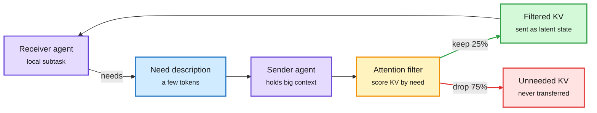

# CacheBack: receiver-conditioned latent communication between agents

**Source:** HuggingFace Daily Papers, 2026-10-05 · [arXiv 2609.32046](https://arxiv.org/abs/2609.32046) · raw: [raw/huggingface/2026-10-05-receiver-conditioned-latent-communication-gives-94-cacheback.md](../../raw/huggingface/2026-10-05-receiver-conditioned-latent-communication-gives-94-cacheback.md)

**TL;DR.** Multi-agent systems split a big context across agents that then talk. Text messages are compact but lossy and need decoding. Sending the raw KV cache (latent communication) skips decoding but grows with both context length and agent count. CacheBack makes the receiver say what it needs in a short description, and the sender uses its own attention weights over that description to keep only the matching part of its KV cache. On FanOutQA with Qwen 3 it drops 75% of the state the receiver would get, raises accuracy 14.7 points and cuts median task latency 3.2x versus text messages. It works on dense Transformers, Mamba-attention hybrids and sliding-window models. Training-free.

The receiver asks first, so the sender ships a quarter of its cache

The only new step is the small "what I need" message going the wrong way.

Purple are the agents, blue is the need message, amber is the attention-based filter, green is what crosses the wire, red is what stays behind.

## Key claims
- Full KV transfer between agents scales as (context per agent) x (number of agents) and soon exceeds GPU memory and context windows.
- Receiver conditioning: the receiver sends a short need description; the sender scores its cached positions by attention to that description and transfers only the top slice.
- FanOutQA, Qwen 3: 75% less transferred state, +14.7 points accuracy, 3.2x lower median completion latency vs text communication.
- Gains hold across dense, Mamba-attention hybrid and sliding-window-attention families.

## How it relates to prior wiki pages
- **Extends** [KVCMAS and PReCache (09-30)](2026-09-30-kvcmas-precache-multi-agent-kv-sharing.md), which shared one cache across agents on the same base model plus a low-rank per-agent delta. Those cut duplicate prefill. CacheBack cuts what is sent at all. Together they make "cross-agent" a real KV-sharing axis next to cross-layer and cross-tier ([KV cache concept](kv-cache.md)).
- **Same idea as query-aware eviction**, moved across an agent boundary: the receiver's need plays the role of the future query that SnapKV-style selectors guess at.
- **Bears on swarm economics**: Toby Ord's swarm-scaling analysis (10-05, [summary](../agentic-systems/2026-10-06-swarm-scaling-speed-not-capability.md)) says swarms cost about 2x tokens for the same result. Communication overhead is part of that tax; receiver-conditioned transfer attacks it directly.
- **Contrast with text-level compaction**: [Beyond Token Savings (10-05)](2026-10-05-context-compression-beyond-token-savings.md) showed text compaction can slow agents through extra calls and re-prefill. Latent transfer avoids both.

## Gaps
- One headline benchmark (FanOutQA). No result on long-horizon coding swarms.
- Sender and receiver must share a model family (KV caches are not portable across architectures without a mapping like HeteroFold, 10-03).
- No serving-system integration numbers (transfer bandwidth, batching with other requests).

## Related
[KV cache](kv-cache.md) · [Multi-agent systems](../agentic-systems/multi-agent-systems.md) · [Daily digest 2026-10-06](../daily-digest/2026-10/2026-10-06.md)
