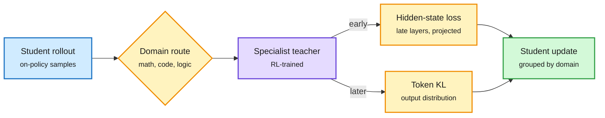

# Multi-teacher on-policy distillation: Latent-MOPD, and what actually reaches the weights

**Sources:** HuggingFace Daily Papers, 2026-10-05 · [Latent-MOPD, arXiv 2610.02381](https://arxiv.org/abs/2610.02381) · [From Gradients to Capabilities, arXiv 2610.02179](https://arxiv.org/abs/2610.02179) · raw: [Latent-MOPD](../../raw/huggingface/2026-10-05-latent-mopd-latent-multi-teacher-on-policy-distillation.md), [Gradients to Capabilities](../../raw/huggingface/2026-10-05-from-gradients-to-capabilities-understanding-multi-teacher-o.md)

**TL;DR.** Two papers on the same day about merging several RL-trained specialist teachers into one student by on-policy distillation (OPD: the student generates, the teacher grades every token). **Latent-MOPD** supervises the student with the teachers' late-layer hidden states as well as their token distributions, bridging different widths with a shared projection and grouping updates by domain. Supervision shifts from hidden states to tokens over training. Same-family: beats token-only, representation-only and uniform-averaging baselines on all nine math/code/logic benchmarks, and the student beats the best single teacher on most. **From Gradients to Capabilities** (UIUC/Princeton/Westlake) is diagnostic: with Qwen3-1.7B and four domain teachers, Adam's first moment makes different teachers' updates 0.83 cosine-similar even when raw gradients differ; token averaging silently up-weights long responses; and BF16 rounding hides most updates (about 97% of FP32 master weights move, but only 7 to 11% of BF16 weights change). Top-64 KL closely matches full-vocabulary gradients, but whether that helps depends on the averaging rule (+2.6 math under response averaging, -2.1 under global token averaging vs sampled-token PG).

Two channels per teacher, one student

Latent-MOPD routes each prompt to its specialist and supervises both hidden states and tokens.

Blue is the student's own sample, amber are routing and the two loss channels, purple is the teacher, green is the merged update.

## How it relates to prior wiki pages
- **Representation-level OPD continues a thread.** OPRD (matching teacher hidden states instead of tokens) was in the wiki in early October; Latent-MOPD is the first multi-teacher version. See [knowledge distillation](knowledge-distillation.md).
- **The BF16 finding reframes "sparse updates."** The 10-02 and 10-03 entries on the distillation page argued the OPD signal "is a direction and lives in a few places," and that learning rate drives update sparsity. Gradients-to-Capabilities says much of the apparent sparsity is BF16 rounding of FP32 master weights. That does not refute direction-based results, but measurements of sparsity in BF16 checkpoints should now be read with caution. Open tension.
- **Agrees with MOPD-Router (09-29)** that routing to the right specialist per sample matters, and with R²-OPD (10-04) that how you weight supervision changes results more than the teacher.
- **OPSFT (same day, [shorts](2026-10-06-efficiency-shorts.md))** says the generalization of on-policy training lives in the cumulative update direction; Adam smoothing teacher differences (0.83 cosine) is consistent with that.

## Gaps
- Latent-MOPD needs white-box teachers with accessible hidden states; no API-teacher path.
- Diagnostics are at 1.7B and 3B only.

## Related
[Knowledge distillation](knowledge-distillation.md) · [RL for LLMs](../llms-foundation-models/rl-for-llms.md) · [Daily digest 2026-10-06](../daily-digest/2026-10/2026-10-06.md)
