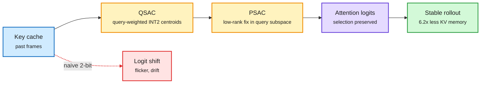

# QuantWM: 2-bit KV cache for video world models, and why Key errors hurt more

**Source:** HuggingFace Daily Papers, 2026-10-05 · [arXiv 2609.26425](https://arxiv.org/abs/2609.26425) · raw: [raw/huggingface/2026-10-05-quantwm-temporally-consistent-2-bit-kv-cache-quantization-fo.md](../../raw/huggingface/2026-10-05-quantwm-temporally-consistent-2-bit-kv-cache-quantization-fo.md)

**TL;DR.** Video world models keep a KV cache of past frames to stay consistent over long rollouts, and that cache becomes the memory bottleneck. Existing 2-bit KV methods look near-lossless on VBench but cause flicker and drift in world models. The authors find a surprise: quantized Keys have smaller reconstruction error than quantized Values but cause more damage, because Key noise changes attention logits and so changes which past spatio-temporal tokens a query picks. QuantWM is training-free and protects that selection. QSAC picks INT2 Key centroids weighted by how sensitive past queries were to each channel. PSAC corrects remaining Key error along the dominant query subspace with a low-rank projection. Across five world models (LingBot-World-v2, HY-World 1.5, Matrix-Game-2, Longcat-Video, Causal-Forcing) it beats prior 2-bit methods with up to 6.2x KV memory compression.

Protect what the query selects, not the raw Key values

Small Key errors flip which past tokens get attended; the fix targets that selection.

Blue is the cache, amber are the two corrections, purple is attention, green is the result, red is what naive 2-bit does.

## How it relates to prior wiki pages
- **Third 2-bit KV paper in a week.** WUSH-KV (10-02) fitted rotations to calibration covariances for 2-bit KV in SGLang; PrismQuant (10-01) aligned rotations with the quantizer. QuantWM adds a different target: preserve attention *selection*, measured through past query sensitivity. See [quantization](quantization.md).
- **Confirms "average metrics hide the failure"**: Periodic Weak Spots (10-01) showed averages hide per-position retrieval failures; here VBench averages hide temporal flicker.
- Key-over-Value sensitivity matches the long-standing LLM finding (KIVI-style per-channel Keys) but with a new mechanism argument: logit shift changes token selection.

## Gaps
- World models only; whether query-weighted centroids help LLM 2-bit KV is untested.
- "Limited additional overhead" is not quantified as latency.

## Related
[KV cache](kv-cache.md) · [Quantization](quantization.md) · [Daily digest 2026-10-06](../daily-digest/2026-10/2026-10-06.md)
