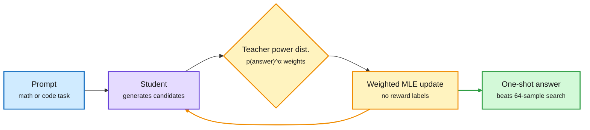

# OPPD: distil a sharpened distribution into one sample, and base models that reason on a cue word

**Sources:** HuggingFace Daily Papers 2026-10-06 · [Sharpen Without Search (OPPD), arXiv 2610.06804](https://arxiv.org/abs/2610.06804) · [code](https://github.com/ArminAzizi98/OPPD) · [Base Models Can Reason By Taking a Cue From Training Data, arXiv 2610.06851](https://arxiv.org/abs/2610.06851), **cross-source confirmed via social** (reshared by MIT CSAIL and Berkeley AI on X)
**Raw:** [OPPD](../../raw/huggingface/2026-10-06-sharpen-without-search-on-policy-distillation-of-sequence-le.md) · [Base-model cues](../../raw/huggingface/2026-10-06-base-models-can-reason-by-taking-a-cue-from-training-data.md)

## TL;DR

Both papers say the reasoning gain usually credited to RL is largely already inside the base model, and both show a cheaper way to get it out.

**OPPD.** A model can put more probability on the right answer than on any single wrong one and still usually sample a wrong one, because the wrong answers together hold more mass. *Power sampling* fixes this by raising each full answer's probability to a power above 1 and renormalizing (sharpening), but it needs many scored candidates per query. OPPD trains that sharpening into the weights. The model being trained generates candidates; a frozen teacher's power distribution weights them in a sequential Monte Carlo sampler; the same weights drive a maximum-likelihood update. **One generation then beats 64-candidate power sampling (+2.4 MATH500, +3.5 GSM8K) and recovers 94% of the gain 16 candidates give the untrained model.** With no reference answers it beats GRPO (RL with verified rewards) from the same checkpoint by 3.8-5.4 points, and stacking OPPD after GRPO adds up to 9.3 more. A single loss coefficient sets how sharp the student gets (exponent 1.19-2.02, against 1.14 for ordinary on-policy distillation).

**Base-model cues.** Forcing the first tokens of a base model's answer to ".\n\nOkay" lifts Olmo-3-7B on MATH-500 from 42% to 78%; "Alright," lifts Qwen3-14B from 72% to 87%. RL makes these cues more likely, and fixing them recovers much of RL's gain. Causal data edits can turn "chicken" into a reasoning cue, or make "Think duck duck goose" as effective as "Think step by step". Different cues map to different training-document types, including different refusal behaviour.

Pay for 64 samples once, at training time

The sharpened distribution is distilled, so inference needs one generation.

Blue is the input, purple is the student, amber is the training loop, green is the cheap inference result.

## Gaps

- OPPD is evaluated on math (plus HumanEval transfer). Power sharpening rewards the model's own confident mode; on tasks where the mode is wrong, it should amplify errors, and the paper does not test that.
- The cue paper shows *that* the base model can reason on cue, not how much compute RL saves end to end at matched quality.

## Relation to prior wiki pages

- **Third point in a sharpening thread.** [Sharpening Tax and PPT (10-03)](../llms-foundation-models/2026-10-03-sampling-vs-rl-ppt-sharpening-tax.md) showed post-training trades coverage for consistency, and that power sampling with parallel tempering gets sharpening without training. OPPD is the amortized version: pay for power sampling once during training. The cue paper is the mechanistic version: RL mostly raises the probability of tokens that already trigger reasoning. **Three papers in five days now say RL's gain is mostly sharpening of latent behaviour.**
- **Distillation as a test-time-compute compressor** extends the [knowledge distillation](knowledge-distillation.md) page's line that on-policy distillation can replace RL on reasoning; OPPD does it with no verifier.
- **Safety angle (cue paper):** if refusal behaviour also hangs off first-token cues, prefill attacks are a training-data property, not only a prompt property. Feeds [responsible AI](../responsible-ai/responsible-ai.md).

## Related

[Knowledge distillation](knowledge-distillation.md) · [RL for LLMs](../llms-foundation-models/rl-for-llms.md) · [Test-time compute allocation](test-time-compute-allocation.md)
