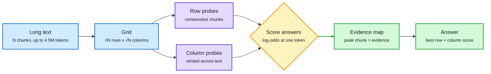

# Periscope: read a long text as a grid of short probes, and the KV cache stops scaling with the text

**Source:** HuggingFace Daily Papers 2026-10-06 · [arXiv 2610.04047](https://arxiv.org/abs/2610.04047)
**Raw:** [HF entry](../../raw/huggingface/2026-10-06-periscope-extending-frozen-language-models-beyond-their-cont.md)

## TL;DR

Periscope is a training-free way to make a frozen model answer questions about texts far longer than its context window. It only works for *decisions over a finite set* (which document is relevant, which option is supported, which passage is evidence). The text is cut into N chunks and laid on a √N x √N grid. The model reads each row (K consecutive chunks, local detail) and each column (K strided chunks sampled across the whole text, global coverage) and scores every answer from the log-odds at a single token. Each answer keeps its best row score and best column score. Scoring each chunk by its row and column gives an **evidence map** for free, whose peak is the chunk behind the answer. A window of W tokens therefore reaches W²/c tokens (c = chunk size) at s^1.5 cost instead of s². On LongBench v2, reading only the top-K chunks from the map (about 9k tokens) matches the same model's best full-window read at 32k to 1M. On InfiniteBench (median 150k context) it beats the best window read by 5 points. Because each call caches only one probe, **a 27B model reads 4.5M-token contexts on one 80GB GPU, where one pass would need 296GB of KV cache.**

The cache holds one probe, never the whole text

Rows give local detail, columns give global coverage; the map picks what to actually read.

Blue is the input layout, purple is the frozen model reading short probes, amber is the scoring step, green is what you get out.

## Key findings

- **Cost:** each probe is about √s·√c tokens; total read cost grows as s^1.5, not s². KV memory is bounded by one probe.
- **Accuracy:** top-ranked 9k tokens match the best full-window read across 32k-1M windows on LongBench v2; +5 points over the best window read on InfiniteBench.
- **Retrieval for free:** the same map gives the best NDCG@10 of six methods on BRIGHT's long-document corpora.
- **Memory:** 27B model, 4.5M tokens, one 80GB GPU (296GB cache needed for a single pass).

## Limits

- Only for closed-set decisions. Open-ended generation over a long text (summaries, multi-hop synthesis that must combine distant chunks) is not covered.
- Cross-chunk reasoning only happens inside a row or a column. Evidence that needs two chunks in different rows *and* columns can be missed.
- No comparison against KV compression or sparse-attention baselines at matched memory.

## Relation to prior wiki pages

- **Different axis from the KV compression pile.** The [KV cache page](kv-cache.md) has tracked compressing each layer's cache (QuantWM, 10-06; PrismQuant, 10-01) and sharing it across layers or agents (the Extender and CacheBack, 10-06). Periscope never builds a long cache at all. It moves the problem from memory to the number of forward passes.
- **Same instinct as CacheBack (10-06),** which had the receiver say what it needs before any cache moved. Here the question is fixed first and the text is probed against it.
- **Extends the "read less" line** from CorpusMap (10-06, entity pages cut input tokens 34-57%) to a training-free, model-internal version.

## Related

[KV cache](kv-cache.md) · [Test-time compute allocation](test-time-compute-allocation.md) · [Agent memory](../agentic-systems/agent-memory.md)
