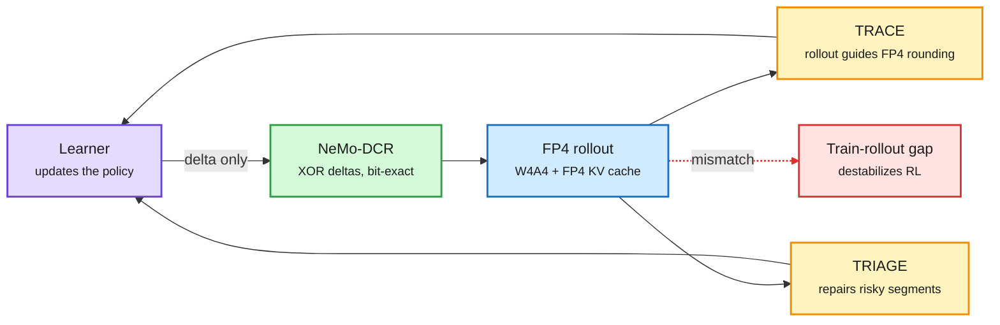

# FP4 RL and delta refits: TRACE, TRIAGE, NeMo-DCR (2026-10-08)

**Source:** HuggingFace Daily Papers 2026-10-07. TRACE ([arXiv 2610.07767](https://arxiv.org/abs/2610.07767), 84 upvotes, [raw](../../raw/huggingface/2026-10-07-trace-rollout-guided-quantization-aware-training-for-fp4-rei.md)), TRIAGE ([arXiv 2610.07043](https://arxiv.org/abs/2610.07043), [raw](../../raw/huggingface/2026-10-07-triage-direction-aware-mismatch-stabilization-of-native-nvfp.md)), NeMo-DCR ([arXiv 2610.08430](https://arxiv.org/abs/2610.08430), [raw](../../raw/huggingface/2026-10-07-nemo-dcr-bit-exact-delta-compressed-refit-for-scalable-agent.md)). No alphaxiv overviews yet; written from abstracts.

**TL;DR.** Three same-day papers attack the cost of RL post-training at three different points. TRACE makes the trainer round its FP4 weights the way the FP4 rollout engine does, so the two quantized copies of the policy stop disagreeing; it reaches BF16-level RL quality with FP4 weights, activations and KV cache in rollout, and up to 5.4x faster rollout on four large MoE models. TRIAGE keeps native NVFP4 (Nvidia's 4-bit float format) on both sampler and learner and instead repairs the policy-gradient objective where the mismatch is dangerous: a few response segments with negative advantage. It reports full-precision math scores on Qwen3-4B and Qwen3-30B-A3B with 2.3x rollout throughput. NeMo-DCR shrinks the step that ships new weights to the rollout cluster: only ~1% of weights change per step, so it sends bit-exact XOR deltas and cuts a 1T-parameter cross-region refit from 87.5 minutes to 150 seconds.

Three cuts to the RL bill, one per stage

Rollout precision, objective repair and weight shipping are separate costs; each paper owns one.

Purple is the learner, blue the cheap rollout engine, amber the two mismatch fixes, green the transfer saving, red the failure they all fight.

## Key points

- **TRACE (train-rollout alignment).** Prior FP4 RL methods optimize quantization error on the training path and on the rollout path separately. TRACE optimizes the gap between them: rollout-side quantization outcomes steer training-side FP4 rounding. A cache keeps only deeper layers' mantissa and scale bits to keep the guidance cheap. Covers joint FP4 weights/activations **and FP4 KV cache** in rollout. Up to **5.4x rollout speedup**; the FP4-trained policy also beats post-hoc FP4 quantization of a BF16-trained policy.
- **TRIAGE (direction-aware stabilization).** Mismatch size alone does not predict harm. What matters is whether a token's mismatch amplifies or contracts the update. In native NVFP4 runs, damage starts in negative-advantage, negative-gap tokens that cluster in a few response segments before spreading. TRIAGE diagnoses segments and rebalances only those, with bounded repair for severe residual mismatch. **2.3x rollout throughput over BF16**, full-precision scores on five math benchmarks.
- **NeMo-DCR (delta-compressed refit).** In disaggregated agentic RL, each update must reach rollout clusters before the next batch. A full 1T checkpoint takes **87.5 min** between two AWS regions. About 1% of BF16 weights change per step. DCR projects changes into checkpoint coordinates, carries them as compressible XOR masks or overwrites, uses the serving runtime's own loader, and commits atomically so mid-refit failures retry cleanly. **12-40x faster than full transfer at 3-5% change rates; 150 s for 1T at 3%.**

## How this relates to prior wiki pages

- **Continues the 10-07 thread that RL is now the GPU sink.** Reflection's Beam ran RL on 10,500 GB300s, more than its pretraining cluster, and [LoGRA (10-07)](../llms-foundation-models/2026-10-07-logra-low-rank-gradient-rl.md) cut RL memory 45.7% with gradient sketches. [RL-Kernel (10-07)](../hardware/2026-10-07-fbtriton-tbe-rl-kernel-coco.md) argued for bitwise train-inference parity. TRACE and TRIAGE take the opposite bet: accept a 4-bit gap and manage it.
- **Extends the phase-aware quantization line in [quantization](quantization.md).** Mix-Quant (05-21) and Disaggregated Quantization (09-24) put FP4 in prefill and kept decode higher. TRACE puts the whole rollout, including decode and KV cache, in FP4, because RL can train the policy to tolerate it.
- **Confirms the 09-16 "compression error has a direction" entry.** TRIAGE is the RL version: the sign of the mismatch relative to the advantage matters more than its size.

## Gaps

- TRACE and TRIAGE are not compared with each other or with a bitwise-parity baseline.
- TRIAGE is math-only at 4B and 30B-A3B. No agentic or long-horizon RL.
- NeMo-DCR's 1% sparsity is measured on BF16; FP4 training could change the delta pattern.

## Related

[Quantization](quantization.md) · [RL for LLMs](../llms-foundation-models/rl-for-llms.md) · [KV cache](kv-cache.md) · [Compute economics](../hardware/compute-economics.md)
