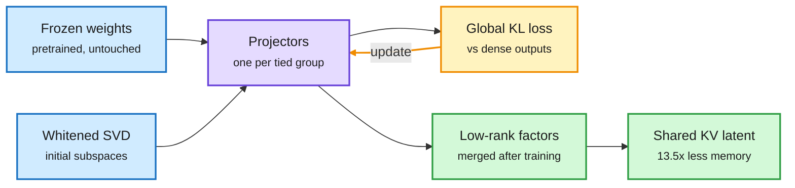

# LSP: learn which subspace to throw away, end to end (2026-10-08)

**Source:** HuggingFace Daily Papers 2026-10-07. "Learning Functional Subspaces for Neural Network Compression" ([arXiv 2609.40127](https://arxiv.org/abs/2609.40127), [raw](../../raw/huggingface/2026-10-07-learning-functional-subspaces-for-neural-network-compression.md)). Bini, Christensen, Alaniz, Goldfeder, Winther, Akata, LeCun, Shwartz-Ziv (Helmholtz Munich / TUM, NYU, Copenhagen/DTU, Télécom Paris). alphaxiv overview used as context.

**TL;DR.** Low-rank compression replaces a big weight matrix with two thin ones, which stays dense and fast on normal GPUs. Existing methods pick what to cut layer by layer, with local rules (activation energy, reconstruction error). Those rules ignore how errors travel through the network, so at high compression they pile up and the model collapses. LSP (Learnable Subspace Projections) gives each layer an orthogonal projector and trains all projectors together against the dense model's output (KL divergence) with frozen weights. Ranks go where they cost the least output KL per parameter saved. Afterwards the projectors fold into ordinary low-rank factors. Layers that read the same input share one factor, which in attention means **caching one narrow latent instead of full keys and values**. At 70% compression, Llama-2-7B keeps **10.9 WikiText-2 perplexity and 42.2% zero-shot accuracy**, against 13.3 and 36.0% for the best baseline. Decoding is up to 1.6x faster at small batch, and **weights plus KV cache shrink 13.5x at 128K context** (untied baselines reach at most 6.5x).

One global objective decides every layer's cut

The projector training is the only new step; the result is a standard low-rank model with a latent KV cache.

Blue is what you start with, purple the learned projectors, amber the global training loop, green what ships.

## Key points

- **Global, not local.** Each projector is trained with all others against one end-to-end objective (output KL or the original training loss). Error propagation is part of the loss, so it stops compounding.
- **Rank allocation by marginal cost.** Ranks go to the projectors whose removal costs the most output KL per saved parameter.
- **Tied groups.** Layers that read the same activations (Q, K, V in attention) share one projector. That is what turns weight compression into a KV-cache compression: the cache stores one narrow latent per token, in the style of MLA (multi-head latent attention, DeepSeek's compressed KV design).
- **Gap widens with compression.** Tested on OPT-125M/1.3B, Qwen3-4B, Llama-2-7B, ViT-B/16; LSP's lead grows as the compression ratio rises.

## How this relates to prior wiki pages

- **Fills the gap [model pruning](model-pruning-sparsity.md) flagged for XMerge and ACE (09-08):** neither reported wall-clock. LSP reports decode speed and combined weight+KV memory.
- **Joins the post-hoc latent-KV line in [KV cache](kv-cache.md).** Earlier entries retrofitted MLA-style latents into trained models through distillation. LSP gets a shared latent as a side effect of weight compression.
- **Same lesson as today's cross-tokenizer OPD paper** ([cluster page](2026-10-08-opd-supervision-reliability-cluster.md)): local, per-position criteria mislead; the global objective decides.

## Gaps

- Largest LLM is Llama-2-7B, an old model; no modern MoE or 70B+ results.
- The 1.6x speedup is at small batch; large-batch serving numbers are not given.
- Projector training cost is not compared with a short LoRA recovery after SVD.

## Related

[Model pruning and sparsity](model-pruning-sparsity.md) · [KV cache](kv-cache.md) · [Quantization](quantization.md)
