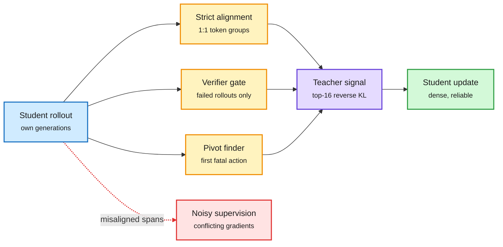

# On-policy distillation: supervise less, but where it is reliable (2026-10-08)

**Sources:** HuggingFace Daily Papers 2026-10-07 and the X feed. Rethinking Cross-Tokenizer OPD ([arXiv 2610.08448](https://arxiv.org/abs/2610.08448), 159 upvotes, the day's top paper, [raw](../../raw/huggingface/2026-10-07-rethinking-cross-tokenizer-on-policy-distillation-from-align.md)); DiffGate ([arXiv 2610.04596](https://arxiv.org/abs/2610.04596), [raw](../../raw/huggingface/2026-10-07-diffgate-difficulty-gated-teacher-guidance-for-on-policy-dis.md)); OPD Before RL ([arXiv 2610.02781](https://arxiv.org/abs/2610.02781), [raw](../../raw/huggingface/2026-10-07-opd-before-rl-warm-starting-rubric-based-rl-with-on-policy-d.md)); PivotOPD (NVIDIA, [arXiv 2609.40285](https://arxiv.org/abs/2609.40285), [project](https://research.nvidia.com/labs/lpr/pivotopd), via [@NVIDIAAI](https://x.com/NVIDIAAI/status/2107928667246715090)).

**TL;DR.** OPD (on-policy distillation: the student writes its own answers and a teacher scores every token) is the default post-training tool of 2026. Four papers say the same thing from different sides: more teacher signal is not better; reliable signal is. Cross-tokenizer OPD finds that strict 1:1 token alignments already cover most student tokens, and reverse KL on a student-chosen **top-16 slice of the shared vocabulary** matches full-vocabulary OPD. Adding supervision for the misaligned spans gives "complete coverage" and *lowers* accuracy, because those gradients point the wrong way. DiffGate applies teacher guidance only to failed rollouts, scaled by difficulty. PivotOPD applies it only at the one early "pivotal" mistake and the few turns after it. OPD Before RL uses a rubric-aware teacher first, then RL.

The teacher speaks only where its signal is trustworthy

Each paper adds a gate in front of the teacher; none adds more teacher.

Amber gates decide where the purple teacher speaks; red is the signal the papers learned to drop.

## Key points

- **Cross-tokenizer OPD.** Three heterogeneous teacher-student pairs, math and code. On pre-distillation student samples the shared vocabulary holds nearly all probability mass at strict positions. Span-level MSE on mismatch groups has weak or negative directional agreement with the strict gradients and grows in magnitude over training. Thesis: "shift from maximizing alignment coverage to prioritizing supervision reliability."
- **DiffGate.** OPD gives dense but correctness-blind token guidance; GRPO (group-relative RL) gives correctness but coarse credit and vanishes when all rollouts fail. DiffGate uses the verifier to choose which trajectories get teacher guidance. Qwen3-0.6B/1.7B: code pass@8 +1.6 and +5.7 over GRPO; math pass@8 +1.1 and +3.9.
- **PivotOPD.** 59% of failed ALFWorld rollouts contain one pivotal mistake, at a median of turn 8-12 of 30. Fixing that one turn lifts replayed success from 8% to 59%. Standard OPD barely helps after a pivot (51% to 49% failure) because the recovery action has <1% probability and is never sampled. PivotOPD uses reverse KL to prevent the pivot and forward KL to teach recovery. Best average over 13 baselines on ALFWorld, WebShop, search QA; +3.2% SWE-Bench Verified for a Nemotron-3.5 student.
- **OPD Before RL.** A student without the rubric matches a rubric-aware teacher, then RL optimizes the rubric reward. Highest scores on HealthBench, ResearchQA, RubricHub Science, and less reward hacking than SFT+RL.

## How this relates to prior wiki pages

- **Confirms TIP (04-16)**, which found most teacher tokens carry no signal and only ~10% are needed. Cross-tokenizer OPD extends it: the extra tokens can carry *negative* signal.
- **Revisits BLD (04-17)**, which solved tokenizer mismatch by moving both models to bytes. Today's result says the mismatch mostly does not need solving; restrict to strict positions instead.
- **Pairs with [OPPD (10-07)](2026-10-07-oppd-power-distillation-and-base-model-cues.md)**, which distilled a sharpened answer distribution so one sample beat 64-sample power sampling. Both treat the teacher signal as something to filter or reshape, not maximize.
- **N-of-a-kind:** cross-tokenizer OPD, DiffGate and PivotOPD make three same-day papers gating the teacher by reliability (alignment, outcome, pivot). The field has converged on selective distillation.

## Gaps

- Cross-tokenizer OPD covers three pairs, math and code only.
- DiffGate's students are under 2B; math avg@8 does not improve.
- PivotOPD needs a symbolic oracle or teacher to find pivots; cost of pivot-finding at scale is not reported.

## Related

[Knowledge distillation](knowledge-distillation.md) · [RL for LLMs](../llms-foundation-models/rl-for-llms.md) · [Agent harness engineering](../agentic-systems/agent-harness-engineering.md)
