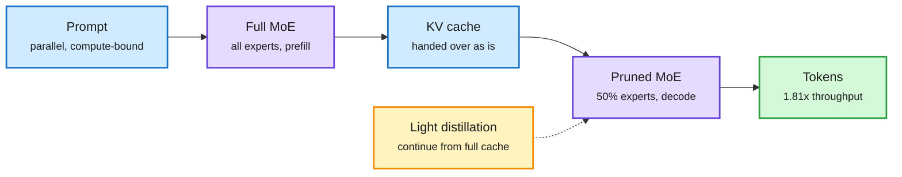

# SlimWise, Stepped MoE, and agentic expert selection (2026-10-08)

**Source:** HuggingFace Daily Papers 2026-10-07. SlimWise ([arXiv 2609.34117](https://arxiv.org/abs/2609.34117), [raw](../../raw/huggingface/2026-10-07-slimwise-decoupling-expert-pruning-across-prefill-and-decode.md)), Stepped MoE ([arXiv 2610.07348](https://arxiv.org/abs/2610.07348), [raw](../../raw/huggingface/2026-10-07-stepped-moe-segment-level-routing-with-configurable-inferenc.md)), Structuring MoE Expert Selection for Agentic RL ([arXiv 2610.07332](https://arxiv.org/abs/2610.07332), [raw](../../raw/huggingface/2026-10-07-structuring-moe-expert-selection-for-agentic-reinforcement-l.md)). No alphaxiv overviews; written from abstracts.

**TL;DR.** In MoE (mixture-of-experts, where each token uses only a few expert sub-networks) serving, one token touches few experts, but a batch of decode tokens touches almost all of them, so decode is bound by loading expert weights. SlimWise prunes experts only during decode. Prefill runs the full model and writes the KV cache (the saved attention state); a 50%-pruned decoder then reads that cache directly, with no conversion. A small distillation step teaches the pruned decoder to continue from full-model caches. In vLLM on Qwen3.6-35B-A3B: **up to 1.81x decode throughput at 50% expert pruning** with minimal accuracy loss. It also warns that benchmark accuracy hides pruning-induced changes in output length.

Prune where memory is the bottleneck, not where compute is

Prefill keeps every expert; only the bandwidth-bound decode phase gets the slim model.

Blue is data and cache, purple the two model variants, amber the repair step, green the result.

## Key points

- **SlimWise.** Works with prefill-decode disaggregation and with colocated serving. Three pruning criteria, two MoE backbones. Training-free handoff already narrows the gap; the distillation stage updates a small parameter subset to fix residual loss and length drift.
- **Stepped MoE (Apple-style elastic MoE for devices).** One backbone conditions on both the input and a target efficiency setting. It activates task-relevant parameters inside nested sub-networks, so one file serves 1B, 2B, 3B or 4B active parameters. 2-5% more accurate than dense models of equal size on knowledge benchmarks, at similar latency, with shared weights saving disk.
- **Agentic expert selection.** In off-the-shelf MoEs, expert routing overlaps more between agent turns doing the same operation (READ, UPDATE) than across operations. Standard RL lets routing drift. A hierarchical control aligns turn-level routing to operations and keeps token-level routing consistent, with an entropy gate for stability. **10+ point success-rate gains** on every benchmark tested.

## How this relates to prior wiki pages

- **Phase-aware compression is now a family of three.** Mix-Quant (05-21) used FP4 for prefill and BF16 for decode. Disaggregated Quantization (09-24) did the same for precision. SlimWise flips the logic for pruning: decode, not prefill, is the phase to slim, because decode is memory-bound. See [quantization](quantization.md) and [model pruning](model-pruning-sparsity.md).
- **Length drift echoes 10-05.** [Beyond Token Savings](2026-10-05-context-compression-beyond-token-savings.md) found compression that saves tokens can run slower. SlimWise shows the same hidden cost for pruning: accuracy holds while generation length changes.
- **Agentic routing structure links to [LLM routing](../ai-routing/llm-routing.md).** Expert routing inside one model already encodes the agent's operation type. That is a free signal for cache placement and expert prefetch.

## Gaps

- SlimWise reports throughput, not end-to-end cost per request with the distillation overhead.
- Stepped MoE tops out at 4B; no frontier-scale evidence.

## Related

[Model pruning and sparsity](model-pruning-sparsity.md) · [KV cache](kv-cache.md) · [Quantization](quantization.md) · [LLM routing](../ai-routing/llm-routing.md)
