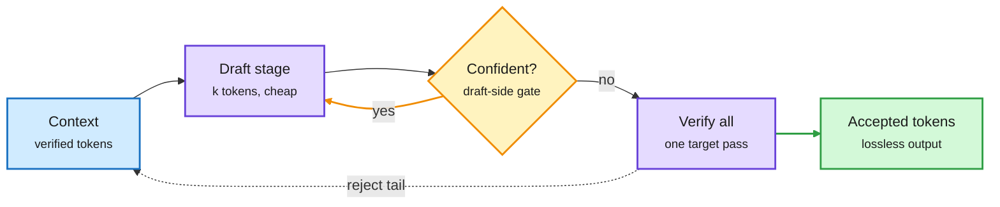

# DLoop: draft more than once before verifying (2026-10-09)

**Source:** HuggingFace Daily Papers 2026-10-08. DLoop ([arXiv 2610.07659](https://arxiv.org/abs/2610.07659), [raw](../../raw/huggingface/2026-10-08-dloop-looped-speculative-decoding.md), code promised at [naver-ai/DLoop](https://github.com/naver-ai/DLoop)). NAVER AI Lab, NAVER AI Search Platform, Korea University. alphaxiv overview read (truncated).

**TL;DR.** Speculative decoding has a small model draft several tokens and the big target model check them in one pass. Drafters are now good enough that the target often accepts the whole draft, yet it still runs a verification pass after every drafting stage. DLoop lets the drafter run **several drafting stages in a row while it stays confident**, then verifies everything at once. The catch for parallel drafters (DFlash, Domino, MTP heads) is that each new stage needs target-model hidden states for tokens the target has not seen yet. DLoop's **loop-aware training** exposes the drafter to its own hidden states so it stays reliable in later stages. Across EAGLE-3, DFlash, Domino, DSpark and MTP modules, wall-clock speedup rises **5-41%**, still lossless.

Skip the check when the draft is clearly on track

Fewer target passes, paid for with extra cheap draft passes.

Blue is context, purple the draft and target passes, amber the confidence loop, green the output.

## Key points

- **The [speculative decoding page](speculative-decoding.md) asked for content-adaptive speculation depth.** Its standing open question was a learned k-schedule. Adaptive-length methods existed, but only for autoregressive drafters. DLoop is the first adaptive-depth method that works for parallel drafters, which is where the field has moved.
- **It is the reverse of AgSpec (10-03).** AgSpec removed the draft model by copying drafts from the agent's own history. DLoop keeps the draft model and removes verifications. Both target the same cost: target-model passes per accepted token.
- **Why it works on GPUs.** Verifying more tokens in one pass costs little extra because decode is memory-bound: the target reads its weights once either way. Drafting is cheap compute. So trading draft passes for target passes is a bandwidth trade.
- **Batch-size caveat.** Speculative gains usually shrink at large batch as spare compute disappears (see Uno's claim, 09-18). The abstract does not say whether DLoop's gain holds at high batch.

## Gaps

- No batch-size sweep in the abstract; no serving-stack integration (vLLM 0.30 already has adaptive verification for variable-length drafts, 10-06).
- Extra drafting stages cost more draft compute on rejection; the abstract gives no energy or FLOPs number.

## Related

[Speculative decoding](speculative-decoding.md) · [KV cache](kv-cache.md) · [AgSpec (10-03)](2026-10-03-agspec-retrieval-speculative-decoding.md) · [GPU kernels](../hardware/gpu-kernels.md)
