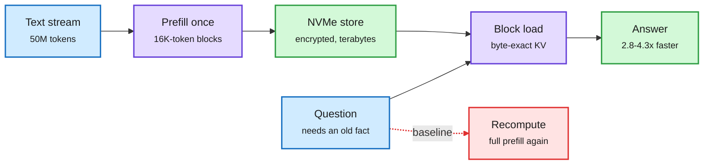

# galahad-kv: a 50M-token KV memory on NVMe (2026-10-09)

**Source:** HuggingFace Daily Papers 2026-10-08 (2 upvotes, low community signal). "Real Long-Term Memory for AI: A 50-Million-Token Window That Is Faster and Cheaper Than Recompute" ([arXiv 2610.10845](https://arxiv.org/abs/2610.10845), [raw](../../raw/huggingface/2026-10-08-real-long-term-memory-for-ai-a-50-million-token-window-that.md)). No alphaxiv overview. Written from the abstract. Authored around a public package (galahad-kv), so read as a vendor-style report.

**TL;DR.** Every time a prompt is resent, the model recomputes its KV state (the attention memory for those tokens). galahad-kv saves the KV state of each ~16,000-token block to encrypted local NVMe and loads it back byte-exact later. On one H100 under vLLM, with Gemma 4 12B and 31B over 50M tokens of public text: every probed block (100 of 100, depths 0 to 50M) reloaded with no recompute; loading was **2.8x-4.3x faster than recompute and used 8.8x-12.3x less GPU energy**; GPU memory stayed flat. On facts planted millions of tokens earlier, the 12B model answered 82/100 and the 31B 98/100, with no fabricated answers.

Store the attention state once, load it instead of recomputing

It is block reuse, not a wider window: one block is loaded per question.

Blue is input, purple the compute steps, green storage and result, red the recompute path it replaces.

## Key points

- **The missing step is retrieval.** The paper loads the right block; how it picks that block for an arbitrary question is the real long-context problem, and the abstract says answer quality "depends on the model". This is memory, not attention over 50M tokens.
- **Energy is the underrated number.** 8.8-12.3x less GPU energy per reuse matters more than latency for always-on agents, and it is the first energy figure the [KV cache page](kv-cache.md) has for storage-tier reuse.
- **Fits the SSD-tier thesis.** On 10-08 an investor note projected SanDisk data-center revenue up ~30x by 2028 on agent KV moving to SSD. This paper is the single-GPU mechanism behind that bet; Dynamo's KvHint ([session-aware inference](2026-10-09-session-aware-agentic-inference-dynamo.md)) is the cluster-scale policy.

## Gaps

- Single GPU, two models from one family, a protocol written by the package authors. No comparison with LMCache, Mooncake or vLLM's own offloading.
- Terabytes of NVMe per 50M tokens; no cost per stored token or reuse-rate break-even.
- Byte-exact reuse means the model cannot change. Any weight update invalidates the store.

## Related

[KV cache](kv-cache.md) · [Memory hierarchy](../hardware/memory-hierarchy.md) · [Agent memory](../agentic-systems/agent-memory.md)
