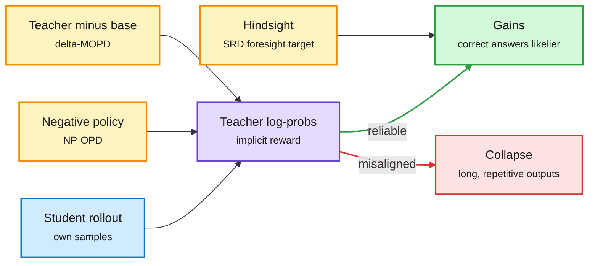

# On-policy distillation: the teacher is a reward model (2026-10-09)

**Sources:** HuggingFace Daily Papers 2026-10-08. Gains and Collapse in On-Policy Distillation ([arXiv 2610.03185](https://arxiv.org/abs/2610.03185), [raw](../../raw/huggingface/2026-10-08-gains-and-collapse-in-on-policy-distillation-a-reinforcement.md), [code](https://github.com/HancCui/opd_hacking)); NP-OPD, On-Policy Distillation with Negative-Policy Rollouts ([arXiv 2610.07874](https://arxiv.org/abs/2610.07874), [raw](../../raw/huggingface/2026-10-08-on-policy-distillation-with-negative-policy-rollouts.md), NAVER); Δ-MOPD, multi-teacher OPD through teacher-relative shifts ([arXiv 2610.10460](https://arxiv.org/abs/2610.10460), [raw](../../raw/huggingface/2026-10-08-composing-what-each-teacher-learned-multi-teacher-on-policy.md)); Self-Retrospection Distillation, SRD ([arXiv 2610.08077](https://arxiv.org/abs/2610.08077), [raw](../../raw/huggingface/2026-10-08-self-retrospection-distillation-turning-post-hoc-experiences.md), 84 upvotes); ReSAIL ([arXiv 2609.39306](https://arxiv.org/abs/2609.39306), [raw](../../raw/huggingface/2026-10-08-resail-mitigating-collapse-in-iterative-agent-self-distillat.md)). Abstracts only.

**TL;DR.** On-policy distillation (OPD: the student generates, the teacher scores each student token) is usually framed as imitation. **Gains and Collapse** reframes it as RL: the teacher's log-probabilities act as an **implicit reward model** over the student's rollouts, including behaviors the teacher itself rarely produces. When that reward is reliable, OPD makes correct answers easier to sample but does not add new capability. When it is not, the student reward-hacks: overlong, repetitive outputs get amplified. Masking unhealthy responses or starting from SFT each fixes the collapse. Four same-day papers then change *what* the teacher signal is: **NP-OPD** adds rollouts from a weaker "negative" policy so tokens the bad policy prefers stay exposed to teacher correction; **Δ-MOPD** distils each teacher's *shift from its own base* rather than its endpoint (+4.11 math with three teachers; order gap in phased routing 10.50 to 6.42); **SRD** distils hindsight from finished trajectories into foresight, and rescues a 2B agent whose RLVR run sat at 0% (98% all-fail groups) to **60.6%**; **ReSAIL** stops iterative self-distillation from collapsing across deployment cycles (+22.5% final-cycle success on ALFWorld and TextCraft).

The teacher scores, so the student can game the score

Every fix today changes what the teacher signal measures, not how hard the student imitates.

Blue is the student's rollout, purple the teacher signal, amber the three signal fixes, green the healthy outcome, red the collapse.

## Key points

- **Third day running that OPD is about teacher reliability, not coverage.** 10-08's cluster found cross-tokenizer OPD works best with a top-16 slice at strictly aligned positions, and NVIDIA's PivotOPD supervised only the one pivotal mistake ([OPD reliability 10-08](2026-10-08-opd-supervision-reliability-cluster.md)). Gains and Collapse supplies the theory: the teacher is a reward model, so its blind spots are reward-hacking targets.
- **Explains the 05-14 Extrapolation Cliff.** That paper found a closed-form threshold above which OPD collapses. The implicit-reward view says why: past that threshold the student is optimizing a reward the teacher never validated.
- **Δ-MOPD is the logit version of 10-07's harness-aware distillation.** Harness-Aware Distillation trained on the difference between a teacher with and without harness info. Δ-MOPD trains on teacher minus base. Both distil a difference, not a distribution. Pattern now three strong (with OPPD's power distribution, 10-07): distillation targets are getting surgical.
- **SRD solves the zero-variance problem RLVR has.** Group-relative RL gets no signal when every rollout in a group fails. SRD still learns from those failures by asking "what could you have anticipated?". Cost angle: same rollout budget, 0% to 60.6%.

## Gaps

- Gains and Collapse: mitigation (masking, SFT init) is shown, but no detector that flags implicit-reward misalignment before collapse.
- NP-OPD: how weak the negative policy should be is not stated in the abstract.
- None of the five report training cost against plain OPD.

## Related

[Knowledge distillation](knowledge-distillation.md) · [RL for LLMs](../llms-foundation-models/rl-for-llms.md) · [Self-evolving agents](../agentic-systems/self-evolving-agents.md)
