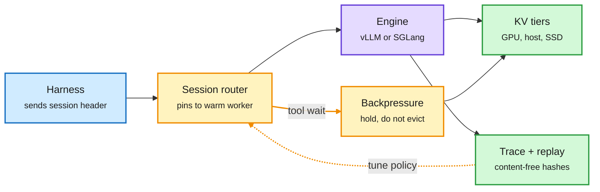

# Session-aware agentic inference: Dynamo, FlexKV and real agent traces (2026-10-09)

**Sources:** "Session-Aware Agentic Inference with NVIDIA Dynamo", PyTorch blog, 2026-10-08, by Ishan Dhanani, Jamie Li, Karen Chung ([blog](https://bit.ly/4emlt21), via [@PyTorch](https://x.com/PyTorch/status/2108271337126957396), X home feed). "Deploying an HSTU Generative Recommender with NVIDIA Dynamo-Triton" ([NVIDIA blog](https://developer.nvidia.com/blog/deploying-an-hstu-generative-recommender-with-nvidia-dynamo-triton/), via [@PyTorch](https://x.com/PyTorch/status/2108301469107577213)). Agentic inference trace dataset ([RT via Hugging Face](https://x.com/huggingface/status/2108202639658013150)). H Company on serving VLMs for computer-use agents with Dynamo ([NVIDIA AI](https://x.com/NVIDIAAI/status/2108150471089426730)). Vendor blogs; no independent benchmarks.

**TL;DR.** Agent traffic does not look like chat. A coding session opens with tens of thousands of prefill tokens (system prompt, tools, guidance), resends the whole growing context every turn, fans out into subagents, and spends most of its wall-clock time waiting on tools while its KV cache (the saved attention state) sits idle on the GPU. Serving stacks route, admit and cache each request alone, with no idea which session it belongs to. Dynamo's answer is one primitive: a **session ID** (and parent session ID for subagents). Claude Code, Codex and OpenCode already send headers that Dynamo maps to it; custom harnesses add one header (`X-Dynamo-Session-ID`). On top of that ID Dynamo builds: session-linked traces that replay offline (AISimulate) or live (AIPerf) without storing prompt text; session-aware routing and admission that apply backpressure at tool boundaries to cut cache thrashing; a shared-pool indexer so the router knows about reusable KV in external stores; and a proposed **KvHint** interface where the orchestrator states cache intent per session and the engine (vLLM, SGLang) decides execution across memory tiers.

The cache stops being per request and becomes per session

One stable ID lets routing, admission and cache placement see the whole agent run.

Blue is the harness, amber the session-aware decisions, purple the engine, green the cache tiers and traces.

## Key points

- **It answers yesterday's routing result directly.** On 10-08 Arena measured Jev Router at 38% higher cost than one cheap model, and the wiki traced part of that to lost prefix cache when a router switches models mid-session ([routing graded](../ai-routing/2026-10-08-routing-graded-jev-router-local-routing.md)). Session pinning is the serving-side fix: route by session first, by query second.
- **Tool-boundary backpressure is the new idea.** Admission control that knows a session is waiting on a tool can hold its cache instead of evicting it, then admit the next turn into a warm worker. This is the infra version of FOCUS and KV-streams (10-03), which attacked agent context from the model side.
- **KvHint splits policy from mechanism.** The orchestrator says what to keep; the engine says how. If it lands upstream, every harness gets cache control without a proprietary API.
- **Same story in recommenders.** NVIDIA's HSTU workflow stores reusable attention state for long user histories in FlexKV: an eight-layer model on an RTX PRO 6000 Blackwell gets up to **5.93x lower latency at batch 8** with a 100% GPU KV hit rate (best case, not a realistic hit rate).
- **Real workloads arrived the same day.** A public agentic inference dataset (206B tokens, 12,002 sessions, 1.19M LLM requests, 1.21M tool calls) is exactly the backtesting data Dynamo's replay tools need, and that cache-eviction research has lacked.
- **Storage tier evidence.** Same day, [galahad-kv](2026-10-09-galahad-kv-50m-token-nvme-memory.md) showed loading saved KV blocks from NVMe is 2.8-4.3x faster than recomputing them.

## Gaps

- No end-to-end numbers in the captured part of the blog: no hit rate, latency or cost per session against request-level routing.
- KvHint is a proposal, not merged.
- Session IDs from commercial harnesses work only because those harnesses happen to send them; privacy and spoofing are not discussed.

## Related

[KV cache](kv-cache.md) · [LLM routing](../ai-routing/llm-routing.md) · [Agent harness engineering](../agentic-systems/agent-harness-engineering.md) · [Memory hierarchy](../hardware/memory-hierarchy.md)
