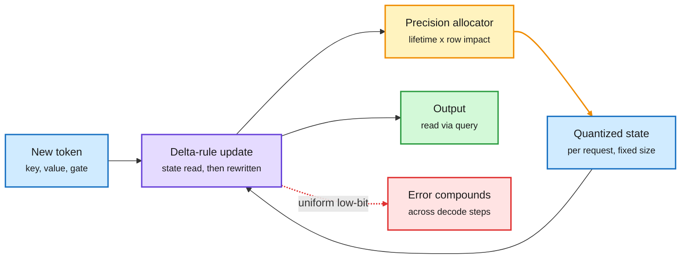

# STEPQuant: quantizing the recurrent state of linear-attention hybrids (2026-10-09)

**Source:** HuggingFace Daily Papers 2026-10-08, the day's #1 paper (103 upvotes). STEPQuant ([arXiv 2609.38169](https://arxiv.org/abs/2609.38169), [raw](../../raw/huggingface/2026-10-08-stepquant-when-and-where-errors-matter-in-delta-rule-recurre.md), [code](https://github.com/Dreamer-Toby/STEPQuant)). Zhejiang, Tsinghua, CASIA, CityU, Harvard, CUHK. alphaxiv overview read (truncated); claims below are from the abstract unless marked.

**TL;DR.** Linear attention (layers that summarize the past in a fixed-size matrix instead of a growing KV cache) is what makes hybrid models like Qwen3.8 and Kimi-Linear cheap at long context. But that fixed-size state is kept per request, in FP32, so under concurrent serving the state pool becomes a big memory line of its own. The alphaxiv overview reports that in SGLang the FP32 state pool for Qwen can exceed the BF16 weights at about 70 concurrent requests. Naive low-bit quantization of the state fails because the state is rewritten every token: each update reads an approximate state, adds new error, and stores it. STEPQuant allocates precision along two axes. **Temporal:** how long an entry lives before the gate forgets it (long-lived memory carries its error for many steps). **Spatial:** which key rows actually move the output, with scales fitted jointly per key row and per value column. Result: at a nominal 6 bits it closely matches FP32-state accuracy on Qwen3.8-27B and Kimi-Linear-48B-A3B; its 4-bit setting beats uniform INT8. In SGLang with custom kernels, 6-bit STEPQuant gives **over 5x state compression and up to 68.7% less total serving memory**.

Spend bits where errors live long and matter most

The state is rewritten every token, so error placement over time matters as much as error size.

Blue is input and stored state, purple the recurrent update, amber the bit allocator loop, green the output, red the failure mode of uniform quantization.

## Key points

- **This is KV-cache quantization's logic, moved to the one memory that hybrids kept.** The [KV cache page](kv-cache.md) has tracked 2-bit KV recipes all month (PrismQuant 10-01, WUSH-KV 10-02, QuantWM 10-06). Hybrids removed most of the KV cache, but their recurrent state is the new per-request cost. STEPQuant is the first wiki entry that quantizes it with an explicit error-propagation model.
- **Same lesson as QuantWM (10-06), different object.** QuantWM found that 2-bit Key errors hurt more than Value errors because they change which past tokens attention selects. STEPQuant finds that errors in some key rows and in long-lived state entries hurt more. Both say reconstruction error is the wrong target; impact on the readout is the right one. See [quantization](quantization.md).
- **Concurrency, not context length, is the cost driver.** The state is constant per request, so the savings grow with batch size. That makes this a serving-throughput result more than a long-context result.
- **Read with Mechanics of Hybrid Models 1.1 (same day).** That paper shows linear-attention hybrids win under long-context continual pretraining ([hybrid mechanics](../llms-foundation-models/2026-10-09-hybrid-mechanics-rlt-cmm.md)). If LA hybrids become the default, their state is where the next round of compression lands.

## Gaps

- Only Delta-rule states (Gated DeltaNet, KDA family). Mamba-style SSM states and triadic 3D states (10-06) are untested.
- The comparison with concurrent DAMP (decay-based FP16 protection plus INT8) is not controlled, per the overview.
- No throughput-per-GPU number at fixed latency, only memory.

## Research angle

The allocator uses gate decay as a proxy for error lifetime. A learned or online estimate (track which state rows the query actually reads at decode time) could allocate bits per request rather than per layer. Second: does state quantization compose with prefix caching of recurrent states (snapshotting the state at a shared prefix)? Snapshots are what serving stacks will want to store on SSD.

## Related

[Quantization](quantization.md) · [KV cache](kv-cache.md) · [Attention mechanisms](../llms-foundation-models/attention-mechanisms.md) · [QuantWM (10-06)](2026-10-06-quantwm-2bit-kv-world-models.md)
