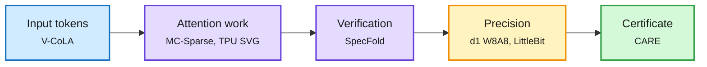

# Efficiency shorts (2026-10-10)

**Sources:** HuggingFace Daily Papers 2026-10-09 (raw files under `raw/huggingface/2026-10-09-*`); AI lab watcher ([raw](../../raw/labs/2026-10-10-015358-labs.md)); X home feed. Abstracts, model cards and lab posts.

**TL;DR.** The day's smaller efficiency results, grouped by where the saving comes from. Several extend threads the wiki already tracks: linear-attention hybrids need their own compression rules, looping is becoming a test-time compute knob, and acceleration needs a quality certificate.

Where today's savings come from

Fewer tokens, less recomputation across branches or steps, lower precision, and a guarantee that speed did not break the task.

Blue is the input stage, purple the compute stages, amber precision, green the safety check on the whole stack.

## Token and attention reduction

- **V-CoLA** ([arXiv 2610.11251](https://arxiv.org/abs/2610.11251)): vision-token compression built for linear-attention hybrids like Qwen3.5, where softmax-era pruning (attention scores, similarity) degrades. A uniqueness-aware importance score plus adaptive merging, kept compatible with chunk-wise linear attention. 99.5% of performance at 50% of vision tokens, over 88% at 12.5%, 1.86-6.15x prefill speedup. Second paper in two days (after STEPQuant, 10-09) showing hybrids need their own compression playbook.
- **MC-Sparse** ([arXiv 2610.06801](https://arxiv.org/abs/2610.06801)): traces sparse-attention quality loss in diffusion transformers to three causes (token-grouping constraints, wrong interaction selection, lost contributions of dropped tokens), then selects individual KV tokens, groups similar queries into GPU tiles, and caches the selection plus dense-minus-sparse residuals across denoising steps. 1.80x denoising speedup on Minimax-H3-Base, 2.32x on 3D asset generation, training-free.
- **Spatio-temporal attention on TPUs** (Google Developers, [post](https://developers.googleblog.com/accelerating-spatio-temporal-attention-for-video-diffusion-on-tpus/)): at 1440p, attention grows from 55.5% to 88.2% of a video-diffusion layer's latency; head-type-aware token ordering (spatial vs temporal heads, after Sparse VideoGen) turns theoretical sparsity into an end-to-end TPU v6e speedup.
- **SpecFold** ([arXiv 2610.04875](https://arxiv.org/abs/2610.04875)): in diffusion LLMs, multi-branch speculative verification recomputes nearly identical hidden states across branches. Token-level residual gating reuses the parent's attention and FFN computation; Triton kernels make it real. Up to 1.64x over Spiffy and 1.99x over vanilla decoding. Orthogonal to temporal caching. Extends the [speculative decoding](speculative-decoding.md) page's "verification is the new cost" thread (DLoop, 10-09).

## Precision and on-device

- **LiquidAI d1-3B-w8a8** ([model card](https://huggingface.co/LiquidAI/d1-3B-w8a8)): the INT8 (weights and activations) build of Liquid's 3B decision model, quantized ahead of time with torchao so it loads with no calibration; 3.8 GB vs 6.2 GB bf16, for Jetson and Ampere-or-newer INT8 tensor cores. Calibrated typed answers in one forward pass, zero output tokens. A decision model built to run as an edge router.
- **Samsung LittleBit** (X feed, [post](https://x.com/0x0SojalSec/status/2108325521016934789)): a claimed 0.1 bits per weight that squeezes a 13B model under 1 GB, with sign flips and XOR replacing multiplies and "up to 11.6x" faster inference. Circulating for a second day with no accuracy figure; treat as unverified.
- **Google ML Drift** ([post](https://developers.googleblog.com/ml-drift-next-gen-gpu-aiml-inference-at-the-edge/)): open-sourced (Apache 2.0) on-device GPU engine behind LiteRT, spanning OpenGL ES, OpenCL, Metal and WebGPU, with shader unification via tensor virtualization. The edge counterpart to Uzu's Apple-silicon speculative decoding (live draft Media Zone).
- **Ai2 byteification in Nature** ([post](https://allenai.org/blog/bolmo-nature)): converts subword models into byte-level ones with a short extra run; new Bwen 8B (from Qwen 3 8B) and Blama 8B come close to their sources, and Stage 1 checkpoints are released.

## Certifying acceleration

- **CARE** ([arXiv 2610.08917](https://arxiv.org/abs/2610.08917)): accelerating a vision-language-action policy can break tasks the original would solve, and average success hides it. CARE runs paired rollouts from identical starts on a calibration set and gives a finite-sample guarantee that acceleration-induced failures stay under a budget, deploying the fastest certified option or falling back to the reference. On LIBERO with OpenVLA-OFT it certifies 9.0-10.8x speedups while preserving at least 85.8% of reference-solved episodes at 95% confidence; uncertified selectors blew the budget in up to 75% of trials. Also works for Qwen3.5-9B and Llama-3.1-8B agents. A general recipe for any compression or routing deployment, and the missing piece for the "gains on average, breaks per task" problem the routing page has logged twice this week.

## Looping as a compute knob

- **InfiLoop** ([arXiv 2610.11570](https://arxiv.org/abs/2610.11570)): looped transformers degrade as loops grow because noisy updates overwrite correct intermediate states. A loop-native residual (content weighting plus learned temporal decay, constant memory) lets a 7M model keep improving past 20,000 effective steps on Sudoku-Extreme (97.9%) and reach 13.6% pass@2 on ARC-AGI-2.
- **SanSi** ([arXiv 2610.07730](https://arxiv.org/abs/2610.07730)): a looped *decision* model, "System 1.5": loop the same layers 1-8 times before one typed readout, every loop trained with a proper scoring rule so one model serves every budget. 72.0% on 10,027 decisions from 59 sources, 13.5 points over a non-looped twin and 1.8 below a 3x larger model; as an RL judge without gold answers it lifts the generator's F1 by 7.7. Links the [looped transformers](../llms-foundation-models/looped-transformers.md) and decision-model threads.

## Infrastructure

- **Ai2 GPU scheduling** ([post](https://allenai.org/blog/impactful-scheduling)): thousands of H100/B200/B300 GPUs face 2-3x oversubscription. Priority scheduling produced GPU squatting and 100% HIGH-priority inflation; Ai2 replaced it with GPU-time budgets, hierarchical fair share and a time-slicing contract, turning allocation into an administrative budget.
- **Huawei OceanStor M900 Context Memory Storage** ([post](https://x.com/IT_Huawei/status/2108025288080941456)): a storage product pitched specifically for shared KV/context capacity in AI data centers, the vendor side of the storage-tier KV thread (galahad-kv, 10-09).

## Related

[Speculative decoding](speculative-decoding.md) · [Quantization](quantization.md) · [Model pruning and sparsity](model-pruning-sparsity.md) · [KV cache](kv-cache.md)
