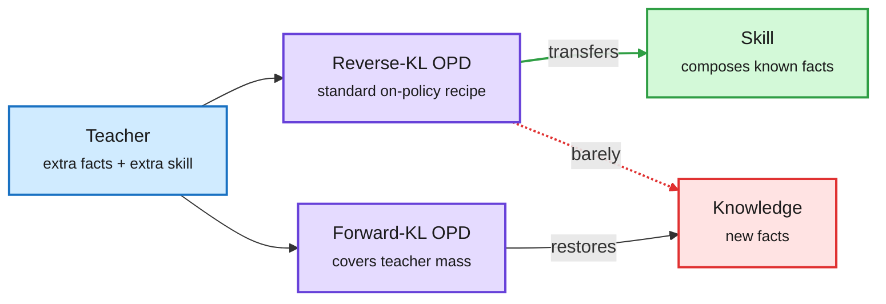

# On-policy distillation teaches skills, not knowledge (2026-10-10)

**Sources:** HuggingFace Daily Papers 2026-10-09: On-Policy Distillation Teaches New Skills but Not New Knowledge ([arXiv 2610.09639](https://arxiv.org/abs/2610.09639), [raw](../../raw/huggingface/2026-10-09-on-policy-distillation-teaches-new-skills-but-not-new-knowle.md)); SGUID, Which Skill to Distill? ([arXiv 2610.12367](https://arxiv.org/abs/2610.12367), via [@rohanpaul_ai](https://x.com/rohanpaul_ai/status/2108755803133903259)). Abstracts and posts.

**TL;DR.** OPD (on-policy distillation: the student generates its own answers and the teacher scores every token) is known to improve reasoning. This paper asks *what* it transfers. In a controlled synthetic setup where the teacher knows extra facts, extra compositional skill, or both, reverse-KL OPD (the standard loss, which pushes the student toward the teacher's high-probability modes) reliably transfers **compositional skill** to unseen reasoning structures but **almost no factual knowledge**. Swap reverse KL for forward KL and facts transfer again; student rollouts specifically improve multi-step execution. On real factual QA and competition math the same asymmetry holds: reasoning gains with no growth in factual memory.

The loss decides what crosses from teacher to student

Reverse KL moves the skill; forward KL is needed for the facts.

Blue is the teacher, purple the two losses, green what transfers, red what reverse KL misses.

## Key points

- **Mechanism, not just outcome.** Reverse KL is mode-seeking: it rewards the student for putting mass where the teacher is confident, and a fact the student has never seen has near-zero student probability, so it never gets sampled and never gets credit. Forward KL penalizes missing the teacher's mass, so facts come through.
- **SGUID (NYU and Amazon), same window:** before distilling a skill bank, log which skills keep producing a useful training signal and keep only those; a small, steady set matches or beats a bank up to 11x larger.

## How it relates to the wiki

- **Explains yesterday's "Gains and Collapse" result** ([OPD teacher-as-reward, 10-09](2026-10-09-opd-teacher-as-reward-cluster.md)), which found OPD sharpens sampling without adding capability. Today's paper says which capability: it sharpens the composition of what the student already knows.
- **Pattern (n=3 in two weeks):** OPPD (10-07) distils a sharpened distribution, Gains and Collapse (10-09) calls OPD an implicit reward, and today's paper shows it organizes rather than adds. OPD is a compressor of search over existing knowledge, not a knowledge-transfer channel. See [Knowledge distillation](knowledge-distillation.md).
- **Practical consequence for compression:** distilling a frontier model into a small one with on-policy reverse KL will not move its world knowledge. Factual coverage needs a forward-KL or SFT phase first, consistent with the "start from SFT" fix in Gains and Collapse.

## Gaps

- Synthetic facts are cleaner than real knowledge; the real-data check is coarse.
- Model scale and family coverage (four models, three families) are small.

## Related

[Knowledge distillation](knowledge-distillation.md) · [RL for LLMs](../llms-foundation-models/rl-for-llms.md)
