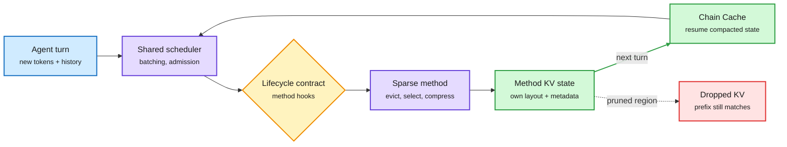

# SparseEngine: one serving engine for every sparse-KV method (2026-10-10)

**Sources:** HuggingFace Daily Papers 2026-10-09: SparseEngine, Harbin Institute of Technology ([arXiv 2609.39068](https://arxiv.org/abs/2609.39068), [code](https://github.com/CURRENTF/SparseEngine), [raw](../../raw/huggingface/2026-10-09-sparseengine-sparse-first-inference-engine.md)); alphaxiv overview.

**TL;DR.** Long agent sessions grow the KV cache (the stored attention keys and values for every past token) until it fills GPU memory and slows each decode step. There are four families of fixes: dynamic sparse attention (Quest, OmniKV: read only some of the cache), eviction (SnapKV, H2O: delete entries), compression (Palu, DeltaKV) and quantization (KIVI, TurboQuant). Each needs its own metadata, layout and update rules, so serving engines support one or two. SparseEngine is built sparse-first: shared infrastructure does scheduling and batching, and each method owns its KV representation through a common **lifecycle contract**. It supports 15 methods across the four families. Two agent-specific features: **Chain Cache** resumes an eviction method from the compacted state it kept last turn (normal prefix caching assumes the full prefix still exists), and **Prefix-Cache Pruning** removes KV from chosen history regions while keeping the logical prefix matchable. Over 10x throughput with KV eviction, over 2.5x faster decode than vLLM at matched concurrency, over 2x end-to-end on agent benchmarks.

The engine owns scheduling; each method owns its cache

Chain Cache lets an evicted cache survive to the next agent turn.

Blue is the incoming turn, purple the shared engine and the method, amber the contract, green kept state, red pruned KV.

## How it relates to the wiki

- **Session-level reuse, from the method side.** Yesterday's [session-aware Dynamo (10-09)](2026-10-09-session-aware-agentic-inference-dynamo.md) kept a waiting agent's cache resident; [galahad-kv (10-09)](2026-10-09-galahad-kv-50m-token-nvme-memory.md) parked byte-exact blocks on NVMe. Both assume the cache is full. Chain Cache is the first engine feature on this page that carries an *already-evicted* cache across turns. The [KV cache](kv-cache.md) page's "who decides what a session keeps" question gets a third answer: the sparse method itself.
- **Pairs with today's TokenRouter** ([10-10](../ai-routing/2026-10-10-tokenrouter-token-level-routing-serving.md)): both papers say engines built around one cache layout and one request rhythm are the bottleneck, and both fix it by letting a plug-in own its state while the engine keeps the schedule.

## Gaps

- The headline speedups compare methods it enables against engines that cannot run them; method-for-method quality vs a tuned vLLM baseline is less clear from the abstract.
- Chain Cache's quality depends on whether an eviction choice made for turn N is still right for turn N+1, the same "compaction is a bet" problem raised by Prime Intellect's swarm essay ([10-10](../agentic-systems/2026-10-10-context-compaction-remory-and-the-swarm.md)).

## Related

[KV cache](kv-cache.md) · [Model pruning and sparsity](model-pruning-sparsity.md)
