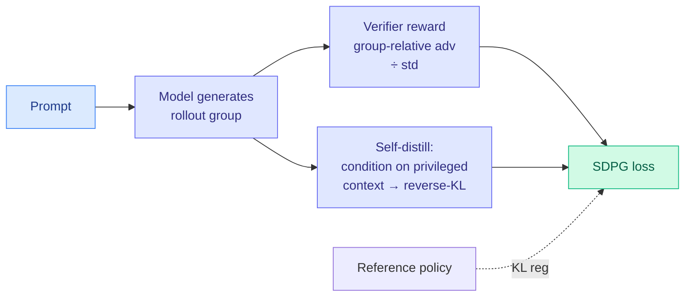

# Self-Distilled Policy Gradient (SDPG)

**Source:** HuggingFace Daily Papers
**arxiv:** [2606.04036](https://arxiv.org/abs/2606.04036)
**Date:** 2026-06-04
**Raw:** [raw/huggingface/2026-06-04-self-distilled-policy-gradient.md](../../raw/huggingface/2026-06-04-self-distilled-policy-gradient.md)
**Tier:** 2 (RL for LLMs; intersects efficiency)

## TL;DR

Reinforcement learning with verifiable rewards (RLVR) gives sparse supervision: one reward per trajectory. SDPG adds a dense supervision signal by letting the model condition on privileged context to supervise its own generations, instantiated as a full-vocabulary student-to-teacher reverse-KL loss. It combines group-relative verifier advantages (normalized by standard deviation), exact full-vocabulary on-policy self-distillation, and reference-policy KL regularization. The result is more stable and higher-performing than RLVR and self-distillation baselines alone.

## Diagram

## Key findings

1. **Dense signal on top of sparse reward.** On-policy self-distillation (the model conditions on privileged context and supervises itself) supplies per-token supervision where RLVR gives only a per-trajectory reward.
2. **Full-vocabulary reverse-KL,** not a cheap estimator — the authors use the exact loss, sidestepping the biased-estimator gradient pathologies that destabilize approximate OPD.
3. **Three coupled terms:** group-relative verifier advantage with std normalization, the self-distillation reverse-KL, and reference-policy KL regularization, together improving stability and performance over both RLVR and self-distillation baselines.

## Relation to prior wiki state

SDPG sits at the intersection of the two biggest live threads:

- **Privileged-context self-supervision.** The "condition on privileged information to supervise yourself" move is the same trick the wiki tracked in D-OPSD (05-07) and PF-OPSD (06-03, world-model futures as teacher-side privileged context, never seen at test). SDPG applies it within RLVR rather than across modalities.
- **Self-distillation as a stabilizer in long RL.** MAI-Thinking-1 (06-03) used self-distillation from its own earlier checkpoints to resume crashed RL runs. SDPG makes self-distillation a first-class auxiliary loss inside the policy gradient, not just a recovery mechanism.

It also lands the same day as FiRe-OPD and ThoughtFold — three papers all attacking the density and selectivity of the learning signal in reasoning training. Where FiRe-OPD filters and reweights teacher tokens, SDPG manufactures a dense teacher from the model's own privileged-conditioned self.

## Why it matters

Sparse reward is the central pain of RLVR: most of a long reasoning trajectory gets no gradient. A principled dense auxiliary that does not require a separate teacher model is attractive for any team running RLVR at scale, especially given Microsoft's bet (MAI-Thinking-1) that you should not depend on third-party teachers at all. SDPG is a way to get dense supervision while staying self-contained.

## Gaps

The privileged-context construction and its cost are not foregrounded against plain RLVR; whether the full-vocabulary reverse-KL stays affordable at frontier vocab sizes and long context is the practical question.

## Links

- [Paper](https://arxiv.org/abs/2606.04036) · [code](https://github.com/lauyikfung/SDPG)
- Related: [FiRe-OPD 2026-06-04](../inference-efficiency/2026-06-04-fire-opd-filter-then-reweight.md), [TrOPD 2026-06-03](../inference-efficiency/2026-06-03-tropd-trust-region-on-policy-distillation.md), [PF-OPSD 2026-06-03](../vision-audio-video/2026-06-03-world-models-meet-language-models.md)
- Concept: [RL for LLMs](rl-for-llms.md), [knowledge distillation](../inference-efficiency/knowledge-distillation.md)
