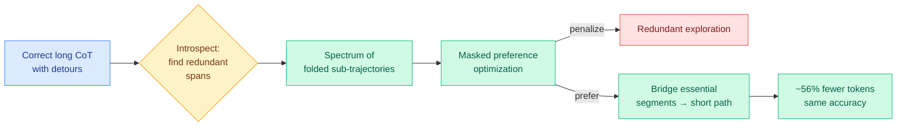

# ThoughtFold: Folding Reasoning Chains via Introspective Preference Learning

**Source:** HuggingFace Daily Papers
**arxiv:** [2606.03503](https://arxiv.org/abs/2606.03503)
**Date:** 2026-06-04
**Raw:** [raw/huggingface/2026-06-04-thoughtfold-folding-reasoning-chains-via-introspective-prefe.md](../../raw/huggingface/2026-06-04-thoughtfold-folding-reasoning-chains-via-introspective-prefe.md)
**Tier:** 2 (reasoning efficiency; intersects Tier 1)

## TL;DR

Large reasoning models trained with RLVR on chains of thought (CoT) over-think: because RLVR rewards outcome-correct trajectories, and correct long CoTs are full of trial-and-error detours, the training reinforces the redundant exploration along with the answer. ThoughtFold cuts this with fine-grained preference learning. It introspectively identifies redundant spans inside each correct trajectory, generates a spectrum of shorter sub-trajectories, and uses a masked preference objective that penalizes redundancy and rewards directly bridging the essential reasoning steps. It cuts DeepSeek-R1-Distill-Qwen-7B token usage by ~56% while keeping accuracy.

## Diagram

## Key findings

1. **The over-thinking cause is structural, not incidental.** Outcome-based RLVR memorizes whole correct trajectories, so the redundant exploration inside them is reinforced too. Prior fixes that just give shorter trajectories more advantage stay outcome-based and cannot un-learn the redundancy.
2. **Introspective span identification + masked preference.** ThoughtFold finds the redundant spans within a correct trace and learns a preference to fold them out, directly bridging the load-bearing segments.
3. **~56% token reduction on DeepSeek-R1-Distill-Qwen-7B** at state-of-the-art accuracy.

## Relation to prior wiki state

ThoughtFold is the reasoning-trace instance of the **"signal is sparse and locatable, train on the load-bearing part"** thread that dominated early June. Where VaSE (06-03) located the load-bearing part in KV value states, and Harmful Continuation (06-03) located the *harmful* part in the post-conclusion span of a CoT, ThoughtFold locates the *redundant* part inside the reasoning and folds it out. It is the efficiency-at-inference payoff of the same span-level view: a 56% token cut is a 56% inference-cost cut on reasoning workloads.

It is also the structural counterpart to test-time-budget work like the Small RL Controller (06-03, learn when to stop sampling): the controller spends fewer rollouts, ThoughtFold makes each rollout shorter. Both attack the cost of reasoning, from different ends.

## Why it matters

Reasoning models are expensive precisely because the chains are long, and most of that length is detour. A training-time fold that halves token usage without losing accuracy is one of the highest-leverage efficiency wins available, because it compounds across every inference call. It is more durable than inference-time truncation because the model learns to be concise rather than being cut off.

## Gaps

Shown on a 7B distilled model and on the trajectory's own redundancy; whether folding generalizes to harder problems where the "redundant" exploration is actually load-bearing for some inputs is the risk. No test of whether aggressive folding hurts the model's ability to recover from a wrong initial step.

## Links

- [Paper](https://arxiv.org/abs/2606.03503)
- Related: [Harmful Continuation 2026-06-03](2026-06-03-harmful-continuation-long-cot-sft.md), [Small RL Controller 2026-06-03](../inference-efficiency/2026-06-03-small-rl-controller-adaptive-sampling.md), [FiRe-OPD 2026-06-04](../inference-efficiency/2026-06-04-fire-opd-filter-then-reweight-distillation.md)
- Concept: [RL for LLMs](rl-for-llms.md)
