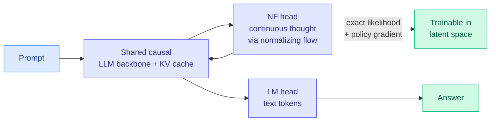

# NF-CoT: Latent Reasoning with Normalizing Flows

**TL;DR.** Textual chain-of-thought (CoT) forces every reasoning step through a discrete, serial token stream: the model must verbalize each step before continuing, even when the underlying update is semantic and only partially formed. Latent reasoning computes in continuous states instead, but prior latent methods gave up the things that make CoT work in autoregressive LLMs: left-to-right generation, probabilistic sampling, KV-cache compatibility, and tractable likelihoods. **NF-CoT** keeps all of them by modeling continuous thoughts with a TARFlow-style normalizing flow inside the LLM backbone. An NF head generates continuous-thought positions; the standard LM head generates text positions in the same causal stream. The flow gives exact likelihoods for latent thoughts, probabilistic left-to-right decoding with the original KV cache, and direct policy-gradient optimization in latent space. On code generation it beats explicit CoT and prior latent baselines while cutting intermediate-reasoning cost.

**Source:** HuggingFace Daily Papers (upvotes: 1)
**arxiv:** [2606.06447](https://arxiv.org/abs/2606.06447)
**Raw:** [raw/huggingface/2026-06-05-latent-reasoning-with-normalizing-flows.md](../../raw/huggingface/2026-06-05-latent-reasoning-with-normalizing-flows.md)

## Key points

- **The CoT tax NF-CoT removes.** Verbalizing each reasoning step is a communication bottleneck; semantic updates get serialized into tokens even when they need not be. NF-CoT does the intermediate computation in compact continuous thoughts and only commits to text when it must.
- **What it keeps that prior latent methods lost.** A normalizing flow is an invertible model with a tractable density, so continuous thoughts get *exact* likelihoods (not a variational bound), can be sampled probabilistically, decode left-to-right reusing the original KV cache, and are optimizable by policy gradient directly in latent space.
- **Mechanism.** A TARFlow-style flow runs inside the backbone; continuous-thought positions distilled from explicit CoT are produced by the NF head, text positions by the LM head, both in one causal stream.
- **Result.** Higher code-generation pass rates than explicit-CoT and prior latent-reasoning baselines, at substantially lower intermediate-reasoning cost.

## How this relates to prior wiki knowledge

NF-CoT is the third recent latent-reasoning entry the wiki has logged, and it directly addresses the limitation of the prior two. [GLR (Geometric Latent Reasoning, 06-02)](2026-06-02-glr-geometric-latent-reasoning.md) reasoned on a learned manifold; [ThoughtFold (06-04)](2026-06-04-thoughtfold-folding-reasoning-chains.md) kept text CoT but folded out redundant spans to cut tokens ~56%. NF-CoT's contribution is *infrastructural*: it is the first latent-reasoning method that stays fully compatible with the autoregressive serving stack (KV cache, left-to-right sampling, exact likelihood for RL). That compatibility is the thing that has kept latent reasoning out of production, so the result matters more than its single-upvote popularity suggests.

The cost angle ties it to the efficiency program: reasoning in compact continuous thoughts instead of verbose token chains is a different lever on the same problem [CLEAR (06-05)](../inference-efficiency/2026-06-05-clear-shadow-price-reasoning-budget.md) and ThoughtFold attack. ThoughtFold shortens the text chain; CLEAR rations chain length across queries; NF-CoT moves part of the chain off the token stream entirely.

## Gaps

- Demonstrated on code generation only; math and open-ended reasoning, where CoT's verbalization may carry more load, are untested.
- Distilling continuous thoughts *from* explicit CoT means the method still needs a text-CoT teacher; whether latent reasoning can be learned without that scaffold is open.

## Research angle

Exact likelihoods plus policy-gradient access in latent space is the enabling combination: it means RLVR could be run directly on continuous thoughts rather than on token sequences. If that works, the verifier reward could shape latent reasoning without ever materializing the chain as text, which would make reasoning both cheaper and harder to audit. Watch for an RLVR-on-latent-thoughts result and, in parallel, for interpretability work asking what these continuous thoughts encode.

## Related pages
- [2026-06-02-glr-geometric-latent-reasoning.md](2026-06-02-glr-geometric-latent-reasoning.md)
- [2026-06-04-thoughtfold-folding-reasoning-chains.md](2026-06-04-thoughtfold-folding-reasoning-chains.md)
- [rl-for-llms.md](rl-for-llms.md)
