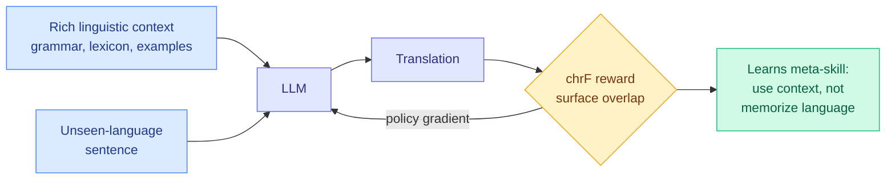

# Reinforcement Learning Elicits Contextual Learning of Unseen Language Translation

**TL;DR.** LLMs can translate low-resource or unseen languages either by continued training or by stuffing a grammar book into context, but both overfit specific languages and transfer poorly zero-shot. This paper argues the real target is a **meta-skill**: using in-context linguistic knowledge rather than memorizing any one language. It trains that skill with reinforcement learning using a lightweight surface-level reward (chrF, a character-n-gram overlap score) and shows the RL-trained model learns to *extract and apply* the linguistic context provided, beating in-context learning and supervised fine-tuning on completely unseen languages. The takeaway is broader than translation: outcome-based RL can teach in-context exploitation, extending RLVR beyond math and code.

**Source:** HuggingFace Daily Papers (upvotes: 19 — highest today)
**arxiv:** [2606.06428](https://arxiv.org/abs/2606.06428)
**Raw:** [raw/huggingface/2026-06-05-reinforcement-learning-elicits-contextual-learning-of-unseen.md](../../raw/huggingface/2026-06-05-reinforcement-learning-elicits-contextual-learning-of-unseen.md)

## Key points

- **The framing shift.** Don't teach the model a language; teach it to *use* the linguistic context it's given. Continued training and grammar-in-context both memorize specific languages and don't transfer; the meta-skill does.
- **Lightweight reward works.** chrF is a crude surface metric, yet outcome-based RL on it is enough to make the model extract and apply the relevant grammar/lexicon from context, beating ICL and SFT on unseen languages.
- **Generalization claim.** The paper positions this as evidence that RL can elicit *contextual learning* as a general capability, not just reasoning, broadening the RLVR recipe to language acquisition from context.

## How this relates to prior wiki knowledge

This is an [rl-for-llms](rl-for-llms.md) result that widens RLVR's domain. The wiki's RLVR thread has been almost entirely about reasoning verifiers (math/code correctness) and the stabilization machinery around them (see the [knowledge-distillation](../inference-efficiency/knowledge-distillation.md) page's TrOPD/SDPG entries, and [ThoughtFold's](2026-06-04-thoughtfold-folding-reasoning-chains.md) finding that outcome RLVR memorizes whole CoTs). Here the verifiable reward is a translation-quality metric, and the skill RL elicits is *in-context exploitation* rather than chain-of-thought. That connects it to today's self-evolving-agents cluster, whose keystone [Continual Experience Internalization](../agentic-systems/2026-06-05-continual-experience-internalization.md) found that principle-level (abstract, transferable) experience is durable while instance-level is not. This paper is the same lesson on the language axis: train the abstract skill of using context, not the instance of a particular language.

The chrF result also rhymes with [RL Elicits weak-supervision reasoning faithfulness (04-21)](2026-04-21-rlvr-weak-supervision-reasoning-faithfulness.md): a coarse or weak reward can still elicit a sophisticated capability, because RL shapes behavior toward the signal rather than imitating a target.

## Gaps

- chrF rewards surface overlap, which can be gamed by literal/cognate-heavy output; whether the meta-skill survives a semantic-fidelity metric or human eval is untested.
- "Unseen language" still relies on rich provided context; how the skill degrades as the context (grammar/lexicon) thins toward genuinely under-documented languages is the real-world test.

## Research angle

The interesting general claim is that outcome-based RL can train *how to learn from context* as a transferable skill. If that holds, the recipe ports to any task where a model is handed a spec and must apply it zero-shot: a new tool's documentation, a novel API, a fresh policy. The signal to watch is a paper showing RL-elicited in-context exploitation transferring across task families (translation → tool use → novel-format reasoning) from one trained meta-skill.

## Related pages
- [rl-for-llms.md](rl-for-llms.md)
- [../agentic-systems/2026-06-05-continual-experience-internalization.md](../agentic-systems/2026-06-05-continual-experience-internalization.md)
