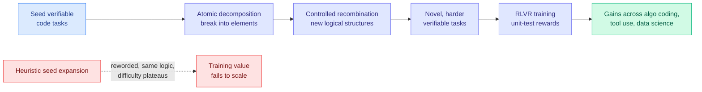

# Combinatorial Synthesis: Scaling Code RLVR via Atomic Decomposition and Recombination (ADR)

**TL;DR.** Reinforcement Learning with Verifiable Rewards (RLVR, where each rollout earns one scalar reward from a deterministic checker like a unit test) is the engine behind LLM coding ability, but it starves on data: it needs tasks that are hard enough to sit right at the model's competence edge, and there are not enough of those. Prior synthetic-data recipes expand seed problems with heuristics that add surface variety but preserve the original logical structure, so difficulty does not scale with quantity. ADR generates genuinely novel, harder verifiable tasks by **decomposing seed tasks into atomic elements and recombining them under control**, producing new logical structures rather than reworded versions of old ones.

**Source:** HuggingFace Daily Papers · arxiv [2605.31058](https://arxiv.org/abs/2605.31058) (Institute of Software, Chinese Academy of Sciences)

## What it is

ADR (Atomic Decomposition and Recombination) is a data-synthesis framework for the RLVR stage of code training. It breaks existing verifiable coding tasks down into atomic elements (the primitive logical pieces a problem is built from) and then recombines those pieces under controlled rules to assemble new problems. Because the recombination changes the *compositional structure* rather than rephrasing the prompt, the synthesized tasks carry novel logic and tunable difficulty, and each comes with the verifiability (executable tests) that RLVR requires.

## What problem it solves

RLVR's payoff depends on training tasks that are difficult enough to challenge the model's current exploration policy. Real challenging tasks are scarce, and the standard fix (model-driven or heuristic expansion of seed problems) increases linguistic diversity while keeping the underlying logical structure intact. So you can synthesize a million tasks and still not move the difficulty needle, and the training value does not scale with the amount of data generated. ADR is built specifically to make logical novelty and difficulty scale with synthesis volume.

## Key results

- ADR-synthesized tasks score higher on **originality, difficulty, diversity, and test quality** than existing synthetic-data baselines.
- RLVR training on ADR data delivers **larger downstream gains across multiple domains**: algorithmic programming, tool usage, and data science, not just the seed domain.
- Frames a new paradigm: synthesize at the level of *atomic logical structure*, not problem surface.

## How it relates to prior wiki knowledge

ADR is a data-side answer to a tension the wiki has been tracking on the reward side. Kurate's cs.LG board this week flags "LLMs Gaming Verifiers: RLVR can Lead to Reward Hacking" (the recurring caution that verifiable rewards invite gaming when tasks are weak or tests are shallow). ADR pushes the opposite lever: rather than patching the reward, it raises task quality and test quality so the verifiable signal is harder to game. It also complements yesterday's [RL-for-unseen-translation](2026-06-05-rl-contextual-learning-unseen-translation.md) (06-05, RLVR with a chrF surface reward extends RL beyond math/code): both widen where RLVR works, one by extending to new domains, ADR by deepening the data within code.

It pairs naturally with the [rl-for-llms.md](rl-for-llms.md) concept thread: the field's bottleneck is shifting from RL algorithms to RL *environments and tasks*, the same point Prime Intellect's 2,500-environment Nemotron contribution (05-05 digest) made on the industry side.

## Gaps

"Controlled recombination" is the crux and the abstract does not specify how recombination avoids producing ill-posed or unsolvable tasks, or how its tests are validated as correct (a wrong test is a poisoned reward). Difficulty is claimed but not calibrated against a fixed model's pass rate over training, so whether tasks stay at the competence edge as the model improves (the moving-target problem) is unclear. Domains shown are code-adjacent; transfer of the decompose-recombine idea to non-code verifiable tasks is untested.

## Industrial implication

Anyone running an RLVR post-training pipeline for a coding model is data-bound, not algorithm-bound. A synthesis method that reliably produces harder, genuinely novel verifiable tasks is a direct lever on final coding ability and a cheaper alternative to scraping or hand-authoring competition problems. If the decompose-recombine recipe generalizes to tool-use and data-science tasks as the paper claims, it becomes a general factory for agentic-RL training data.

## Related pages

- [rl-for-llms.md](rl-for-llms.md)
- [2026-06-05-rl-contextual-learning-unseen-translation.md](2026-06-05-rl-contextual-learning-unseen-translation.md)
- [../agentic-systems/agent-benchmarks.md](../agentic-systems/agent-benchmarks.md)

Raw source: `raw/huggingface/2026-06-06-combinatorial-synthesis-scaling-code-rlvr-via-atomic-decompo.md`
