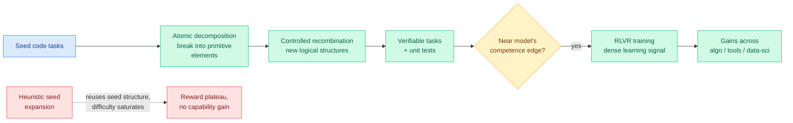

# Combinatorial Synthesis: Scaling Code RLVR via Atomic Decomposition and Recombination (ADR)

**TL;DR.** RLVR (reinforcement learning with verifiable rewards, where a model is trained on tasks whose answers can be auto-checked, e.g. by running unit tests) only improves a coding model when the tasks sit right at the model's competence edge. The supply of such tasks is the bottleneck: heuristic "make this problem harder" expansions reuse the seed problem's structure, so difficulty and novelty saturate and RL rewards plateau. ADR (Atomic Decomposition and Recombination) breaks seed tasks into atomic elements and recombines them under controlled rules to synthesize genuinely novel, harder verifiable code tasks. It reports higher originality, difficulty, diversity, and test quality than prior synthesis, and larger downstream RLVR gains across algorithmic programming, tool use, and data science.

**Source:** HuggingFace Daily Papers · arxiv [2605.31058](https://arxiv.org/abs/2605.31058) · Institute of Software, Chinese Academy of Sciences

## What it is

ADR is a data-synthesis framework for the RLVR stage of code-model post-training. Rather than prompting an LLM to paraphrase or "extend" an existing problem (which preserves the seed's compositional skeleton and therefore its difficulty ceiling), ADR decomposes seed tasks into **atomic elements** (primitive operations, constraints, data structures) and then **recombines** them under controlled rules to assemble new logical structures that did not exist in any seed. Each synthesized task ships with verifiable unit tests, so it can be used directly as an RLVR reward source.

## What problem it solves

RLVR is now the cornerstone recipe for coding ability, but prior work has shown it only delivers significant gains when tasks are near the model's edge of competence. Existing synthetic data increases *linguistic* diversity (different wording) without increasing *logical* diversity or difficulty. The training value of such data fails to scale with the volume synthesized: generate ten times more, learn nothing new, hit reward saturation. ADR is built to make the difficulty and novelty of the task pool scale with synthesis volume.

## Core novelty

The decompose-then-recombine paradigm. Most synthesis preserves the seed's structure and perturbs the surface; ADR destroys the structure into atoms and builds new ones combinatorially, which is what unlocks genuinely novel logical structures rather than rephrasings. The "controlled" recombination is what keeps the synthesized tasks verifiable and well-posed rather than nonsense.

## Key takeaways

- Beats existing baselines on originality, difficulty, diversity, and test quality (the four axes that determine whether synthetic RLVR data is useful).
- Delivers consistently larger RLVR improvements across diverse downstream domains: algorithmic programming, tool usage, and data science.
- Reframes RLVR scaling from "collect more hard problems" to "synthesize the hard-problem distribution combinatorially."

## How it relates to prior wiki knowledge

ADR sits directly on the wiki's **RLVR** thread (see [rl-for-llms.md](rl-for-llms.md)). It is a data-side answer to a worry the wiki has been tracking from the reward side: Kurate's cs.LG board last week flagged ["LLMs Gaming Verifiers: RLVR can Lead to Reward Hacking"](../inference-efficiency) and the [05-05] thread on verifier exploitation. ADR's contribution is orthogonal: it improves *what tasks RLVR trains on*, not how the reward is computed. The "tasks must sit at the competence edge or RL learns nothing" claim is the same curriculum logic behind the spring's selective-supervision distillation line ([knowledge-distillation.md](../inference-efficiency/knowledge-distillation.md): only the load-bearing signal matters), now applied to task generation rather than token selection.

It also pairs with yesterday's [RL-contextual-translation paper](2026-06-05-rl-contextual-learning-unseen-translation.md) (06-05, RLVR with a chrF reward teaches the meta-skill of using in-context grammar) as evidence that the 2026 frontier of RLVR is less about the reward function and more about the *task distribution* the model is exposed to.

## Gaps

The controlled-recombination rules are the crux and the abstract does not specify how recombination avoids producing ill-posed or unsolvable tasks at scale, nor how test-case correctness is guaranteed for fully novel structures (a wrong reference solution silently poisons RLVR). Difficulty is measured relative to current models; whether ADR keeps producing edge-of-competence tasks as the model improves (the moving-target problem) is the real scalability question and is not addressed.

## Industrial implication

If decompose-and-recombine reliably manufactures edge-of-competence verifiable tasks, it removes the hand-curation bottleneck that currently caps how far code-RLVR can be pushed. Any lab post-training a coding model could fold ADR into its data pipeline as a difficulty pump. The risk to watch is silent test-case corruption, which would degrade the model while reward curves still look healthy.

## Related pages

- [rl-for-llms.md](rl-for-llms.md)
- [../inference-efficiency/knowledge-distillation.md](../inference-efficiency/knowledge-distillation.md)
- [2026-06-05-rl-contextual-learning-unseen-translation.md](2026-06-05-rl-contextual-learning-unseen-translation.md)

Raw source: `raw/huggingface/2026-06-06-combinatorial-synthesis-scaling-code-rlvr-via-atomic-decompo.md`
