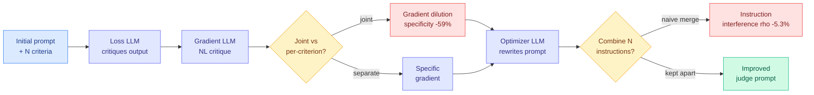

# When Gradients Collide: Failure Modes of Multi-Objective Prompt Optimization for LLM Judges

**Source:** HuggingFace Daily Papers
**arxiv:** [2605.26046](https://arxiv.org/abs/2605.26046)
**Date:** 2026-06-08
**Raw:** [raw file](../../raw/huggingface/2026-06-08-when-gradients-collide-failure-modes-of-multi-objective-prom.md)
**Tier:** 2

## TL;DR

This paper studies why optimizing an LLM judge's prompt across several evaluation criteria at once tends to fail. An LLM judge is a model used to score the outputs of another model, and customizing it to a task usually means tuning its prompt to handle multiple criteria together. Textual gradient methods automate prompt tuning for a single criterion by producing natural-language critiques that act like gradients, but those critiques are words, not numerical vectors, so the standard multi-task conflict-resolution toolkit (PCGrad and MGDA, which reconcile competing gradients by projecting or reweighting them) cannot be applied in the textual setting. The authors test five decomposition modes that vary how much cross-task information the loss, gradient, and optimizer LLMs share. In 6 of 10 configurations, optimization never improves on the initial prompt. They isolate two separable failure modes: optimization-time gradient dilution, where the gradient LLM loses specificity when it processes multiple criteria jointly, and inference-time instruction interference, where the criteria fight each other inside the final prompt.

## Key points

- The multi-task conflict-resolution toolkit (PCGrad, MGDA) does not transfer because textual gradients are natural-language critiques, not numerical vectors.
- Five decomposition modes tested, varying how much cross-task information the loss, gradient, and optimizer LLMs share.
- In 6 of 10 configurations, optimization never beats the initial prompt.
- Gradient specificity drops 59% (from 9.0 to 3.7) when the gradient LLM processes multiple criteria jointly: optimization-time gradient dilution.
- Naively concatenating per-task instructions into one prompt degrades Spearman's rho by 5.3 percent: inference-time instruction interference.
- The two failure modes are separable, which means they call for different fixes.

## Relation to prior wiki state

This connects to the prompt-optimization-as-agent line, most directly [sepo-self-evolving-prompt-agent](../agentic-systems/2026-06-05-sepo-self-evolving-prompt-agent.md), which framed prompt improvement as a self-evolving agentic loop. "When Gradients Collide" is the cautionary footnote to SEPO: the same textual-gradient machinery that SEPO leans on breaks down once you optimize for more than one criterion at a time, failing outright in 6 of 10 setups. It also relates to [reflective-prompt-tuning-function-calling](2026-05-31-reflective-prompt-tuning-function-calling.md), which used reflective critiques to tune prompts for a single objective. The new contribution is naming why the single-objective success does not extend: textual gradients have no equivalent of PCGrad-style projection to resolve conflicts, so multi-criterion gradients dilute rather than compose. For anyone building LLM-as-judge pipelines, this is the first wiki page to pin down a measurable failure (59% specificity loss, 5.3% rho drop) rather than treating prompt optimization as a black box that just works.

## Why it matters

LLM-as-judge is now the default evaluation substrate for most RLHF and model-grading pipelines, and almost everyone hand-stuffs multiple criteria into one judge prompt, which this paper shows is exactly the configuration that fails. The clean result is that the two failure modes are separable: gradient dilution happens during optimization, instruction interference happens at inference, and they need different mitigations. That reframes the engineering task from "write a better mega-prompt" to "keep criteria decomposed through both stages," which is a concrete, testable design rule. If textual-gradient methods cannot resolve multi-objective conflicts, the field needs a textual analogue of PCGrad, and naming that gap is the paper's most useful service.

## Gaps

The study diagnoses two failure modes but does not deliver a working multi-objective optimizer, so the prescriptive answer is "keep criteria separate" rather than a method that genuinely composes them. The numbers come from a specific set of judge tasks, and it is untested whether the 59% dilution figure holds as the number of criteria grows past the tested range.

## Links

- Paper: https://arxiv.org/abs/2605.26046
- Raw: [raw file](../../raw/huggingface/2026-06-08-when-gradients-collide-failure-modes-of-multi-objective-prom.md)
