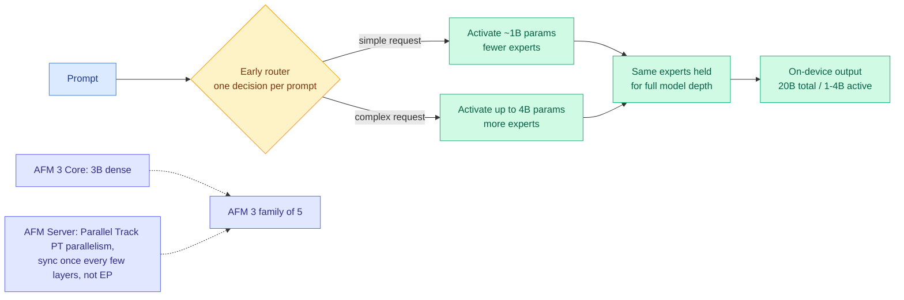

# Apple's Third-Generation Foundation Models (AFM 3): adaptive-compute MoE with per-prompt routing

**TL;DR.** Apple shipped its third generation of Apple Foundation Models (AFM 3) at WWDC 2026, a family of five models built in collaboration with Google, spanning on-device to Private Cloud Compute. The two on-device models are the headline for routing/efficiency: **AFM 3 Core** (a 3B dense model) and **AFM 3 Core Advanced**, a natively-multimodal **20B-total sparse MoE that activates only 1–4B parameters at a time depending on the request**. Crucially, the routing decision is made **once per prompt, early** ("early routing"): a single up-front decision selects which experts will be active for the *full model depth*, and apparently also decides *how many* active parameters to allocate — adaptive compute at the prompt level. The server model (AFM Server) is trained and served with **Parallel Track (PT) parallelism** rather than expert parallelism (EP). Source detail comes from Apple's ML research blog, surfaced and unpacked by HuggingFace's @eliebakouch.

## Key points

- **Per-prompt adaptive compute.** AFM 3 Core Advanced decides once, up front, which experts (and how many active params, 1–4B of 20B) to use for the *entire* forward pass. This is coarser than per-token MoE routing but cheaper to serve and predictable in latency, a deliberate on-device tradeoff.
- **Early routing fixes the experts for full depth**, unlike standard per-layer per-token MoE. @eliebakouch notes it's unclear whether the early decision does layer selection or expert selection.
- **Parallel Track (PT) parallelism on the server.** Think of PT as an extension of tensor parallelism (TP) that syncs *once every few layers* instead of multiple times per layer, cutting communication. Apple chose PT over expert parallelism (EP).
- **Five models, on-device to Private Cloud Compute**, natively multimodal at the Advanced tier, built with Google.

## How it relates to prior wiki knowledge

- **Product validation of the routing-as-policy thesis.** The [llm-routing](../ai-routing/llm-routing.md) page argues routing is becoming the central control surface. AFM 3 ships *input-conditioned compute allocation* into hundreds of millions of phones: the cheapest sufficient compute per request, decided up front. It is the consumer-scale counterpart to [CLEAR](../inference-efficiency/2026-06-05-clear-shadow-price-reasoning-budget.md)'s per-query compute rationing and [Kappa-SwiGLU](../inference-efficiency/2026-06-02-kappa-swiglu-confidence-adaptive-moe.md)'s confidence-adaptive MoE.
- **Lands the same day as [Chiaroscuro Attention](../ai-routing/2026-06-09-chiaroscuro-attention-spectral-routing.md)** (06-09), which routes *per token* to cheap vs expensive operators. AFM 3 routes *per prompt* to cheap vs expensive expert sets. Research and product converging on the same input-conditioned-compute idea at different granularities.
- **Connects to the [MoE muP scaling](../ai-routing/2026-05-17-moe-mup-maximally-scale-stable-parameterization.md)** line (the Kurate-rated MoE scaling paper): a 20B MoE with 1–4B active is exactly the regime where stable-scaling parameterization matters.
- The Private Cloud Compute / Google Cloud / NVIDIA-GPU angle ties to today's Industry Pulse (Apple expanding PCC to Google Cloud on NVIDIA GPUs).

## Gaps

- Apple's blog reports architecture, not independent benchmarks; quality vs. Gemma 4 / Qwen on-device peers is unverified.
- Whether early routing's coarse per-prompt allocation costs accuracy on mixed-difficulty prompts (where per-token routing would adapt mid-sequence) is the open question.

**Source:** Twitter/X (@eliebakouch, Hugging Face) → [Apple ML Research blog](https://machinelearning.apple.com/research/introducing-third-generation-of-apple-foundation-models) · raw: `raw/twitter/2026-06-09-afternoon.json`

**Related:** [../ai-routing/llm-routing.md](../ai-routing/llm-routing.md) · [../ai-routing/2026-06-09-chiaroscuro-attention-spectral-routing.md](../ai-routing/2026-06-09-chiaroscuro-attention-spectral-routing.md) · [../inference-efficiency/2026-06-05-clear-shadow-price-reasoning-budget.md](../inference-efficiency/2026-06-05-clear-shadow-price-reasoning-budget.md)
