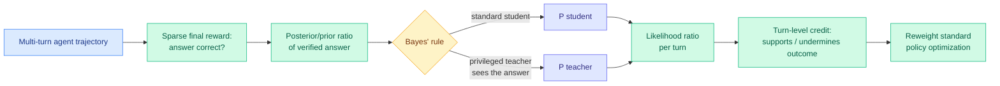

# PBSD: Privileged Bayesian Self-Distillation for Long-Horizon Credit Assignment

**Source:** HuggingFace Daily Papers, 2026-06-09. arxiv [2606.09348](https://arxiv.org/abs/2606.09348).
**Raw:** [farmed](../../raw/huggingface/2026-06-09-pbsd-privileged-bayesian-self-distillation-for-long-horizon.md)

## TL;DR

Long-horizon agentic tasks (especially multi-turn search agents) get only a **trajectory-level reward** that says whether the final answer was right, with no signal about *which* intermediate turns helped. Successful trajectories contain misleading actions; failed ones contain useful evidence-gathering. PBSD assigns **turn-level credit** under sparse final rewards using a Bayesian self-distillation trick. It measures trajectory quality through the **posterior-to-prior probability ratio of the verified answer**, then applies Bayes' rule to convert that hard-to-estimate answer-side ratio into a **tractable likelihood ratio between a standard student model and a privileged answer-conditioned teacher model** (the teacher sees the verified answer). Decomposing this Bayesian evidence score autoregressively yields per-turn signals: does this turn support or undermine the verified outcome? The result is a principled reweighting scheme, fully compatible with standard policy optimization, that turns sparse outcome supervision into Bayes-calibrated turn-level credit and **transfers short-context training to long-context inference**.

## Key points

- **Credit assignment, not reward shaping.** PBSD does not invent intermediate rewards; it re-derives per-turn credit from the *same* final verifier signal via a Bayesian identity, so it stays faithful to the outcome.
- **The privileged answer-conditioned teacher is the key device.** A model that conditions on the verified answer assigns higher likelihood to turns that genuinely led there; the student/teacher likelihood ratio exposes which turns mattered. This is on-policy self-distillation used as a *measurement* tool, not a training target.
- **Short-to-long transfer.** Training credit on short contexts improves long-context inference — directly useful for search agents that train cheap and deploy long.
- Gains hold **in-domain and out-of-domain**, suggesting the turn-level signal improves generalization, not just fit.

## Relation to prior wiki state

- **Third distillation-family paper today**, alongside [On the Geometry of OPD](../inference-efficiency/2026-06-09-geometry-on-policy-distillation.md) and [Trajectory-Refined Distillation](../inference-efficiency/2026-06-09-trd-trajectory-refined-distillation.md). All three sit at the OPD/OPSD ↔ RLVR boundary the [knowledge-distillation](../inference-efficiency/knowledge-distillation.md) page has been mapping. PBSD is the one that crosses fully into RL credit assignment.
- **Privileged-conditioning teacher = same trick as [D-OPSD](../inference-efficiency/2026-05-07-d-opsd-self-distillation-step-distilled-diffusion.md) (05-07) and [SDPG](../inference-efficiency/2026-06-04-sdpg-self-distilled-policy-gradient.md) (06-04)**, where a model conditioned on privileged information teaches its unconditioned self. PBSD's novelty is using that asymmetry to *score turns* rather than to supervise tokens.
- **Long-horizon credit assignment** connects to the agent-RL line and [rl-for-llms.md](rl-for-llms.md); it is the search-agent counterpart to step-level optimization for computer-use agents (05-02).

## Gaps

The privileged teacher must produce calibrated likelihoods for the Bayesian ratio to be meaningful; how sensitive PBSD is to teacher miscalibration is not the headline. Demonstrated on verifiable-answer search tasks; open-ended agentic tasks without a clean verifier (the common case) are out of scope.

## Related pages

- [rl-for-llms.md](rl-for-llms.md)
- [../inference-efficiency/knowledge-distillation.md](../inference-efficiency/knowledge-distillation.md)
- [../agentic-systems/agent-memory.md](../agentic-systems/agent-memory.md)
