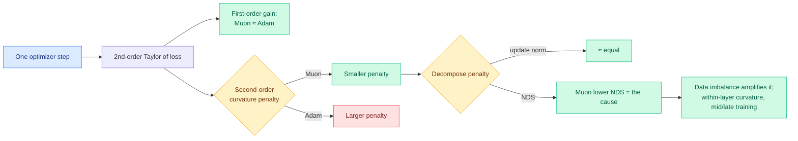

# Why Muon Outperforms Adam: A Curvature Perspective

**TL;DR.** Muon trains large language models about **2x more efficiently than Adam**, but nobody had pinned down *why* at the level of local geometry. This paper does, using a second-order Taylor expansion of the loss landscape. At matched validation loss, Muon achieves a **larger one-step loss decrease** than Adam. The first-order gains are comparable; the difference is the **second-order curvature penalty**, which is smaller for Muon. Decomposing that penalty into squared update norm and **Normalized Directional Sharpness (NDS)**, the authors find update norms are comparable, so Muon's advantage is **lower NDS**, not smaller steps. Controlled experiments with Zipf-distributed PCFG data show **data imbalance amplifies Muon's NDS advantage**, and a within-/cross-layer decomposition traces the advantage mainly to **smaller within-layer curvature in the middle and late training stages**. A stylized quadratic analysis proves Muon attains smaller average NDS than gradient descent by balancing update energy across curvature groups.

## Key points

- **The advantage is curvature, not step size.** Muon and Adam take comparably sized steps; Muon's win is that its steps point in lower-sharpness directions (lower NDS), incurring a smaller second-order penalty at matched loss.
- **Data imbalance amplifies the gap.** On Zipf-PCFG data with controlled imbalance, Muon's NDS advantage grows with imbalance, which matters because real text is heavily Zipfian.
- **Localized in space and time.** The advantage is sustained mainly by smaller within-layer curvature in the middle and late stages of training.
- **Backed by theory.** A stylized quadratic problem with heterogeneous curvature proves Muon balances update energy across curvature groups, and when curvature heterogeneity is strong, also yields lower local loss after equal steps.

## How it relates to prior wiki knowledge

- **Grounds the optimizer half of the pretraining-efficiency story.** The wiki's efficiency program has mostly tracked inference and post-training (the OPD line, KV cache). This is the *pretraining-optimizer* lever: a 2x efficiency gain that good optimizer choice already delivered, echoing @eliebakouch's 06-08 point that pretrain research has quietly handed the field "2x less FLOPs for the same loss."
- **Complements the [muP / scale-stable parameterization](../ai-routing/2026-05-17-moe-mup-maximally-scale-stable-parameterization.md)** thread (Kurate-rated MoE scaling): parameterization and optimizer are the two knobs that make large-model training stable and cheap; this paper explains the optimizer knob mechanistically.
- Connects to the broader Hessian/curvature framing in [Hamilton-Jacobi theory of deep learning](2026-06-02-hamilton-jacobi-theory-deep-learning.md) (06-02).

## Gaps

- Analysis is local (one-step, second-order); whether lower NDS compounds into the full 2x end-to-end advantage across a complete training run is argued but not exhaustively measured at frontier scale.
- The stylized quadratic proof assumes structure (heterogeneous curvature, gradient alignment to high-curvature modes) that real LLM landscapes only approximate.

**Source:** HuggingFace Daily Papers · [Paper](https://arxiv.org/abs/2606.04662) · raw: `raw/huggingface/2026-06-09-why-muon-outperforms-adam-a-curvature-perspective.md`

**Related:** [rl-for-llms.md](rl-for-llms.md) · [2026-06-02-hamilton-jacobi-theory-deep-learning.md](2026-06-02-hamilton-jacobi-theory-deep-learning.md) · [../ai-routing/2026-05-17-moe-mup-maximally-scale-stable-parameterization.md](../ai-routing/2026-05-17-moe-mup-maximally-scale-stable-parameterization.md)
