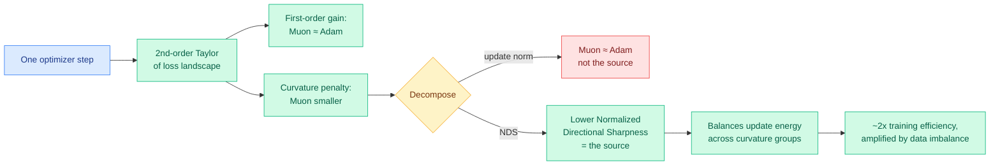

# Why Muon Outperforms Adam: A Curvature Perspective

**Source:** HuggingFace Daily Papers, 2026-06-09. arxiv [2606.04662](https://arxiv.org/abs/2606.04662). Wang et al. (NUS, Yale, U. Minnesota).
**Raw:** [farmed](../../raw/huggingface/2026-06-09-why-muon-outperforms-adam-a-curvature-perspective.md)

## TL;DR

Muon trains large language models roughly **2x more efficiently than Adam**, but *why* has been hand-waved (associative-memory arguments, long-tailed data). This paper gives a **curvature-based explanation**. Using a second-order Taylor expansion of the loss landscape, the authors show that at matched validation loss Muon achieves a **larger one-step loss decrease** than Adam. The two optimizers have comparable first-order (gradient) gains and comparable update norms, so the advantage is entirely in the **second-order curvature penalty**, which Muon keeps smaller. They decompose that penalty into squared update norm × **Normalized Directional Sharpness (NDS)** and show Muon wins on NDS, not norm. Controlled Zipf-PCFG experiments show **data imbalance amplifies Muon's NDS advantage**, and a within-/cross-layer decomposition localizes the gain to **smaller within-layer curvature in the middle and late stages** of training. A stylized quadratic-problem analysis proves Muon attains lower average NDS than gradient descent by **balancing update energy across curvature groups**.

## Key points

- **The advantage is curvature, not magnitude.** Matched first-order gain and matched update norm; Muon's edge is a smaller second-order penalty driven by lower NDS. This rules out "Muon just takes bigger steps."
- **NDS = how aligned the update is with high-curvature directions.** Muon's orthogonalized (spectral-norm-constrained) update spreads energy across curvature groups rather than piling into sharp directions, which is where Adam pays.
- **Data imbalance amplifies the gap.** On controlled Zipf-PCFG data with tunable imbalance, more imbalance → larger Muon NDS advantage. Real text is heavily Zipfian, so this predicts Muon helps *more* on natural data.
- **Localized to within-layer curvature, mid-to-late training** — a concrete place to look, not a global hand-wave.
- **Theory backs the empirics:** for stylized heterogeneous-curvature quadratics, Muon provably attains lower average NDS than GD, and lower local loss after equal steps when curvature heterogeneity is strong.

## Relation to prior wiki state

- **Mechanism layer under the optimizer-as-efficiency-lever theme.** The wiki tracks training-side efficiency (RL-Kernel's GRPO/PPO kernels 06-08, MoE-muP scale-stable parameterization 05-17). Muon is the optimizer most frontier labs (Kimi, GLM, DeepSeek-V4 lineage) now use; this paper is the first principled "why" the wiki logs, and it reframes the win as a *curvature-conditioning* property rather than a heuristic.
- **Connects to the outlier/sharpness thread.** The KV-cache and quantization lines repeatedly find that a few high-magnitude / high-curvature directions dominate ([LongAct](../inference-efficiency/2026-04-18-longact-saliency-sparse-rl.md) 04-18, VaSE value outliers). Muon's NDS story is the optimization-side version: high-curvature directions are exactly where naive updates waste energy.

## Gaps

The proof is for stylized quadratics; the bridge to real deep nets is empirical (Zipf-PCFG + LLM training curves), not a theorem at scale. NDS is measured, not predicted before training, so it explains rather than forecasts when Muon will help most.

## Research angle

If NDS is the load-bearing quantity, an optimizer that *explicitly* minimizes NDS (beyond Muon's orthogonalization) could beat Muon. And if data imbalance amplifies the advantage, curriculum or data-mixing choices interact with optimizer choice — an unexplored joint design space (optimizer × data distribution).

## Related pages

- [rl-for-llms.md](rl-for-llms.md)
- [../ai-routing/2026-05-17-moe-mup-maximally-scale-stable-parameterization.md](../ai-routing/2026-05-17-moe-mup-maximally-scale-stable-parameterization.md)
- [../inference-efficiency/knowledge-distillation.md](../inference-efficiency/knowledge-distillation.md)
