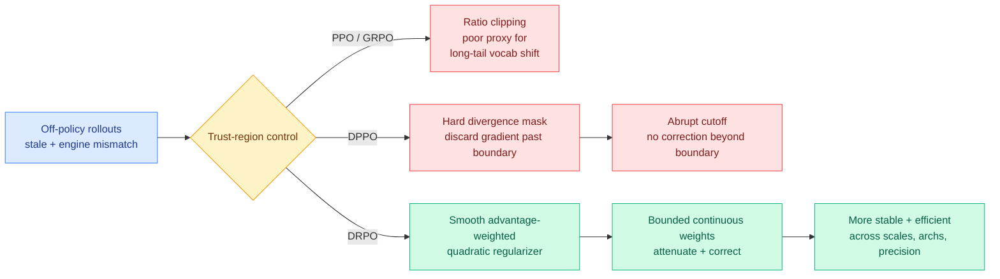

# DRPO: Divergence Regularized Policy Optimization

**TL;DR.** RL post-training of LLMs is almost always slightly off-policy (the data was generated by a slightly stale policy, and the training and inference engines disagree numerically), so it needs a trust region to stay stable. PPO and GRPO build that trust region from the importance ratio, which is a poor proxy for real distributional shift in long-tailed vocabularies. DPPO fixed the proxy by masking tokens whose absolute probability shift crosses a boundary, but its mask is *hard*: once a token crosses in a harmful direction, its gradient is thrown away with no correction. DRPO (arxiv 2606.09821, Tencent Hunyuan + NUS + UIUC) replaces the hard mask with a smooth advantage-weighted quadratic regularizer, keeping DPPO's trust-region geometry but giving continuous, bounded gradient weights that *attenuate and correct* diverging updates instead of discarding them. It improves stability and efficiency across model scales, architectures, and precision settings.

## What it is

DRPO sits in the trust-region lineage of LLM RL. TRPO gave principled divergence constraints but did not scale; PPO approximated the trust region with ratio clipping; GRPO and SPO built on PPO (SPO swapping the hard clip for a smooth quadratic regularizer). DPPO changed the *geometry*, replacing the ratio with a divergence (a Binary total-variation approximation of absolute probability shift) so the trust region is defined by how much a sampled token's probability actually moved, not by a ratio that misbehaves on rare tokens. DRPO's move is to combine DPPO's better geometry with SPO-style smoothness: an advantage-weighted quadratic regularizer on policy shift that preserves DPPO's trust-region shape but produces bounded, continuous gradient weights, so a token that diverges in a harmful direction is corrected rather than silently dropped.

## Why it matters / relation to prior wiki pages

- **The trust-region debate moves from distillation to RL, the same week.** The wiki tracked the *on-policy distillation* trust-region thread through [TrOPD](../inference-efficiency/2026-06-03-tropd-trust-region-on-policy-distillation.md) (06-03, trust-region control for which teacher tokens the student should trust) and the broader OPD autopsies of 06-09 ([Geometry](../inference-efficiency/2026-06-09-geometry-on-policy-distillation.md), [TRD](../inference-efficiency/2026-06-09-trd-trajectory-refined-distillation.md)). DRPO is the RL-objective counterpart: same underlying problem (how hard to constrain each token's update when the data is off-policy), different lever (a smooth divergence regularizer in the RL loss). The field is converging on "soft, corrective constraints beat hard cutoffs" across both post-training families.
- **Hard-mask-to-smooth-regularizer is becoming a pattern.** SPO already softened PPO's hard clip; DRPO now softens DPPO's hard mask. The repeated finding, that discarding signal at a boundary wastes corrective gradient that a continuous penalty would use, echoes [TRD](../inference-efficiency/2026-06-09-trd-trajectory-refined-distillation.md)'s argument that truncating a bad trajectory acts too late, and [FiRe-OPD](../inference-efficiency/2026-06-04-fire-opd-filter-then-reweight-distillation.md)'s discard-versus-reweight tension.
- **Relevant to the day's RL credit-assignment paper.** [FlowTracer](2026-06-10-flowtracer-attention-flow-credit-assignment.md) (06-10) decides *which tokens* deserve reward; DRPO decides *how hard to constrain* each token's update. They are complementary halves of the same token-level-RL design surface, and could compose: flow-shaped rewards inside a smooth divergence-regularized trust region.

## Gaps

The alphaxiv overview frames DRPO as combining DPPO geometry with SPO smoothness, but the captured material does not give the headline numbers (how much faster, how much more stable, on which benchmarks), so the size of the win is unverified here. The advantage-weighting introduces a coupling between the advantage estimate and the trust-region strength; whether a noisy advantage estimate destabilizes the regularizer it weights is not addressed in the abstract.

## Source

- Paper: https://arxiv.org/abs/2606.09821
- Raw: [raw/huggingface/2026-06-10-rethinking-the-divergence-regularization-in-llm-rl.md](../../raw/huggingface/2026-06-10-rethinking-the-divergence-regularization-in-llm-rl.md)
