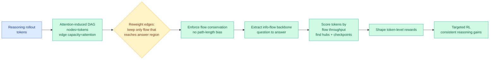

# FlowTracer: Attention-Induced Information Flow for Targeted RL

**TL;DR.** RL for LLM reasoning usually rewards every token in a correct rollout equally, so decisive reasoning steps get the same credit as routine formatting and fluent filler. FlowTracer (arxiv 2606.10646) assigns credit by *tracing where information actually flows* to the answer. It builds a directed acyclic graph whose nodes are tokens and whose edge capacities come from aggregated attention weights, reweights edges to keep only influence that can reach the answer region, enforces flow conservation so intermediate tokens neither gain nor lose mass from path length, then extracts the question-to-answer information-flow backbone and scores each token by its throughput. Those scores shape token-level rewards, concentrating learning on the tokens that route information toward (or away from) the correct answer. Consistent gains across reasoning tasks.

## What it is

FlowTracer is an RL framework for token-level credit assignment. Instead of a point-wise heuristic (score each token by its own internal signal), it models the *global structure* of information propagation. Attention weights define edge capacities on a token graph; the graph is pruned to retain only influence that can reach the answer, with local flow conservation so a token's importance reflects genuine throughput rather than how many paths happen to pass through it. The extracted backbone exposes high-impact hubs and aggregation checkpoints, the tokens that mediate long-range dependencies, and their flow scores become token-level reward weights.

## Why it matters / relation to prior wiki pages

- **Closes a loop the spring distillation work opened.** [TIP](../inference-efficiency/2026-04-16-tip-token-importance-on-policy-distillation.md) (04-16, under 10% of teacher tokens carry signal) and [LongAct](../inference-efficiency/2026-04-18-longact-saliency-sparse-rl.md) (04-18, long-context training signal concentrates in the first 5% of tokens) established that *most tokens don't matter* and used saliency or position heuristics to find the ones that do. Yesterday's [Geometry of On-Policy Distillation](../inference-efficiency/2026-06-09-geometry-on-policy-distillation.md) (06-09) explained *why* token selection always worked: the useful update lives in a narrow subspace. FlowTracer supplies a principled *selection mechanism* for the RL setting, replacing point-wise heuristics with a graph-flow structure, which is the "predict the important tokens, don't just observe them" step those papers flagged as open.
- **Attention-as-information-flow, reused for reward shaping.** Treating attention weights as a flow graph echoes the mechanistic-interpretability work the wiki tracks ([xetrieval mechanistic dense retrieval](../responsible-ai/2026-05-30-xetrieval-mechanistic-dense-retrieval.md), [monitoring internal monologue probes](../responsible-ai/2026-05-19-monitoring-internal-monologue-probe-trajectories.md)), but turns the diagnostic into a *training signal* rather than an audit. It is the same primitive Chiaroscuro used as a routing signal (per-token complexity), here used for credit.
- **Pairs with today's DRPO.** [DRPO](2026-06-10-drpo-divergence-regularized-policy-optimization.md) (06-10) decides how hard to constrain each token's update; FlowTracer decides which tokens deserve reward at all. Together they sketch a token-level-RL stack: flow-derived credit inside a smooth divergence-regularized trust region.

## Gaps

Using attention as a proxy for causal information flow is the load-bearing assumption; attention weight is correlational, and high attention does not always mean high causal influence, so the backbone may credit tokens that look central but are not. Building and reweighting a per-rollout DAG adds cost over uniform credit that the abstract does not quantify against the accuracy gain. Gains are reported on reasoning tasks with a clear answer region; for open-ended generation with no single answer node to flow toward, the construction has no obvious target.

## Source

- Paper: https://arxiv.org/abs/2606.10646
- Raw: [raw/huggingface/2026-06-10-how-does-reasoning-flow-tracing-attention-induced-informatio.md](../../raw/huggingface/2026-06-10-how-does-reasoning-flow-tracing-attention-induced-informatio.md)
