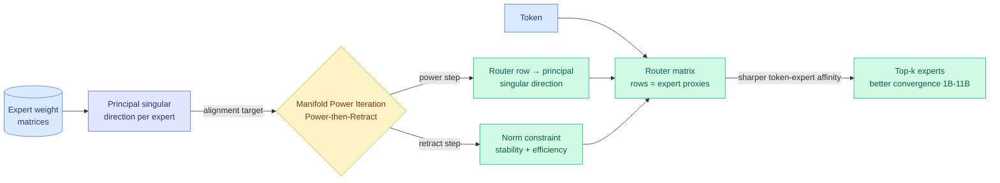

# Redesign Mixture-of-Experts Routers with Manifold Power Iteration (MPI)

**TL;DR.** In a Mixture-of-Experts (MoE) model (where each token is routed through a small subset of specialized sub-networks instead of the whole network), the router is a matrix whose rows act as proxies for the experts: the dot product between a token and a router row decides which experts fire. The problem is that nothing in standard training forces a router row to actually *represent* its expert. This paper proposes a design principle: each router row should align with the **principal singular direction** of its expert's weight matrix, since that direction is the most expressive single-vector summary of a matrix. It enforces this with Manifold Power Iteration (MPI), a "Power-then-Retract" step that runs a power-iteration update on the router weights and then retracts onto a norm constraint for stability. Pretrained across 1B–11B parameters, MoE models with MPI routers converge better and are more competent.

**Source:** HuggingFace Daily Papers · arxiv [2606.12397](https://arxiv.org/abs/2606.12397) (Wu, Lv, Xie, Lin — Renmin University of China + Tencent)

## Key findings

- **A design principle where there was none.** Conventional routers are trained with no explicit constraint linking a router row to its expert's actual features. MPI supplies the missing principle: align each row with the expert's principal (top) singular direction, the vector that captures the most variance of the expert's transformation.
- **Power-then-Retract.** A power-iteration step nudges each router row toward the dominant singular direction of its expert; a retraction step imposes a norm constraint so the update stays stable and cheap. The authors prove convergence toward the principal singular directions.
- **Validated at scale.** Pretraining MoE models from 1B to 11B parameters confirms the alignment yields more effective models — better routing precision, which they argue improves both training convergence and downstream competence.

## How this relates to prior wiki knowledge

This sits squarely in the wiki's MoE-router thread and is the first 2026-06 paper to attack router quality from a **linear-algebra-of-the-expert** angle rather than a load-balancing or capacity angle. Prior router work the wiki tracked: [BEAM](../ai-routing/2026-05-16-beam-binary-expert-activation-masking-moe.md) (05-16, binary expert-activation masking), [CaRE](../ai-routing/2026-05-11-care-bi-level-routing-moe-continual-learning.md) (05-11, bi-level routing for continual learning), [UniPool](../inference-efficiency/2026-05-09-unipool-shared-expert-pool-moe.md) (05-09, shared expert pool), and [κ-SwiGLU](../inference-efficiency/2026-06-02-kappa-swiglu-confidence-adaptive-moe.md) (06-02, confidence-adaptive MoE). Those tune *which* experts fire or *how many*; MPI tunes *how faithfully the router represents each expert in the first place* — an earlier point in the causal chain.

It is complementary to the scaling-parameterization line: [MoE μP / maximally scale-stable parameterization](../ai-routing/2026-05-17-moe-mup-maximally-scale-stable-parameterization.md) (05-17/05-21, ai_rating 9.0 on Kurate, how to set MoE hyperparameters so behavior transfers across scale). μP tells you how to *scale* a router stably; MPI tells you what the router rows should *converge to*. The two could compose: a scale-stable parameterization whose routers are also singular-direction-aligned.

**Research angle.** The unproven jump is from "principal singular direction is the most expressive single vector" to "therefore it is the best routing key." An expert's *most-activated* direction in practice need not be its top singular direction, especially after the expert specializes during training. Worth tracking: does MPI's benefit hold once experts diverge late in training, or does the alignment need to be re-run periodically? And does singular-direction alignment change expert *collapse* behavior (the failure where many experts learn the same thing) — a sharper router key could either prevent collapse or accelerate it by over-committing tokens early.

→ Raw: [`raw/huggingface/2026-06-11-redesign-mixture-of-experts-routers-with-manifold-power-iter.md`](../../raw/huggingface/2026-06-11-redesign-mixture-of-experts-routers-with-manifold-power-iter.md)
