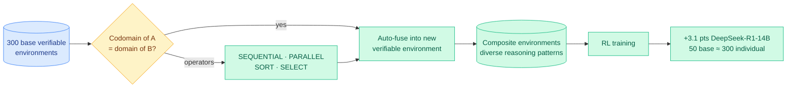

# RACES: Verifiable Environments Are LEGO Bricks — recursive composition for reasoning generalization

**TL;DR.** Reinforcement learning with verifiable environments (tasks where a checker can mechanically score the answer) reliably improves LLM reasoning, and more environments means better RL. But building environments by hand scales linearly — each new environment is one more piece of human labor. RACES (Recursive Automated Composition for Environment Scaling) treats verifiable environments as composable building blocks: when the output type of one environment matches the input type of another, the two can be **automatically fused** into a new verifiable environment. From 300 base environments and four composition operators (SEQUENTIAL, PARALLEL, SORT, SELECT), RACES generates a combinatorial space of new tasks that induce diverse reasoning patterns. RL on these composites improves reasoning on six held-out benchmarks, and 50 base environments composed reach the performance of training on 300 individual ones.

**Source:** HuggingFace Daily Papers · arxiv [2606.12373](https://arxiv.org/abs/2606.12373)

## Key findings

- **Type-matching enables automatic fusion.** The key insight is a programming-language one: if environment A's output type (codomain) matches environment B's input type (domain), they compose into a new, still-verifiable environment. Verifiability is preserved through composition because each brick's checker still applies to its stage.
- **Four operators, diverse reasoning.** SEQUENTIAL (chain), PARALLEL (run together), SORT, and SELECT induce structurally different reasoning demands, so composition yields *diversity*, not just *more*.
- **Beats the linear scaling limit.** RACES improves DeepSeek-R1-Distill-Qwen-14B by +3.1 points on average (48.2 → 51.3) and Qwen3-14B from 58.8 → 61.1 on six benchmarks unseen during environment construction.
- **Efficiency.** 50 base environments composed reach the performance of 300 hand-built individual environments — a 6x reduction in human-authored environment count.

## How this relates to prior wiki knowledge

RACES is the **environment-side** answer to the wiki's recurring "where does RL signal come from?" question, and it directly extends [EvoEnv](../agentic-systems/2026-05-15-evoenv-self-evolving-rl-via-environment-synthesis.md) (05-15, self-evolving RL via environment synthesis). EvoEnv *generates* new environments; RACES *composes* existing verified ones, which is a different and arguably safer scaling axis — composition inherits verifiability from its parts, whereas synthesis must re-establish it. The four typed operators make RACES feel like a small DSL for reasoning tasks.

It sits in the same 06-11 cluster as [Arbor](../agentic-systems/2026-06-11-arbor-hypothesis-tree-refinement.md) (autonomous research over a hypothesis tree), EvoTrainer (co-evolving policy + training harness, below), and [DeNovoSWE](../agentic-systems/2026-06-11-denovoswe-whole-repo-generation.md) (scaling long-horizon SWE environments). All four are about manufacturing the *substrate* an agent learns from — environments, harnesses, datasets — rather than the model. This continues the [self-evolving agents](../agentic-systems/self-evolving-agents.md) page's 06-08 theme that 2026's agent gains are increasingly substrate gains.

EvoTrainer (arxiv 2606.03108) deserves a one-line gloss as the closest sibling: it co-evolves the LLM policy *and* the training harness through empirical feedback (diagnose rollouts, revise diagnostics, backtest interventions, accumulate reusable skills), matching or beating human-engineered RL references with the largest gain on long-horizon agentic SWE. Where RACES scales the *environments*, EvoTrainer scales the *harness that interprets them*.

**Research angle.** The held-out gain (+3.1 on six unseen benchmarks) is the claim that matters: composition is supposed to teach *transferable* reasoning structure, not memorized task forms. The open question is whether the gain comes from genuine compositional generalization or from the composites accidentally covering the held-out benchmarks' reasoning shapes. A clean test would be composing operators the held-out set never exercises (e.g. only SORT+SELECT) and checking whether SEQUENTIAL-heavy benchmarks still improve. For a routing reader, the typed-composition idea is suggestive: a router over composable verified skills is the inference-time mirror of RACES's train-time composition.

→ Raw: [`raw/huggingface/2026-06-11-verifiable-environments-are-lego-bricks-recursive-compositio.md`](../../raw/huggingface/2026-06-11-verifiable-environments-are-lego-bricks-recursive-compositio.md) · EvoTrainer: [`raw/huggingface/2026-06-11-evotrainer-co-evolving-llm-policies-and-training-harnesses-f.md`](../../raw/huggingface/2026-06-11-evotrainer-co-evolving-llm-policies-and-training-harnesses-f.md)
