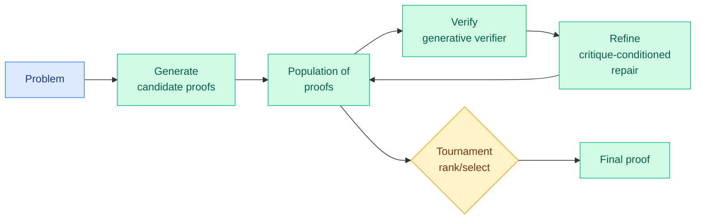

# MaxProof: population-level test-time scaling for mathematical proof (MiniMax-M3)

**Date:** 2026-06-12
**Source:** HuggingFace Daily Papers
**Links:** [Paper (arxiv 2606.13473)](https://arxiv.org/abs/2606.13473)

## TL;DR

MaxProof is the proof-solving system in the same MiniMax-M3 series as today's [MSA sparse-attention paper](../inference-efficiency/2026-06-12-minimax-sparse-attention-msa.md). M3 is trained with three proof-oriented capabilities — proof generation, proof verification, and critique-conditioned proof repair — using a "defense-in-depth" generative verifier engineered for a low false-positive rate. These are merged into one released model. At test time, MaxProof treats that single model as **generator, verifier, refiner, and ranker at once**: it searches over a population of candidate proofs and returns one final proof via tournament selection. The result clears the human gold-medal bar on two olympiads: **35/42 on IMO 2025 and 36/42 on USAMO 2026.**

## What problem it solves

Competition proof needs a reliable reward signal, but proofs have no cheap ground-truth checker the way arithmetic answers do — you need a *generative* verifier, which brings reward noise, false positives, and reward hacking. MaxProof's answer is to make verification and repair first-class trained capabilities (not just a scoring head) and to spend test-time compute on a population search the verifier can prune.

## Core novelty

**One model playing four roles in a population search, with a low-false-positive generative verifier as the linchpin.** The "critique" capability is localized error description (point to *where* the proof breaks), not a scalar score — which is what makes critique-conditioned repair and tournament ranking work. The defense-in-depth verifier design is explicitly aimed at the reward-hacking failure mode.

## Key takeaways

- **35/42 IMO 2025, 36/42 USAMO 2026** — above human gold-medal threshold on both.
- Generation + verification + critique-repair trained, then merged into one shipped M3 model.
- Test-time scaling is *population-level*: search many candidates, refine, rank by tournament.

## Relation to prior wiki state

- **Lands squarely in the verifier-trust tension the wiki keeps flagging.** This week's Kurate-rated "LLMs Gaming Verifiers: RLVR can lead to reward hacking" (cs.LG #13) is the warning; MaxProof's "defense-in-depth, low-false-positive generative verifier" is an engineering response to exactly that risk. It also echoes [OmniVerifier-M1 (05-28)](../agentic-systems/2026-05-28-omniverifier-m1.md) and [BetaPRM (05-20)](2026-05-20-process-rewards-learned-reliability-betaprm.md): verifier reliability, not raw generation, is the bottleneck.
- **Continues the population/tournament test-time-scaling line.** It is the proof-domain cousin of the wiki's [G-Zero verifier-free self-play (05-12)](2026-05-12-g-zero-verifier-free-self-play.md) and the broader test-time-search work — except MaxProof keeps a *trained* verifier in the loop rather than going verifier-free.
- **Part of MiniMax's coordinated 06-12 open-weight push** alongside MSA — efficiency engine plus a frontier-math capability, both in the M3 series.

## Gaps

- Two olympiads (IMO 2025, USAMO 2026) are small, curated test sets; generalization to broad proof corpora or to lemma-heavy research math is unshown.
- Population search is compute-hungry; the paper's accuracy comes with an unstated test-time cost — the accuracy-per-FLOP curve matters for whether this is practical.
- "Low false-positive" verifier is the whole game; the residual false-positive rate and its failure cases are the number to scrutinize.

## Links

- Raw: `raw/huggingface/2026-06-12-maxproof-scaling-mathematical-proof-with-generative-verifier.md`
- Related: [MSA 06-12](../inference-efficiency/2026-06-12-minimax-sparse-attention-msa.md) · [BetaPRM 05-20](2026-05-20-process-rewards-learned-reliability-betaprm.md) · [G-Zero 05-12](2026-05-12-g-zero-verifier-free-self-play.md)
</content>
