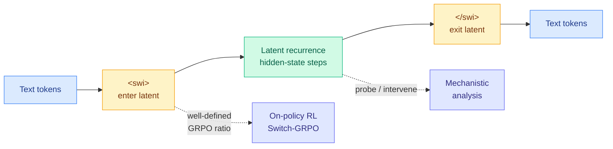

# SWITCH: switchable latent reasoning that is RL-trainable and interpretable

**Date:** 2026-06-12
**Source:** HuggingFace Daily Papers
**Links:** [Paper (arxiv 2606.13106)](https://arxiv.org/abs/2606.13106)

## TL;DR

Latent chain-of-thought (reasoning that happens in continuous hidden states instead of visible text tokens) is attractive because it compresses reasoning, but it has two chronic problems: it is hard to train with standard on-policy RL, and it is opaque to interpretability. SWITCH fixes both with one cheap move: **a single pair of discrete boundary tokens, `<swi>` to enter latent mode and `</swi>` to exit.** Because the boundaries are ordinary discrete tokens, the GRPO policy ratio (the importance-sampling term RL needs) is well-defined at every decision point, so latent reasoning becomes trainable with the same machinery as text reasoning. The same anchors give interpretability a foothold: you can probe and causally intervene exactly at the latent block.

## What problem it solves

Prior hidden-state-recurrence latent reasoning ([Coconut-style] continuous thought) cannot cleanly use on-policy RL because there is no discrete decision point at which to define a policy ratio, and it resists mechanistic analysis because there is no anchor to probe. SWITCH's boundary tokens create both: a discrete entry/exit that RL can hook into, and a fixed location that interpretability can target.

## Core novelty

The realization that **one pair of explicit boundary tokens solves the trainability and the interpretability problem simultaneously.** Training uses a visible-to-latent curriculum plus a "Switch-GRPO" objective that propagates gradients through the recurrent latent computation. The mechanistic payoff is concrete: the paper shows (i) `<swi>` is a sharply localized *learned* switching policy, not a stylistic tic; (ii) the latent step does problem-specific, causally important computation, not filler; and (iii) that computation concentrates at a *single hidden-state transition* on entry.

## Key takeaways

- Consistently beats prior hidden-state-recurrence latent reasoning at similar scale.
- Boundary tokens make latent reasoning compatible with standard GRPO out of the box.
- Causal analysis localizes the useful latent computation to one transition on entry — a rare clean interpretability result for latent reasoning.

## Relation to prior wiki state

- **Directly advances the latent-reasoning thread** the wiki has built through [GLR (geometric latent reasoning, 06-02)](2026-06-02-glr-geometric-latent-reasoning.md), [NF-CoT (latent reasoning via normalizing flows, 06-05)](2026-06-05-nf-cot-latent-reasoning-normalizing-flows.md), and [NITP (next implicit token prediction, 06-02)](2026-06-02-nitp-next-implicit-token-prediction.md). Those made latent reasoning *work*; SWITCH makes it *trainable with RL and legible* — the two things that block latent CoT from production.
- **Rare bridge between efficiency and interpretability.** Latent reasoning is a Tier-1-adjacent efficiency play (fewer emitted tokens), and SWITCH delivers a mechanistic-interpretability result on top — connecting to the wiki's responsible-AI work on probing and causal intervention. The finding that on-policy RL improves the model "from the inside" via a localized latent transition is the kind of result that makes latent CoT auditable.

## Gaps

- Scale is "similar scale" to prior latent-reasoning baselines, i.e. small; no frontier-scale validation.
- The interpretability findings are on math-style reasoning; whether the single-transition concentration holds on open-ended tasks is untested.
- Latent compression's actual token/latency savings vs visible CoT are not the paper's headline, so the efficiency win is implied rather than quantified.

## Links

- Raw: `raw/huggingface/2026-06-12-demystifying-hidden-state-recurrence-switchable-latent-reaso.md`
- Related: [GLR 06-02](2026-06-02-glr-geometric-latent-reasoning.md) · [NF-CoT 06-05](2026-06-05-nf-cot-latent-reasoning-normalizing-flows.md) · [rl-for-llms.md](rl-for-llms.md)
</content>
