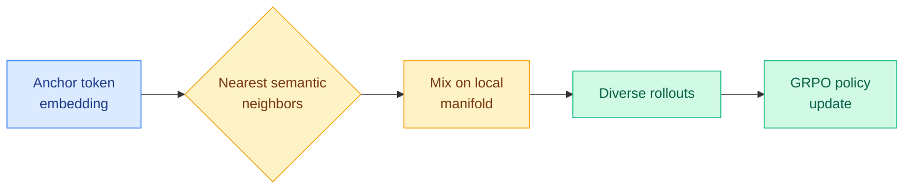

# N-GRPO: Embedding-Level Neighbor Mixing for Enhanced Policy Optimization

**TL;DR** — RL for math reasoning (GRPO, Group Relative Policy Optimization — the rollout-and-compare scheme behind DeepSeek-R1-style training) lives or dies on the diversity of solution paths sampled during rollout. Two existing knobs both fail: token-level sampling produces trajectories that differ only in rephrasing, and injecting random noise at the embedding level breaks semantic consistency. N-GRPO threads the needle with *Semantic Neighbor Mixing*: it builds each input representation by mixing an anchor token's embedding with its nearest semantic neighbors, injecting diversity while staying on the local semantic manifold. On DeepSeek-R1-Distill-Qwen models across sizes it beats strong baselines on math benchmarks and generalizes out-of-distribution.

## What it is

An exploration strategy plugged into GRPO. Instead of sampling diverse trajectories at the token level (cheap but redundant) or perturbing embeddings with random noise (diverse but off-manifold and semantically incoherent), N-GRPO mixes the anchor embedding with its k nearest semantic neighbors. The mixed representation stays inside the region of embedding space the model treats as meaningful, so the diversity it injects is real exploration rather than noise.

## Why it matters

The diversity-vs-validity trade-off in RL rollouts is a recurring open problem on the wiki. The contribution here is locating the perturbation in a semantically safe place — the local manifold — which is a more principled answer than "add noise and hope." It is a Tier 2 result (RL for LLMs) with a clean, transferable mechanism. The OOD generalization claim is the part that needs the most scrutiny.

## Key points

- Semantic Neighbor Mixing: input embeddings built by mixing an anchor with its nearest neighbors.
- Avoids both redundant token-level rollouts and semantics-breaking random embedding noise.
- Consistent gains over strong baselines on math benchmarks with DeepSeek-R1-Distill-Qwen, across sizes.
- Reports robust out-of-distribution generalization.

## Gaps

Evaluated mainly on math-reasoning benchmarks and a single distilled model family; whether neighbor-mixing helps on open-ended reasoning or larger base models is untested. The cost of nearest-neighbor lookup during rollout is not characterized.

## Relation to prior wiki

Extends the [rl-for-llms](rl-for-llms.md) concept page, specifically the rollout-diversity thread. It is an exploration-side complement to verifier-gated methods like [SG-OPD](../inference-efficiency/2026-06-12-sg-opd-sign-gated-on-policy-distillation.md) (sign-consistency gating of teacher updates): both try to make the learning signal denser, one by improving what gets sampled, the other by filtering what gets trusted.

**Source:** HuggingFace Daily Papers · [Paper](https://arxiv.org/abs/2606.10768) · raw: `raw/huggingface/2026-06-14-n-grpo-embedding-level-neighbor-mixing-for-enhanced-policy-o.md`
