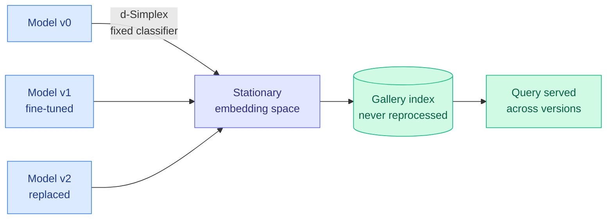

# A Stationary (and Therefore Compatible) Representation is All You Need

**TL;DR** — When you upgrade a model that produces embeddings (a retrieval encoder, a face/image gallery index), the new model's embeddings usually live in a different geometry than the old one's, so you have to re-embed your entire gallery. That backfill is expensive and sometimes infeasible. This paper shows that *stationary* representations learned with a d-Simplex fixed classifier are provably compatible: old and new embeddings stay interchangeable across updates. Adding a contrastive term to the usual cross-entropy captures higher-order structure that cross-entropy alone misses, and is shown equivalent to learning cross-entropy under the compatibility constraint. Result: uninterrupted retrieval through model updates and even full model replacement, at state-of-the-art quality, with no gallery reprocessing.

## What it is

A theory-plus-method result on compatible representation learning. The d-Simplex fixed classifier pins class prototypes to fixed, maximally-separated positions on a simplex, so feature distributions align at first-order statistics across model updates — which the paper proves implies compatibility in its formal definition. Because first-order alignment misses higher-order dependencies, they add a contrastive loss in convex combination with cross-entropy and show it both captures those dependencies and is equivalent to cross-entropy under the compatibility constraint.

## Why it matters

This is a Tier 2 representation-learning paper with a direct operational payoff that touches Amit's routing interest: model versioning. Any production system that routes between or hot-swaps model versions pays a re-embedding tax when the new model's feature space drifts. Provable compatibility means you can replace the encoder without rebuilding the index — the embedding-space analogue of a backward-compatible API. The "occasionally replaced with an improved model" scenario they test is exactly the lifecycle of a deployed retrieval stack.

## Key points

- d-Simplex fixed classifiers yield stationary representations that provably satisfy compatibility.
- Cross-entropy alone aligns only first-order statistics; a contrastive term captures higher-order dependencies.
- The combined loss is shown equivalent to cross-entropy under compatibility constraints.
- Enables uninterrupted retrieval across sequential fine-tuning and full model replacement, at SOTA, with no gallery reprocessing.

## Relation to prior wiki

New territory for the wiki's [llms-foundation-models](rl-for-llms.md) area on the representation-stability side. The model-versioning angle connects to the [ai-routing](../ai-routing/2026-05-15-routeprofile-llm-profile-design-space.md) thread, where routing across model versions assumes a stable interface; compatible representations are what make that assumption safe on the embedding side.

**Source:** HuggingFace Daily Papers · [Paper](https://arxiv.org/abs/2606.12488) · raw: `raw/huggingface/2026-06-14-a-stationary-and-therefore-compatible-representation-is-all.md`
