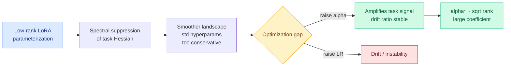

# The Hidden Power of Scaling Factor in LoRA Optimization

**TL;DR.** In LoRA (Low-Rank Adaptation, where you freeze the base model and train only a small low-rank update), the scaling factor alpha is usually treated as a sidekick to the learning rate. This paper shows alpha is actually the dominant knob: it delivers convergence gains the learning rate cannot replicate. LoRA's low-rank parameterization "spectrally suppresses" the loss landscape and smooths it, which makes standard hyperparameters too conservative and opens an optimization gap. Raising alpha amplifies the task signal without inflating the "drift ratio" (off-task movement), so it accelerates convergence where a higher learning rate would just destabilize. The optimal alpha follows a **square-root law in the rank** (not the linear rank-tied heuristic everyone uses), and with a surprisingly large coefficient. Their LoRA-alpha recipe restores alpha to this principled regime and lets LoRA work with normal small learning rates, improving results while shrinking the hyperparameter search.

**Source:** HuggingFace · [Paper](https://arxiv.org/abs/2606.12883) · arxiv 2606.12883

## What it is

A study of what the LoRA scaling factor alpha actually does to optimization, backed by a theoretical "Signal-Drift" framework and broad empirical sweeps. The headline reframing: alpha and learning rate are not interchangeable. Alpha governs how strongly the low-rank update's signal is injected, and because LoRA suppresses the spectrum of the task Hessian (flattening sharp curvature), the landscape is smoother than the chosen hyperparameters assume, leaving performance on the table.

## What problem it solves

Practitioners tie alpha to rank with a linear heuristic (e.g. alpha = 2·rank) and then tune the learning rate, treating alpha as a passive multiplier. That undershoots LoRA's potential and makes hyperparameter search a two-dimensional mess. The paper explains *why* LoRA often needs unusually high learning rates (spectral suppression) and shows the fix is alpha, not LR.

## Core novelty

Three findings: (1) LoRA's low-rank form spectrally suppresses the landscape, creating an optimization gap under conservative defaults; (2) alpha closes that gap better than LR because it amplifies task signal without raising the drift ratio, whereas LR raises both; (3) the optimal alpha scales as the **square root of the rank** with a large coefficient, contradicting the linear rank-tied convention. LoRA-alpha operationalizes this so LoRA runs with standard small learning rates.

## Key takeaways

- Alpha, not learning rate, is the dominant driver of effective LoRA optimization.
- Optimal alpha follows a square-root-in-rank law, not the standard linear heuristic.
- Restoring alpha to its principled regime lets LoRA use normal small LRs and improves results.
- Streamlines hyperparameter search (fewer joint LR/alpha sweeps).

## Gaps

Tasks and base models tested are not exhaustive; whether the square-root coefficient is universal or model/dataset-dependent is the obvious next question. The Signal-Drift framework's predictions are validated on the same regimes used to derive them, so out-of-regime (very high rank, quantized LoRA / QLoRA) behavior is untested.

## How it relates to prior wiki knowledge

- Fits the wiki's parameterization-and-scaling-law cluster: [MoE μP](../ai-routing/2026-05-17-moe-mup-maximally-scale-stable-parameterization.md) (05-17, scale-stable parameterization for mixture-of-experts), [Gated Delta Network μP](../inference-efficiency/2026-06-04-gated-delta-network-mup-scaling.md) (06-04, μP for gated linear attention). All three say the same thing in different corners: the *parameterization* hides a scaling rule, and getting the rule right unlocks capacity standard heuristics waste. LoRA-alpha is the PEFT-side instance.
- Practical complement to the distillation/RL efficiency thread: LoRA is how skills get cheaply attached ([LatentSkill](../agentic-systems/2026-06-09-latentskill-in-weight-skills.md) 06-09 converts skills to LoRA adapters), so a better LoRA optimization rule lowers the cost of that whole pattern.

## Research angle

If alpha is the real lever and LR can stay at base-model defaults, this simplifies the adapter-merging and hypernetwork-to-LoRA lines ([Code2LoRA](../inference-efficiency/2026-06-06-code2lora-hypernetwork-repo-adapters.md)) where many adapters are trained at different ranks, the square-root law gives a single principled alpha per rank instead of per-adapter tuning. Worth testing whether the square-root law also stabilizes adapter *composition* (parameter-space arithmetic over LoRAs trained at mismatched ranks).

→ Raw: `raw/huggingface/2026-06-15-the-hidden-power-of-scaling-factor-in-lora-optimization.md`
