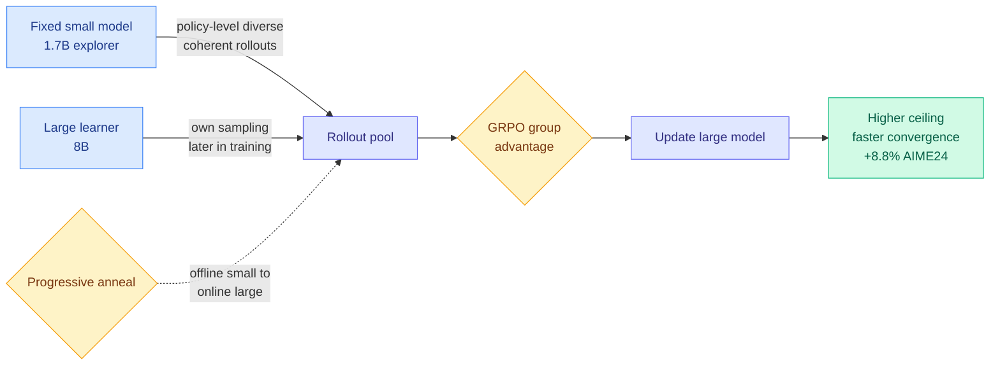

# S2L-PO: Smaller Models are Natural Explorers for Policy-Level Diversity in GRPO

**TL;DR.** GRPO (Group Relative Policy Optimization, the RL method that scores a group of sampled answers against each other instead of against a learned value model) needs diverse rollouts to learn. The standard way to get diversity is to crank up sampling temperature, injecting token-level randomness, but that produces incoherent, step-wise-noisy trajectories. This paper finds a cleaner source: smaller models in the same family are *naturally* more diverse at the policy level (their pass@k rises faster than larger siblings' as you draw more samples), and that diversity is temporally correlated and logically consistent, not random noise. S2L-PO (Small-to-Large Policy Optimization) uses a fixed small model as a free "explorer" to generate rollouts for training a larger model, with a progressive annealing schedule that hands control back to the large learner's own sampling as training proceeds. Result: +8.8% on AIME 24 using a 1.7B explorer to guide an 8B learner, with *less* rollout compute.

**Source:** HuggingFace · [Paper](https://arxiv.org/abs/2605.30789) · arxiv 2605.30789

## What it is

A new axis for rollout diversity in GRPO. Instead of getting variety from sampling temperature (token-level noise), get it from a different, smaller policy that explores the answer space in a structurally coherent way, then train the large model on those rollouts.

## What problem it solves

GRPO's signal comes from differences within a sampled group. Temperature-based diversity buys variety at the cost of coherence: high-temperature trajectories often go incoherent, so the group contains noise, not structured exploration. That caps both convergence speed and the achievable ceiling.

## Core novelty

The empirical observation that smaller same-family models have higher *policy-level* diversity (superior pass@k scaling), which is temporally correlated and logic-preserving, unlike token-level randomness. S2L-PO turns that into a training method: fixed small explorer rollouts early, annealed toward the large learner's own sampling late, so the small model's capacity ceiling never caps the large model mid-training.

## Key takeaways

- Smaller models explore the policy space more diversely than larger siblings (pass@k rises faster with sample count).
- This diversity is structured (coherent trajectories), a better gradient signal than temperature noise.
- +8.8% on AIME 24 with a 1.7B explorer guiding an 8B learner, while reducing rollout compute.
- Annealing from offline-small to online-large avoids the mid-training dip from the explorer's capacity limit.

## Gaps

Demonstrated on math reasoning (AIME and similar); whether small-model policy diversity transfers to code, tool use, or open-ended tasks is untested. The "same family" requirement may not hold across architectures or tokenizers. No analysis of how small the explorer can go before its diversity stops being useful signal.

## How it relates to prior wiki knowledge

- Direct neighbor of [N-GRPO](2026-06-14-n-grpo-neighbor-mixing-grpo.md) (06-14, mixing neighbor rollouts to stabilize GRPO advantage estimates): both attack GRPO's diversity/variance problem at the rollout-construction stage rather than the loss. S2L-PO sources diversity from a *smaller model*; N-GRPO sources it from *neighbors*.
- It is the exploration-side complement to the "the learning signal is sparse and locatable" thread the [rl-for-llms](rl-for-llms.md) concept page tracks (TIP 04-16: <10% of tokens carry signal; Temporal Scheduling for RLVR 06-02: schedule credit over training). Those decide where/when to spend signal; S2L-PO decides *where the diverse signal comes from*.
- The "small model guides large model" structure inverts the usual distillation direction (big teaches small). Here a weak model supplies *exploration*, not *knowledge*, a distinction worth tracking against the OPD/distillation line ([Extrapolation Cliff](../inference-efficiency/2026-05-14-extrapolation-cliff-on-policy-distillation.md) 05-14).

## Research angle

The deep claim is that exploration capacity and capability are anti-correlated within a model family: smaller = more exploratory. If true, the optimal RL setup is a *fleet* of small explorers feeding one large exploiter, a heterogeneous-policy GRPO. The falsifiable question is whether policy-level diversity is a property of size specifically or just of any sufficiently different policy (a differently-seeded same-size model might do as well, which would reframe the result as "diverse policy" not "small policy").

→ Raw: `raw/huggingface/2026-06-15-smaller-models-are-natural-explorers-for-policy-level-divers.md`
