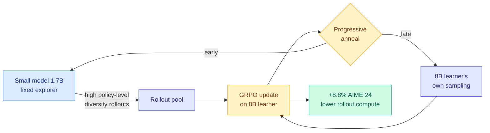

# Smaller Models are Natural Explorers for Policy-Level Diversity in GRPO

**TL;DR.** GRPO (Group Relative Policy Optimization, the rollout-and-compare RL behind DeepSeek-R1-style training) needs diverse rollouts to learn. The standard way to get diversity is to crank sampling temperature, injecting token-level randomness, but that produces incoherent trajectories and can trigger entropy explosion. This paper finds a cleaner source: **smaller models in the same family are naturally more diverse at the policy level**, shown by their better pass@k as sample count grows. That diversity is temporally correlated and logically consistent, unlike random token noise. S2L-PO (Small-to-Large Policy Optimization) uses a fixed small model as an "explorer" to generate rollouts for training a larger model, then anneals from the small model's offline rollouts to the large learner's own sampling so the small model's capacity ceiling never caps the big one. Result: +8.8% on AIME 24 using a 1.7B explorer to train an 8B model, at lower rollout compute.

**Source:** HuggingFace · [Paper](https://arxiv.org/abs/2605.30789) · arxiv 2605.30789

## What it is

A new axis for rollout diversity in GRPO. Instead of perturbing at the token level (temperature, noise) the paper perturbs at the *policy* level by sampling from a smaller sibling model. The key empirical observation: within a model family, smaller models have higher pass@k as k grows, i.e. they cover more distinct valid solution modes. That diversity is "structured" (temporally correlated, logically coherent) and so gives better gradient-estimation signal than step-wise noise.

## What problem it solves

Token-level diversity injection is the default and it is bad: high temperature causes entropy explosion, instability, and degraded reasoning; random per-step noise yields incoherent chains. Off-policy reuse of old rollouts suffers distribution shift as the learner evolves; ensembles need multiple large models. S2L-PO gets diversity from a cheap fixed small model without any of these costs.

## Core novelty

(1) Identifying policy-level diversity (measured via pass@k scaling) as a distinct, more useful diversity axis than token-level randomness. (2) Using a *fixed small model as a natural explorer* to drive a larger model's GRPO training. (3) A progressive annealing schedule that shifts from offline small-model rollouts to the large learner's own sampling, dodging the mid-training performance drop you'd otherwise hit when the small model's capacity ceiling becomes the bottleneck.

## Key takeaways

- Smaller same-family models exhibit higher policy-level diversity (superior pass@k as samples grow).
- +8.8% on AIME 24 using a 1.7B explorer to guide an 8B learner.
- Reduces rollout compute (small model rollouts are cheaper than large-model sampling).
- Annealing avoids the small-model capacity ceiling capping the large model.

## Gaps

Demonstrated on math reasoning with a single model family; whether the "smaller = more policy-diverse" property holds for code, tool use, or across families (not just within one) is untested. The annealing schedule is a tuned hyperparameter; sensitivity is not fully characterized. No analysis of when the small explorer's diversity is *miscalibrated* (diverse but wrong) and whether that injects bad gradients.

## How it relates to prior wiki knowledge

- Direct sibling to [N-GRPO](2026-06-14-n-grpo-neighbor-mixing-grpo.md) (06-14, the same-week paper that adds rollout diversity by mixing a token's embedding with its nearest semantic neighbors instead of random noise). Both attack the same diagnosis, token-level noise breaks semantics, from opposite ends: N-GRPO perturbs the *input representation* on the semantic manifold; S2L-PO swaps the *whole policy* for a more diverse one. Two papers in two days converging on "make what gets sampled better, not just noisier." This is now a clear pattern.
- Continues the RLVR-rollout-cost thread: rollout generation is the dominant compute in frontier RL ([Speculative Decoding for RL Rollouts](../inference-efficiency/2026-04-30-speculative-decoding-rl-rollouts.md), 04-30). S2L-PO cuts that cost from a different angle, generate with a cheaper model, not faster.
- The "small model guides large model" structure inverts the usual distillation direction (teacher → student) and echoes [RLRT / Rebellious Student](2026-05-12-rebellious-student-rlrt.md) (05-12, reinforce the student's own exploration where it beats the teacher's prediction): both find value in a *weaker or different* policy's exploration signal.

## Research angle

This connects rollout diversity to the pass@k literature directly: if pass@k scaling is a measurable, family-stable property, you could *select* an explorer model by its pass@k curve rather than guessing. The deeper question is whether "policy-level diversity" and N-GRPO's "semantic-manifold diversity" are the same underlying quantity expressed at different layers; if so, a unified diversity objective could replace both. Pairs naturally with [Temporal Scheduling for RLVR](2026-06-02-temporal-scheduling-rlvr.md) (06-02): anneal the *explorer* and the *credit criterion* on a shared schedule.

→ Raw: `raw/huggingface/2026-06-15-smaller-models-are-natural-explorers-for-policy-level-divers.md`
