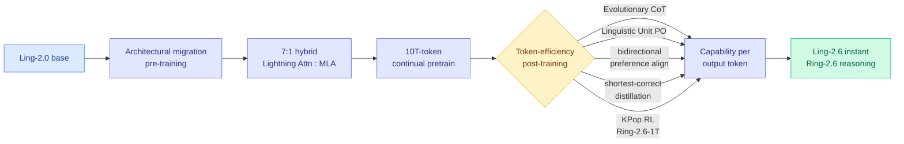

# Ling-2.6 / Ring-2.6: Hybrid Linear Attention at 1T Scale

**TL;DR.** Ant Group's inclusionAI released Ling-2.6 and Ring-2.6 (arxiv 2606.15079), a model family upgraded *in place* from the Ling-2.0 base rather than trained from scratch. The headline architectural move, flagged by HuggingFace's Elie Bakouch: they replaced full GQA attention with a **7:1 hybrid of Lightning Attention (linear) and MLA (Multi-head Latent Attention)**, continued pre-training on 10T tokens, and tuned hard for *reasoning efficiency* (capability per output token). Ling-2.6 targets instant low-latency responses; Ring-2.6 (up to 1T parameters) targets deep reasoning and agentic workflows. The base model was released too. Surfaced via the Twitter farmer (@eliebakouch), not HuggingFace Daily Papers.

## What it is

A unified co-design of architecture, optimization objectives, serving systems, and agent-training environments, delivered as an upgrade path rather than a fresh model:

- **Architectural migration pre-training** — take the existing Ling-2.0 base and migrate its architecture, avoiding a from-scratch run.
- **Hybrid linear attention** — integrate **Lightning Attention** (a linear-complexity attention variant) with **MLA** (DeepSeek's low-rank latent KV attention), in a 7:1 ratio (7 linear layers per MLA layer), improving long-context training and decoding efficiency.
- **Token efficiency** — Evolutionary Chain-of-Thought, Linguistic Unit Policy Optimization, bidirectional preference alignment, and shortest-correct-response distillation, all aimed at raising capability *per output token*.
- **KPop** — an RL framework for stable training of Ring-2.6-1T on large-scale environment-grounded agentic data, with asynchronous rollouts for training efficiency.

Ling-2.6 is the instant-response variant; Ring-2.6 is the deep-reasoning/agentic variant. The 1T model was migrated from full GQA to the linear-MLA hybrid specifically for efficiency and agentic capability, per the authors' tech report and Bakouch's read of it.

## How it relates to prior wiki knowledge

This is the **second frontier-scale hybrid-linear-attention efficiency upgrade published the same day** as NVIDIA's [Nemotron 3 Ultra](2026-06-16-nemotron-3-ultra-moe-hybrid-mamba.md) (Mamba+attention hybrid MoE). Two independent labs converting large models to mixed linear/full-attention backbones on 2026-06-16 is a clear convergence signal: the [attention-mechanisms](attention-mechanisms.md) and [KV cache](../inference-efficiency/kv-cache.md) pages have tracked the hybrid recipe since the PrfaaS serving models (Kimi Linear, MiMo-V2-Flash) and the linear-attention substrate line ([MDN](../inference-efficiency/2026-05-11-mdn-momentum-deltanet-linear-attention.md), [Gated DeltaNet-2](../inference-efficiency/2026-05-24-gated-deltanet-2-decoupled-erase-write.md)); now it is the default for new frontier releases, not an experiment.

The specific Lightning-Attention + MLA pairing is notable: it composes the two distinct efficiency families the wiki separates — *linear attention* (fixed-state, cheap long context) and *MLA* (low-rank KV compression, the [VideoMLA](../inference-efficiency/2026-06-02-videomla-low-rank-latent-kv-cache.md) / DeepSeek line). The 7:1 ratio is an explicit design point on how much full-expressivity attention a reasoning model still needs.

The token-efficiency post-training (shortest-correct distillation, capability-per-output-token) is the supply side of the wiki's "more tokens is not more capability" thread — it connects to [ThoughtFold](2026-06-04-thoughtfold-folding-reasoning-chains.md) (06-04, fold redundant reasoning) and the CLEAR/reasoning-budget line. Bakouch's companion remark (a model "outputting less token because it's smarter" is the opposite of what's happening — they trained it to be terse) is a useful corrective: token-efficiency here is engineered, not emergent.

## Gaps

This is sourced from a tech report and expert Twitter commentary, not yet an independent benchmark; the actual quality-vs-cost position against DeepSeek V4 / MiniMax M3 is unverified here. The 7:1 hybrid ratio's effect on retrieval precision at long context (the usual linear-attention tax) is not characterized in the surfaced material. "Architectural migration pre-training" is intriguing but under-specified — how much capability survives swapping full GQA for a linear-MLA hybrid via continued pre-training is the load-bearing claim.

## Industrial implication

The "migrate, don't retrain" story is the practically important one: if a lab can convert an existing full-attention 1T model to a cheaper hybrid backbone with 10T tokens of continued pre-training instead of a from-scratch run, the cost of adopting linear-attention efficiency drops sharply for everyone sitting on a trained dense/GQA model. Combined with Nemotron 3 Ultra the same day, expect hybrid linear-attention to be the assumed backbone for the next generation of open agentic models.

**Source:** Twitter (@eliebakouch, Hugging Face) — surfaced via farmer, not HF Daily Papers · [Paper](https://arxiv.org/abs/2606.15079) · [Raw tweet](../../raw/twitter/2026-06-16-afternoon.md)
