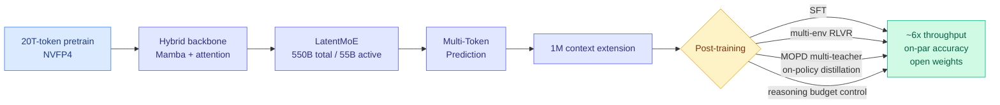

# Nemotron 3 Ultra: Open MoE Hybrid Mamba-Transformer for Agentic Reasoning

**TL;DR.** NVIDIA's Nemotron 3 Ultra (arxiv 2606.15007) is a 550B-total / 55B-active Mixture-of-Experts model whose backbone is a hybrid of Mamba (a state-space sequence layer that scales linearly with context) and attention layers. Pre-trained on 20T tokens, extended to 1M-token context, and post-trained with SFT, RL, and multi-teacher on-policy distillation, it claims up to ~6x higher inference throughput than comparable open LLMs at on-par accuracy. The whole stack — base, post-trained, and quantized checkpoints plus training data and recipe — is open-sourced. The pitch is explicitly long-running autonomous agents: high throughput plus 1M context.

## What it is

A frontier-scale open model that stacks most of the wiki's efficiency levers into one production system:

- **Hybrid Mamba-attention backbone** — Mamba/SSM layers carry the long sequence in linear time; attention layers handle what needs full pairwise mixing. This is the architecture class behind the throughput claim at 1M context.
- **LatentMoE** — a latent-routed MoE giving 550B total capacity at 55B active per token.
- **Multi-Token Prediction (MTP)** — predict several future tokens per step, a built-in speculative-decoding-friendly training objective.
- **NVFP4 pre-training** — 4-bit floating point used during pre-training itself, not just post-hoc quantization.
- **Multi-environment RLVR** (RL with verifiable rewards) + **Multi-teacher On-Policy Distillation (MOPD)** + **reasoning budget control** in post-training.

Headline: ~6x inference throughput vs state-of-the-art open LLMs at comparable accuracy, with 1M context, positioned for long-horizon agentic tasks. Everything is open: base, post-trained, quantized checkpoints, data, recipe.

## How it relates to prior wiki knowledge

Nemotron 3 Ultra is the **convergence point** of nearly every architecture-efficiency thread the wiki tracks, shipped as one open model:

- **Hybrid linear-attention + full-attention** is the same recipe behind the [PrfaaS](../inference-efficiency/2026-05-24-kvserve-service-aware-kv-compression.md) family of long-context serving models (Kimi Linear, MiMo-V2-Flash) noted on the [KV cache page](../inference-efficiency/kv-cache.md), and the [attention-mechanisms](attention-mechanisms.md) page's linear/SSM line. Notably this is the *same day* as the Ling-2.6/Ring-2.6 report ([summary](2026-06-16-ling-ring-2.6-hybrid-linear-attention.md)) which moves a 1T model from full attention to a 7:1 Lightning-Attention:MLA hybrid for the same reasons. Two frontier-scale labs publishing hybrid-attention efficiency upgrades on one day is the pattern, not a coincidence.
- **NVFP4 in pre-training** extends the [LongLive-2.0](../inference-efficiency/2026-05-19-longlive-2-nvfp4-parallel-infrastructure-long-video.md) (05-19) NVFP4 stack from video to a 550B text MoE, confirming 4-bit-native training is moving from demo to frontier-scale production on Blackwell.
- **Multi-teacher on-policy distillation** sits on top of the wiki's heavy OPD line — [Dense Supervision, Sparse Updates](../inference-efficiency/2026-06-15-dense-supervision-sparse-updates-opd-geometry.md) (06-15, OPD writes a small FFN-heavy subnetwork) and the [knowledge-distillation page](../inference-efficiency/knowledge-distillation.md). MOPD is the first *multi-teacher* OPD the wiki has logged at this scale.
- **Reasoning budget control** is the model-internal version of the per-query compute rationing in [CLEAR](../inference-efficiency/2026-06-05-clear-shadow-price-reasoning-budget.md) (06-05) and the [ai-routing](../ai-routing/llm-routing.md) "how many tokens to think" axis.

The significance is integrative: individually the wiki has seen each lever; Nemotron 3 Ultra is the open existence proof that they stack into a 6x-throughput frontier model rather than fighting each other.

## Gaps

"~6x throughput" and "on-par accuracy" are vendor claims pending independent benchmarks; the comparison set ("state-of-the-art publicly available LLMs") is unspecified in the abstract. Hybrid Mamba-attention models historically trade some retrieval precision for throughput at extreme context — whether 1M context holds up on needle-in-a-haystack and multi-hop retrieval (where pure-attention baselines are strong) is the number to check. No per-lever ablation in the abstract, so the contribution of each technique to the 6x is unclear.

## Industrial implication

This is NVIDIA shipping its own efficiency research as deployable open weights — a competitive answer to the open Chinese frontier models (DeepSeek V4, MiniMax M3, Ling/Ring) that have dominated the cost-per-task charts. If the 6x and 1M-context claims hold under audit, Nemotron 3 Ultra becomes a default base for self-hosted long-horizon agents, and it validates "hybrid SSM-attention MoE with 4-bit-native training" as the frontier-scale efficiency template rather than a research curiosity.

**Source:** HuggingFace Daily Papers · [Paper](https://arxiv.org/abs/2606.15007) · [Raw](../../raw/huggingface/2026-06-16-nemotron-3-ultra-open-efficient-mixture-of-experts-hybrid-ma.md)
