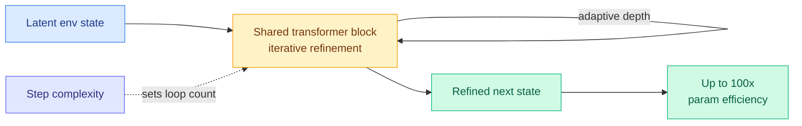

# Looped World Models (LoopWM)

**TL;DR.** World models face a tension: faithful long-horizon simulation wants deep computation, but deeper models are expensive and accumulate compounding errors. LoopWM resolves it by being the first looped architecture for world modelling: a single parameter-shared transformer block iteratively refines the latent environment state. This yields up to 100x parameter efficiency over conventional deep world models, with adaptive computation that scales loop depth to match each prediction step's complexity. The framing is that iterative latent depth is a *new scaling axis* for world simulation, orthogonal to growing model size or training data.

**Source:** HuggingFace · [arxiv 2606.18208](https://arxiv.org/abs/2606.18208)

## Key findings

- **First looped architecture for world models** — refine latent state by re-applying one shared block rather than stacking many distinct layers.
- **Up to 100x parameter efficiency** versus conventional deep world models at comparable simulation fidelity.
- **Adaptive computation:** loop depth automatically scales with each prediction step's complexity, so easy steps stay cheap.
- **Iterative latent depth as a scaling axis,** orthogonal to model size and data — the same framing LoopCoder-v2 makes for language.

## Relation to prior wiki

- LoopWM is the world-model instance of the week's **loop convergence**: with [LoopCoder-v2](../inference-efficiency/2026-06-17-loopcoder-v2-parallel-loop-transformer.md) (06-17, two-loop PLT coder, SWE-bench 43→64.4) and the Kurate-rated *Solve the Loop: Attractor Models for Language and Reasoning* (cs.LG #6), this is three papers in one week treating looped/iterative depth as a first-class scaling axis. See the [looped-transformers](looped-transformers.md) concept page.
- Where LoopCoder-v2 finds looping *saturates at two loops* for code, LoopWM claims *adaptive* loop depth as a feature for simulation. The open question across the cluster is whether adaptive per-step depth (LoopWM) avoids the oscillatory-saturation that fixed deep looping (LoopCoder loops 3+) hits.
- Connects to the world-model line tracked in [Ken Huang's world-models survey](2026-05-03-ken-huang-world-models-architectures.md) (05-03) and the WorldKV video-memory work — efficiency-first world modelling rather than scale-first.

## Gaps

"Up to 100x" is a headline ratio that needs the fidelity-matched operating point to interpret. Compounding-error behavior over very long rollouts — the original motivation — is asserted to improve but the horizon at which looped refinement still helps is the result to verify. No standardized world-model benchmark named in the abstract.

Raw: `raw/huggingface/2026-06-17-looped-world-models.md`
