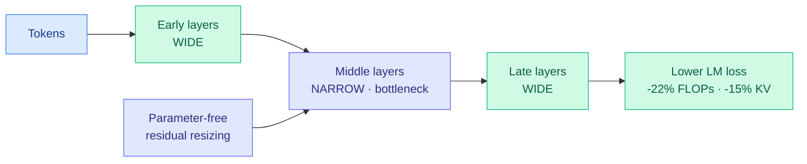

# Variable-Width Transformers: a bottleneck-shaped network is more FLOP-optimal

**TL;DR.** Almost every transformer keeps the same width at every layer, spending parameters and compute evenly across depth even though different layers do different jobs. This paper proposes a `>‹former` ("times-shaped") architecture: keep early and late layers wide, narrow the middle layers, joined by a parameter-free residual-resizing mechanism. Across dense models 200M–2B and a 3B MoE, the bottleneck shape consistently beats parameter-matched uniform baselines on language-modeling loss, while cutting FLOPs ~22% and KV-cache memory / I/O ~15% under loss-matched scaling. Analysis shows the bottleneck produces qualitatively different residual-stream representations.

## What it is

A capacity-allocation study. Instead of scaling depth and width uniformly, it varies *width across depth*: wide ends, narrow middle, shaped like the `>‹` glyph in the paper's name. The narrowing reduces the average layer width, which is what buys the FLOP and KV-cache savings, and a parameter-free residual resizing keeps the residual stream consistent across width changes. The claim is that uniform width over-provisions the middle layers, which play a different computational role than the input-facing and output-facing ends.

## Key findings

- Consistently lower LM loss than parameter-matched uniform baselines, from 200M to 2B dense and 3B MoE.
- ~22% FLOP reduction under fitted loss-matched scaling curves.
- ~15% smaller KV-cache memory and I/O cost (narrower middle layers hold smaller K/V).
- The bottleneck yields qualitatively different residual-stream representations, suggesting non-uniform width changes *what* layers compute, not just *how much*.

## How it relates to prior wiki knowledge

- This is the **width-axis** complement to the depth-axis efficiency work. [POLAR / Program-of-Layers](../inference-efficiency/polar-program-of-layers.md) (06-15) reused layers as a program; Variable-Width keeps layers distinct but right-sizes each. Both reject the "every layer is equal" prior.
- The 15% KV-cache reduction makes it a quiet member of the [kv-cache](../inference-efficiency/kv-cache.md) efficiency line — a structural KV saving baked into the architecture rather than a serving-time compression ([Tangram](../inference-efficiency/2026-06-16-tangram-non-uniform-kv-compression-serving.md), [OSCAR](../inference-efficiency/2026-05-21-oscar-extreme-kv-cache-quantization.md)).
- "Different layers play distinct roles" echoes today's [Hybrid Attention](../inference-efficiency/2026-06-17-hybrid-attention-large-window-laziness.md) finding (retrieval localized to full-attention layers) — both argue capacity should be allocated by layer function, not uniformly.

## Gaps

Largest tested model is 3B (MoE); whether the bottleneck shape and its 22% FLOP win survive at frontier scale is the obvious open question, and the "fitted loss-matched scaling curves" extrapolation is doing heavy lifting. The optimal width profile (how narrow, where) is fit empirically, not derived. No downstream-benchmark numbers, only LM loss.

## Research angle

If middle-layer capacity is genuinely over-provisioned, this composes with MoE (sparsify the wide ends, keep the narrow middle dense?) and with the [muP / scale-stable parameterization](../inference-efficiency/2026-05-21-moe-mup-scale-stable-parameterization.md) line — a variable-width muP would let the bottleneck profile transfer across scales without re-tuning. The residual-stream representation shift is the interesting thread: if the narrow middle forces a more compressed code, it may be a natural place to read off interpretable features.

**Source:** [arXiv 2606.18246](https://arxiv.org/abs/2606.18246) · [HuggingFace](https://huggingface.co/papers/2606.18246) · raw: `raw/huggingface/2026-06-17-variable-width-transformers.md`
