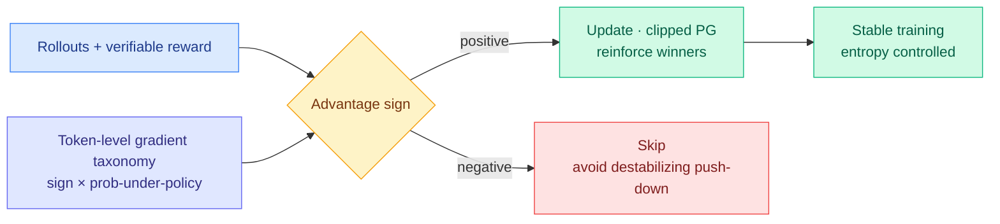

# WAPO: a gradient taxonomy for why RLVR collapses, and a one-sided fix

**TL;DR.** RLVR (reinforcement learning with verifiable rewards — train on tasks where an answer can be auto-checked) improves reasoning, but GRPO-style optimization is prone to collapse. This paper analyzes the instability through *token-level gradient dynamics*, deriving a taxonomy that predicts how each update moves next-token probabilities and entropy, and shows stability depends jointly on the advantage sign and the token's probability under the current policy. The practical payoff is **Winner Advantage Policy Optimization (WAPO)**: a simple online clipped policy-gradient objective that updates *only on positive-advantage completions*. Across math reasoning and multi-hop QA, WAPO improves training stability and matches or beats baselines across model families.

## What it is

A diagnosis-then-fix paper for RLVR stability. The diagnosis is a token-level gradient taxonomy: classify each token by its advantage sign and its probability under the current policy, and predict how the GRPO update will move that token's probability and the policy's entropy. The taxonomy shows certain combinations (notably pushing down already-low-probability tokens on negative-advantage completions) are the destabilizing ones. The fix, WAPO, simply drops the negative-advantage branch: it is a clipped policy-gradient objective that updates only on positive-advantage (winning) completions, reinforcing what works rather than fighting to suppress what doesn't.

## Key findings

- Token-level gradient taxonomy predicts update effects on next-token probability and entropy from advantage sign + token probability.
- Stability is a *joint* property of advantage sign and policy distribution, not advantage alone.
- WAPO (positive-advantage-only, clipped) improves stability and matches or outperforms baselines on math and multi-hop QA across multiple model families.
- Code released: github.com/layer6ai-labs/wapo.

## How it relates to prior wiki knowledge

- Slots directly into the [rl-for-llms](rl-for-llms.md) GRPO-collapse line. It is the gradient-space sibling of the control-theoretic stabilizers the wiki tracked: [MAI-Thinking-1](2026-06-03-mai-thinking-1-hill-climbing.md) (asymmetric trust region + entropy integral controller) and the [TrOPD](../inference-efficiency/2026-06-03-tropd-trust-region-on-policy-distillation.md) trust region. All three fight the same enemy — destabilizing updates under distribution mismatch — but WAPO's lever is the crudest and cheapest: just don't take the negative-advantage step.
- "Update only on winners" is the RLVR echo of the [Sparse-to-Dense Reward Principle](../inference-efficiency/2026-05-13-sparse-to-dense-reward-principle.md) and the broader **sparse-signal** theme: most of the gradient mass is noise or actively harmful, and concentrating on the productive subset stabilizes training.
- Cross-source link: this is the academic counterpart to SemiAnalysis's 06-16 "RL Systems Mind the Gap" (RL system efficiency is the binding constraint on capability) and Interconnects' note that "RL got expensive and conflict-prone." WAPO makes each RL step cheaper *and* more stable, attacking the same cost wall from the algorithm side.

## Gaps

Dropping negative-advantage completions discards the "what not to do" signal entirely; on tasks where suppressing a confident wrong mode matters (safety, format adherence), one-sided updates may underperform. Demonstrated on math and multi-hop QA (verifiable-reward home turf); transfer to agentic / long-horizon RL where rewards are sparse and delayed is untested. The taxonomy is derived for GRPO-style objectives; whether it generalizes to PPO or off-policy variants is open.

## Research angle

The taxonomy is the durable contribution: if "advantage sign × token probability" reliably predicts entropy collapse, it is a principled basis for *adaptive* clipping (clip harder exactly on the predicted-destabilizing combinations) rather than the blunt drop-all-negatives rule. Worth watching whether an open frontier RL run (OLMo, a DeepSeek follow-up) adopts the positive-only objective or the taxonomy-guided clip, which would move it from a paper to a recipe.

**Source:** [arXiv 2606.16154](https://arxiv.org/abs/2606.16154) · [HuggingFace](https://huggingface.co/papers/2606.16154) · [code](https://github.com/layer6ai-labs/wapo) · raw: `raw/huggingface/2026-06-17-a-gradient-perspective-on-rlvr-stability-and-winner-advantag.md`
