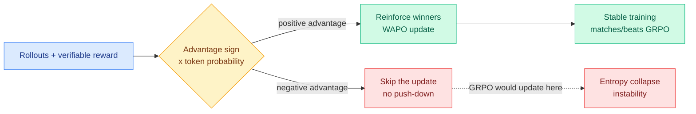

# A Gradient Perspective on RLVR Stability and Winner Advantage Policy Optimization (WAPO)

**TL;DR.** RLVR (reinforcement learning with verifiable rewards — train the model on problems where an answer can be auto-checked) reliably improves reasoning, but GRPO-style optimization keeps collapsing in training. This paper analyzes the instability at the level of token gradients, deriving a taxonomy that predicts how each update moves next-token probabilities and entropy. The key finding: stability depends jointly on the *sign of the advantage* and the *token's probability under the current policy*. Negative-advantage updates on already-unlikely tokens are the destabilizing case. The proposed fix, **Winner Advantage Policy Optimization (WAPO)**, is a simple online clipped policy-gradient objective that updates *only on positive-advantage completions* — it reinforces winners and never explicitly pushes down losers. Across math reasoning and multi-hop QA, WAPO improves training stability and matches or beats baselines across model families.

**Source:** HuggingFace · [arxiv 2606.16154](https://arxiv.org/abs/2606.16154) · [code](https://github.com/layer6ai-labs/wapo)

## Key findings

- **A token-gradient taxonomy** predicts how updates affect next-token probability and entropy, as a function of advantage sign and current token probability. This is a diagnostic, not just a fix.
- **Negative-advantage updates are the instability source** in the regime where the suppressed token is already low-probability — pushing it down further wrecks the distribution.
- **WAPO updates only positive-advantage completions.** Reinforce winners, drop the loser-suppression term. Simple clipped online objective.
- **Stability + parity or better:** improved training stability and matched/outperformed baselines on math reasoning and multi-hop QA across multiple model families.

## Relation to prior wiki

- WAPO is a close cousin of [SDPG: Self-Distilled Policy Gradient](../inference-efficiency/2026-06-04-sdpg-self-distilled-policy-gradient.md) (06-04) and [Sign-Gated On-Policy Distillation](../inference-efficiency/2026-06-12-sg-opd-sign-gated-on-policy-distillation.md) (06-12, gate updates by the sign of the learning signal) — a small family converging on the idea that the *sign* of the update is what to control. It also extends [Delta: discriminative token-credit RLVR](2026-05-23-delta-discriminative-token-credit-rlvr.md) (05-23, assign credit per token rather than per sequence): both are token-level reframings of where RLVR's signal actually lives.
- The "drop the zero/negative-signal portion" instinct matches [TIP](../inference-efficiency/2026-04-16-tip-token-importance-on-policy-distillation.md) (04-16, most teacher tokens carry no signal, train on ~10%) — RLVR and distillation are independently discovering that most of the gradient is noise.
- Directly relevant to the RL-systems industrialization thread: SemiAnalysis's *RL Systems Mind the Gap* (06-16) explains that GRPO produces *zero* training signal when every rollout in a group passes or fails (uniform reward → zero advantage). WAPO attacks the same GRPO pathology from the algorithm side that SemiAnalysis attacks from the systems side. Updated in [rl-for-llms](rl-for-llms.md).

## Gaps

Tested on math and multi-hop QA only; whether dropping negative-advantage updates costs exploration on open-ended or agentic tasks (where pushing *away* from bad behavior matters) is untested. "Matches or outperforms" leaves open whether WAPO is a Pareto win or a stability-for-peak-score trade.

Raw: `raw/huggingface/2026-06-17-a-gradient-perspective-on-rlvr-stability-and-winner-advantag.md`
