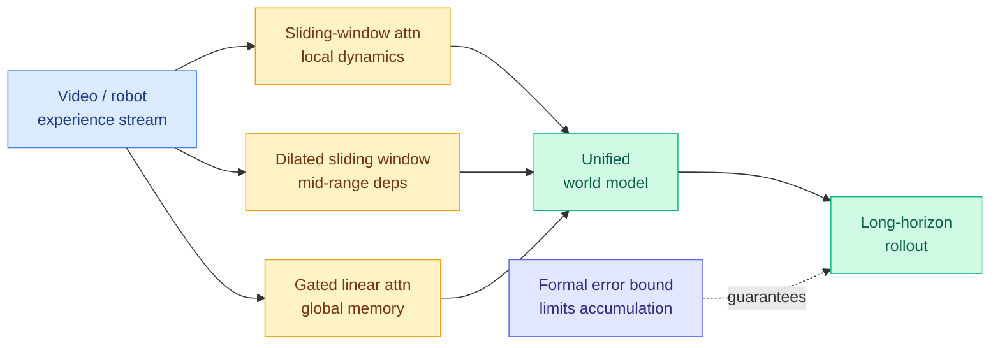

# Kairos: a native world model stack built on three-tier Hybrid Linear Temporal Attention

**TL;DR.** Kairos is a "world model" stack for Physical AI (systems that predict how the physical world evolves so robots and agents can plan inside it). The world-model goal is lower interest here, but the attention design is the part worth reading. Kairos introduces **Hybrid Linear Temporal Attention**, which factors temporal modeling across three layers: sliding-window attention (full attention over a short recent window) captures local frame-to-frame dynamics, dilated sliding-window attention (a window with gaps so it reaches further back at the same cost) captures mid-range dependencies, and gated linear attention (a recurrent-style mixer with constant per-step memory) holds persistent global state over long horizons. The headline claim for Amit: the authors prove **formal theoretical bounds** showing this temporal factorization strictly limits error accumulation, which they frame as a mathematical guarantee that state propagates correctly across extended horizons. Kairos pairs this with a cross-embodiment data curriculum and deployment co-design for server and consumer hardware, and reports a strong efficiency-capability trade-off on embodied and long-horizon benchmarks.

**Source:** HuggingFace · [arxiv 2606.16533](https://arxiv.org/abs/2606.16533) · "Kairos Team", arxiv-dated 2026-06-17

## What it is

A full stack for training and deploying world models, with three named pieces. (1) A **Native Pre-training Paradigm** driven by a Cross-Embodiment Data Curriculum that orders open-world video, human behavioral data, and robot interaction data into a progressive developmental pathway, so the model acquires world knowledge from heterogeneous experience rather than one data type. (2) A **Native Unified Architecture** built on Hybrid Linear Temporal Attention, the three-tier local/mid/global split described above. (3) **Deployment-Aware System Co-Design** that targets low-latency rollout on both server and consumer-grade hardware.

Kairos positions itself against three existing world-model streams: generative pixel-level rendering (NVIDIA Cosmos, which predicts future frames as pixels), predictive latent embedding (Meta JEPA / V-JEPA and DINO-world, which predict in a learned latent space instead of pixels), and interactive environment modeling (DeepMind Genie, World Labs Marble, which build playable simulated environments). Kairos's pitch is that none of these are "native operational infrastructure": they don't jointly acquire cross-embodiment knowledge, hold persistent long-horizon state, and run under real deployment constraints at once.

## Key findings

- **Three-tier temporal attention.** Sliding-window for local dynamics, dilated sliding-window for mid-range, gated linear attention for persistent global memory. Each tier handles a different time scale at a different compute cost.
- **Formal error bound.** The authors prove the temporal factorization strictly limits error accumulation, a mathematical guarantee for state propagation across extended horizons. This is the standout claim: most long-horizon stability results are empirical, not proven.
- **Cross-embodiment curriculum.** Open-world video plus human behavioral data plus robot interaction data, ordered as a developmental pathway.
- **Deployment co-design.** Targets low-latency rollout on server and consumer-grade hardware, and reports a strong efficiency-capability trade-off.
- **Top-level results** on embodied world-model, long-horizon, and action-policy benchmarks.

## Relation to prior wiki

- **Second hybrid-attention design in two days with an explicit local / mid / global split, but Kairos proves what 06-17 only observed.** Yesterday's [Rethinking the Role of Efficient Attention in Hybrid Architectures](../inference-efficiency/2026-06-17-rethinking-efficient-attention-hybrid.md) found that in text hybrids long-range retrieval lives in the full-attention layers, and that bigger sliding windows make those layers lazy ("Large-Window Laziness": a wide window lets the model lean on local context instead of learning to retrieve). That result was empirical mechanistic probing. Kairos makes the same architectural bet, splitting work across local, mid-range, and global layers, but in the temporal/video state domain rather than text retrieval, and it claims a **formal error bound** where 06-17 had only measured behavior. The two papers approach the same structural intuition from opposite ends: 06-17 says "we observe full attention carries the long-range load"; Kairos says "we can prove the factored design bounds long-horizon error". Whether Kairos's gated-linear global tier escapes a temporal analogue of Large-Window Laziness (where the cheap global mixer smooths state instead of precisely retaining it) is exactly the open question below.
- Extends the [attention-mechanisms](attention-mechanisms.md) concept page's running thread that hybrids keep a small amount of expensive attention for the hard part and push bulk compute to cheaper mixers. Kairos generalizes that template from one efficient tier to two (dilated SWA plus gated linear attention) and from positional retrieval to temporal state.

## Research angle

Two questions stand out. First, **does the formal error bound hold empirically at long horizons?** Theoretical bounds on error accumulation are often loose or rest on assumptions (Lipschitz dynamics, bounded per-step error) that real video rollouts violate; the bound is only useful if measured drift tracks it across thousands of steps, not tens. Second, **does gated linear attention's global memory actually retain precise state, or just smooth dynamics?** Linear-attention recurrence has constant-size state, so it must compress history. For world modeling that may be fine for slow global context but lossy for precise object positions or rare events. This is the temporal version of the 06-17 retrieval question: does the cheap global tier carry real state, or does it just shape the trajectory while precise propagation actually rides on the sliding-window tiers? An ablation removing the gated-linear tier would answer it directly.

## Gaps

The benchmarks are embodied / world-model / action-policy specific, so the attention design's value for general long-context language modeling is untested here. The "consumer-grade hardware" claim needs concrete latency and memory numbers to evaluate. The formal bound's assumptions are not summarized in the abstract, and a proof of bounded error accumulation is only as strong as those assumptions. No reported head-to-head against the predictive-latent stream (V-JEPA / DINO-world) on a shared long-horizon metric.

**Industrial context.** World models are drawing a funding wave: Odyssey raised a $310M Series B on 2026-06-17. That capital is flowing into exactly the operational-infrastructure framing Kairos targets, which raises the stakes on whether a proven efficiency-capability trade-off, not just a demo, is what wins deployment.

Raw: `raw/huggingface/2026-06-18-kairos-a-native-world-model-stack-for-physical-ai.md`
