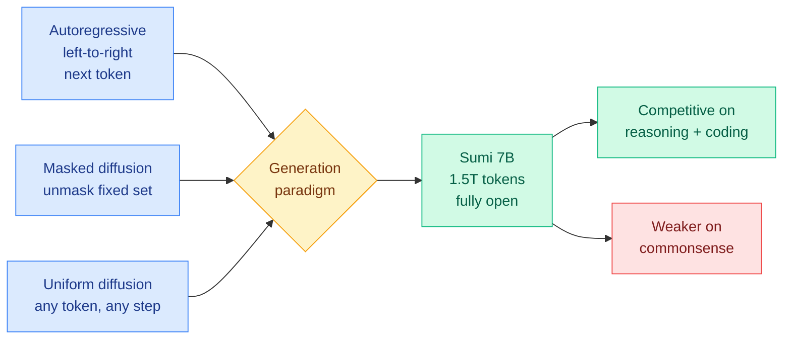

# Sumi: the first open uniform diffusion language model pretrained from scratch at scale

**TL;DR.** Language models come in three generation families. Autoregressive (AR) models generate left-to-right, one next token at a time. Masked diffusion models start from a fixed set of masked positions and progressively unmask them. Uniform diffusion language models (UDLMs) are the most flexible: any token can be updated at any denoising step, including tokens already written, so the model can revise its own earlier choices. AR and masked diffusion both have capable models at scale, but uniform diffusion had none, because no one had pretrained a UDLM from scratch at both large parameter count and large token budget. **Sumi** ("ink" in Japanese) fills that gap. It is a fully open 7B uniform diffusion model trained from scratch on 1.5T tokens, with weights, checkpoints, and the complete training recipe (including the data mixture) released. Sumi is competitive with AR models at a comparable token budget on knowledge, reasoning, and coding benchmarks, and weaker on commonsense, which the authors attribute to an education-heavy data mixture.

**Source:** HuggingFace · [arxiv 2606.19005](https://arxiv.org/abs/2606.19005)

## What it is

A from-scratch pretrained uniform diffusion language model at production-relevant scale. The contribution is partly the model and partly the act of opening it: a 7B UDLM trained on 1.5T tokens with all weights, intermediate checkpoints, and the full recipe released. Uniform diffusion's selling point over masked diffusion is controllability and revision: because any token can be re-updated at any step, the model is not locked into earlier commitments the way masked diffusion (which only fills in masked slots) or AR (which never goes back) is. Until Sumi, that flexibility was a theoretical property with no large-scale model to test it on.

## Key findings

- **First large-scale open UDLM.** 7B parameters, 1.5T training tokens, pretrained from scratch. No prior uniform diffusion model existed at this scale.
- **Fully open.** Weights, checkpoints, and the complete training recipe including the data mixture are released, not just final weights.
- **Competitive on knowledge, reasoning, and coding** against AR models trained at a comparable token budget.
- **Weaker on commonsense benchmarks**, which the authors flag as likely caused by an education-heavy data mixture rather than the diffusion paradigm itself.

## Relation to prior wiki

- **Sumi is the missing open base model that yesterday's post-training recipe needed.** On 06-17 the wiki covered [d-OPSD](../inference-efficiency/2026-06-17-d-opsd-dllm-self-future-distillation.md), the first on-policy self-distillation recipe built for diffusion LLMs, which post-trains a dLLM by conditioning a self-teacher on the student's own generated answer as a suffix, beating RLVR and SFT on reasoning at roughly 10% of RLVR's optimization steps. d-OPSD answered "how do you cheaply post-train a diffusion LLM?" but the wiki's gap note for it was that diffusion LLMs lacked the mature open base-model layer that AR models enjoy. Sumi supplies exactly that layer: an open, scaled, recipe-transparent base that recipes like d-OPSD can be studied and reproduced on. Read together, the two papers are two pieces of the same stack maturing in two days, the open base model (Sumi) and the cheap post-training recipe (d-OPSD), in an architecture race the autoregressive recipe still dominates.
- Joins the broader diffusion-LLM efficiency line the wiki has tracked (dMoE block-level MoE, TIDE MoE diffusion inference, RT-Lynx activation sparsity, all referenced from the d-OPSD page). Those works improve diffusion-LLM inference and post-training; Sumi is the first to put a fully open, scaled *base* under them.

## Research angle

The unresolved claim is whether **uniform diffusion's revision ability beats masked diffusion's controllability once both are at scale**. UDLM's theoretical edge is that it can rewrite earlier tokens, but that edge has never been demonstrated against a masked-diffusion model of the same size and token budget. Sumi makes that comparison possible for the first time. If d-OPSD-style post-training transfers cleanly onto Sumi and the revision ability shows up as concrete gains in self-correction or constrained generation, uniform diffusion becomes a real third option rather than a curiosity.

## Gaps

The commonsense weakness is confounded by the education-heavy data mixture, so we cannot yet separate "uniform diffusion is weak on commonsense" from "this particular data mix was". There is no head-to-head against a masked-diffusion model at the same 7B / 1.5T scale, which is the comparison that would actually justify the "uniform is more flexible" claim. Competitiveness is reported against AR at a comparable token budget, but compute-per-token for diffusion training differs from AR, so a token-matched comparison may not be a compute-matched one.

**Links:** [Paper](https://arxiv.org/abs/2606.19005) · [HuggingFace](https://huggingface.co/papers/2606.19005)

Raw: `raw/huggingface/2026-06-18-sumi-open-uniform-diffusion-language-model-from-scratch.md`
