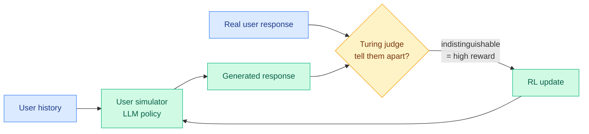

# Learning User Simulators with Turing Rewards

**TL;DR.** Simulating human users in interactive settings is useful for training agent assistants, evaluating personalization, and social-science research. The standard recipe trains an LLM to match a single ground-truth user response, either by maximizing its log probability or with a similarity reward, which optimizes for *reproducing one answer*. This paper proposes **Turing-RL**: instead of matching a specific response, train the simulator to be *indistinguishable* from a real user. It uses a discriminative Turing reward, an LLM judge scores how hard it is to tell a generated response apart from the real user's, given the user's history, and the simulator learns to maximize that indistinguishability. Across conversational chat and Reddit forum discussion, Turing-RL beats response-matching baselines on both LLM and human evaluation.

**Source:** HuggingFace · [arxiv 2606.19336](https://arxiv.org/abs/2606.19336) · arxiv-dated 2026-06-18

## What it is

A reinforcement-learning method for training user-simulator models. The objective is reframed from imitation to indistinguishability. A standard simulator is trained to reproduce the one real response a user gave; Turing-RL instead rewards the simulator for producing responses an LLM judge cannot distinguish from what the real user *could have said*, conditioned on the user's history. The name is a direct nod to the Turing test: success is fooling the discriminator, not matching a target string.

This is structurally an adversarial / discriminative reward (like a GAN's discriminator, but realized with an LLM judge), applied to the user side of an interaction rather than the assistant side.

## Key findings

- Turing-RL beats log-probability-matching and similarity-reward baselines across two domains (conversational chat, Reddit forum discussion).
- Wins on both LLM-judge and human evaluation, so the gain is not just judge-gaming.
- The framing claim: optimizing for indistinguishability is a better training signal for user simulators than optimizing for response matching, because real users are distributions, not single answers.

## Relation to prior wiki

- This is an RLVR-adjacent method where the "verifier" is a discriminative Turing judge rather than a correctness checker, see [rl-for-llms](rl-for-llms.md). It sits beside the year's other reward-design moves that replace exact-match with a learned signal, and it inherits the same risk the wiki has flagged repeatedly: an LLM-judge reward is gameable (cf. the Kurate-surfaced "LLMs Gaming Verifiers" cs.LG #13, RLVR reward hacking).
- A high-quality user simulator is infrastructure for the agent-training and agent-benchmark lines: it is the counterparty an assistant agent practices against, and a more realistic simulator makes long-horizon agent training (and benchmarks like CEO-Bench's noisy customers) more faithful.
- Conceptually it pairs with [Beyond Alignment](../responsible-ai/2026-06-18-value-diversity-multicultural-agents.md) (same day): both treat a human population as a *distribution* to be represented faithfully rather than a single point, one for cultural values, one for individual user responses.

## Research angle

The interesting tension is reward-hacking versus the human-eval win. Indistinguishability rewards are notoriously exploitable (the simulator can learn the judge's blind spots rather than genuine human-likeness), yet the paper reports gains on human evaluation too, which suggests the Turing judge is capturing something real here. The open question: does the advantage survive when the judge is held fixed and the simulator is trained long enough to find its exploits, the standard adversarial-collapse failure? A co-trained judge (judge improves as simulator improves) is the obvious next step and the obvious place it could destabilize.

## Gaps

Two domains only (chat, Reddit), both text; whether it transfers to task-oriented or multimodal interaction is open. The LLM judge defines the reward, so the simulator's ceiling is the judge's discrimination ability, and a weak judge yields an easily-fooled, unrealistic simulator. No analysis of whether the simulator preserves the *diversity* of real users or collapses to a plausible-average user, the exact failure Beyond Alignment warns about for populations.

Raw: `raw/huggingface/2026-06-18-learning-user-simulators-with-turing-rewards.md`
