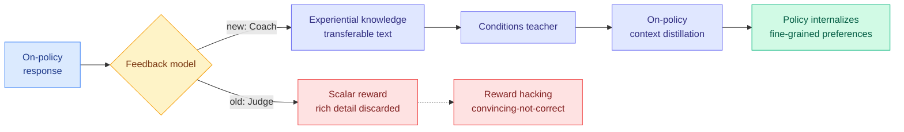

# LLM-as-a-Coach: Experiential Learning for Non-Verifiable Tasks

**TL;DR.** RL on open-ended tasks (writing, advice, anything without a checkable answer) compresses a rich rubric-based evaluation into a single scalar reward. That throws away the textual feedback and treats two responses with very different quality profiles as identical if they score the same. Experiential Learning (EL) repurposes the feedback model: instead of an LLM-as-a-Judge that emits a number, it uses an **LLM-as-a-Coach** that distills its assessment of each response into transferable "experiential knowledge," conditions a teacher on it, and internalizes it into the policy via on-policy context distillation. The higher-bandwidth signal generalizes better out of distribution and mitigates reward hacking.

## What it is

A post-training method for **non-verifiable** tasks. Standard rubric-based RL runs the rubric, produces a scalar, and trains on it, discarding the rubric's textual content. EL keeps that content: the "coach" writes down *why* a response is good or bad as reusable experiential knowledge, which conditions a teacher model; the policy then absorbs it through on-policy context distillation. This is a higher-bandwidth feedback channel than a scalar, giving dense supervision and preserving fine-grained preferences among high-quality responses.

## Core novelty

Converting the judge's discarded rationale into a **first-class training signal** via context distillation, rather than collapsing it to a reward number. The feedback can come from the policy itself or from a proprietary model, and in both cases EL beats rubric-based RL.

## Key results

- Across **two policy families**, with feedback from the policy itself or a proprietary model, EL consistently beats rubric-based RL on held-out and unseen open-ended tasks.
- **Generalizes better beyond the training distribution** than scalar-reward RL.
- **Mitigates reward hacking** — a direct rebuttal to the failure mode below.

## How it relates to prior wiki knowledge

- **Answers the reward-hacking caution the wiki has been building**: [C2 rubric reward modeling (2026-04-18)](2026-04-18-c2-rubric-reward-modeling.md) and [Reward Hacking in Rubric-Based RL (2026-05-13)](2026-05-13-reward-hacking-rubric-based-rl.md) showed rubric rewards get gamed; Kurate's current cs.LG board carries **More Convincing, Not More Correct (#12)** (self-play reward hacking of reference-free judges) and **LLMs Gaming Verifiers (#20)** (RLVR reward hacking). EL's claim that textual feedback resists hacking better than scalar reward is a concrete counter-proposal. See [rl-for-llms.md](rl-for-llms.md).
- **Part of the July "beyond scalar reward" cluster** with [GEPO](2026-07-21-gepo-group-entropy-policy-optimization.md) and [Distilled RL](../inference-efficiency/2026-07-21-distilled-rl-post-training.md).
- **On-policy context distillation** links back to the OPD thread in [knowledge-distillation.md](../inference-efficiency/knowledge-distillation.md).

## Gaps

Only "mitigates," not eliminates, reward hacking — no adversarial stress test quantifies the residual. The coach is itself an LLM, so its experiential knowledge can be wrong or biased; the paper does not deeply probe coach-quality sensitivity. "Non-verifiable" evaluation is inherently soft (win-rates, judged comparisons), so the OOD-generalization claim rests on judged metrics.

**Raw source:** [HuggingFace Daily Papers 2026-07-21](../../../raw/huggingface/2026-07-21.md) · [arXiv 2607.18110](https://arxiv.org/abs/2607.18110)
